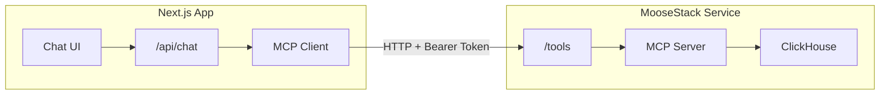

import { FileTree, Callout, BulletPointsCard, ToggleBlock } from "@/components/mdx";
import { Accordion, AccordionItem, AccordionTrigger, AccordionContent } from "@/components/ui/accordion";

# Tutorial: From Parquet in S3 to Chat Application

:::include /shared/chat-guide/prerequisites.mdx

<Callout type="info" title="Data source">
This tutorial requires a Parquet data source in S3. Bring your own, or use the [Amazon Customer Reviews dataset](https://clickhouse.com/docs/getting-started/example-datasets/amazon-reviews) (150M+ rows, no auth required).
</Callout>

In this tutorial, you'll bootstrap the MooseStack MCP template, load real Parquet data from S3 into ClickHouse, validate queries via the MCP-enabled chat UI, then deploy the backend to Fiveonefour and the Next.js app to Vercel.

### Architecture & Scope

This tutorial bootstraps a complete chat-over-data application using the MooseStack MCP template with Parquet data from S3.



**What you'll build:**

| Component | Description |
| :---- | :---- |
| **Chat UI** | Resizable panel with message input/output, tool result rendering |
| **API Route** | Handles chat requests, streams responses from Claude |
| **MCP Server** | Exposes `query_clickhouse` and `get_data_catalog` tools |
| **Authentication** | Bearer token flow between frontend and backend |
| **Production deployment** | Backend on Fiveonefour, frontend on Vercel |

**What this covers:**

- Installing the Moose CLI and initializing the template (or adding to an existing app)
- Modeling your data and bulk-loading from S3 into ClickHouse
- Setting up a development harness with MooseDev MCP and copilot context
- Testing chat locally and customizing the frontend
- Optionally adding a type-safe query layer for performance
- Deploying MooseStack to Fiveonefour and the Next.js app to Vercel

**Not in scope:** Continuous data ingestion. This covers initial bulk load only. For recurring ingestion, see [MooseStack Workflows](https://docs.fiveonefour.com/moosestack/workflows).

## Project Setup

Get your project initialized and running locally.

<GuideStepper id="chat-project-setup" persist>

<GuideStepper.Step id="setup" number={1} title="Initialize Your Project" summary="Install CLI, create project, and configure environment variables">
<GuideStepper.WhatYouNeed>
    - Node.js v20+, pnpm v8+, Docker Desktop
    - GitHub account, Claude API key
</GuideStepper.WhatYouNeed>
<GuideStepper.WhatYouGet>
    - Configured project with MCP server and chat UI ready to run
</GuideStepper.WhatYouGet>

<ConditionalContent whenId="starting-point" whenValue="scratch">

<GuideStepper.Checkpoint id="install-cli" title="Install Moose CLI">

```shell
bash -i <(curl -fsSL https://fiveonefour.com/install.sh) moose
```

</GuideStepper.Checkpoint>

<GuideStepper.Checkpoint id="init-project" title="Initialize project and install dependencies">

```shell
moose init <project-name> typescript-mcp 	# initialize your project
cd <project-name>

pnpm install # install dependencies
```

</GuideStepper.Checkpoint>

<GuideStepper.Checkpoint id="configure-env" title="Create and configure .env files">

Create .env files

```shell
cp packages/moosestack-service/.env.{example,local}
cp packages/web-app/.env.{example,local}
```

Create API Key authentication tokens:

```shell
cd packages/moosestack-service
moose generate hash-token # use output for the API Key & Token below
```

Set environment variables for API:

1. Set your **API Key** in `packages/moosestack-service/.env.local` to the ENV API KEY generated by `moose generate hash-token`
2. Set your **API Token** in `packages/web-app/.env.local` to the Bearer Token generated by `moose generate hash-token`

If you want to use the chat in the application, (which will have MCP based access to the local ClickHouse managed by MooseDev), make sure to set your Anthropic key as an environment variable

```shell
echo "ANTHROPIC_API_KEY=your_api_key_here" >> packages/web-app/.env.local
```

If you don't have an Anthropic API key, you can get one here: [Claude Console](https://console.anthropic.com/)

</GuideStepper.Checkpoint>

</ConditionalContent>

<ConditionalContent whenId="starting-point" whenValue="existing-nextjs">

<Callout type="info" title="Assumptions">
- You have a monorepo
- Your application already has a Next.js service
- Your application already has a MooseStack service, or you are willing to create one
- You are using Express for your APIs (other frameworks work, but aren't covered here)
</Callout>

**Source template:** All code snippets reference [github.com/514-labs/moosestack/tree/main/templates/typescript-mcp](https://github.com/514-labs/moosestack/tree/main/templates/typescript-mcp)

<GuideStepper.Checkpoint id="add-mcp" title="Add MCP server to your MooseStack service">

<Callout type="info" title="Don't have a MooseStack service yet?">
<ToggleBlock openText="Show instructions to create one" closeText="Hide instructions">
Create one first and add it to your `pnpm-workspace.yaml`:
```shell
moose init moosestack-service typescript --location packages/moosestack-service
```
```yaml
# pnpm-workspace.yaml
packages:
  - 'packages/*'
```
Then add dev scripts to your root `package.json`:
```json
{
  "scripts": {
    "dev": "pnpm --parallel --stream -r dev",
    "dev:moose": "pnpm --filter moosestack-service dev",
    "dev:web": "pnpm --filter web-app dev"
  },
  "pnpm": {
    "onlyBuiltDependencies": [
      "@confluentinc/kafka-javascript",
      "@514labs/kafka-javascript"
    ]
  }
}
```
</ToggleBlock>
</Callout>

From your monorepo root, run:

```shell
moose add mcp-server --dir packages/moosestack-service
```

This adds the MCP server (with `query_clickhouse` and `get_data_catalog` tools), adds the required npm dependencies, creates an `MCP_API_KEY` placeholder in `.env.local`, and exports the MCP server from your project's entry file.

Add `--yes` to skip confirmation prompts, or `--overwrite` to replace existing files if re-running.

**Generate an API key:**

```shell
moose generate hash-token
```

This outputs two values:
- **ENV API Key** → Put this in packages/moosestack-service/.env.local as MCP_API_KEY
- **Bearer Token** → Save this for your frontend config (see next checkpoint)

</GuideStepper.Checkpoint>

<GuideStepper.Checkpoint id="add-chat" title="Add chat UI to your Next.js app">

<Callout type="info" title="shadcn/ui setup">
If you don't have shadcn/ui set up, you'll also need the UI components. See [ui.shadcn.com/docs/installation](https://ui.shadcn.com/docs/installation).
</Callout>

From your monorepo root, run:

```shell
moose add chat --dir packages/web-app
```

This installs all chat UI components, API routes, layout components, npm dependencies, shadcn/ui components, and adds the required env vars to `.env.local` and `.env.development`.

<Callout type="info" title="System prompt">
To customize your chat's system prompt, edit `src/features/chat/system-prompt.ts`.
</Callout>

After `moose add chat` completes, follow the printed "Next steps":

1. Paste the **Bearer Token** from `moose generate hash-token` into `.env.local` as `MCP_API_TOKEN`
2. Add your Anthropic API key to `.env.local` as `ANTHROPIC_API_KEY` (from [console.anthropic.com](https://console.anthropic.com))
3. Add `ChatLayoutWrapper` to your root layout:

```tsx
import { ChatLayoutWrapper } from "@/components/layout/chat-layout-wrapper";
import { ThemeProvider } from "@/components/theme-provider";

export default function RootLayout({ children }) {
  return (
    <html lang="en" suppressHydrationWarning>
      <body>
        <ThemeProvider attribute="class">
          <ChatLayoutWrapper>{children}</ChatLayoutWrapper>
        </ThemeProvider>
      </body>
    </html>
  );
}
```

</GuideStepper.Checkpoint>

</ConditionalContent>

</GuideStepper.Step>

<GuideStepper.Step id="local-dev" number={2} title="Run Locally" summary="Start Docker, run the stack, and verify the chat UI loads">
<GuideStepper.WhatYouNeed>
    - Docker Desktop installed and running
    - Completed project setup from Step 1
</GuideStepper.WhatYouNeed>
<GuideStepper.WhatYouGet>
    - MooseStack and web app running locally
    - Chat UI accessible at localhost:3000
</GuideStepper.WhatYouGet>

<GuideStepper.Checkpoint id="verify-docker" title="Make sure Docker Desktop is running">

```shell
docker version
```

</GuideStepper.Checkpoint>

<GuideStepper.Checkpoint id="run-stack" title="Run the whole stack">

From the root of your project, run:

```shell
pnpm dev						# run the MooseStack and web app services
```

Alternatively, run MooseStack and your frontend separately

From the root of your project, run:

```shell
pnpm dev:moose    					# Start MooseStack service only
pnpm dev:web      					# Start web app only
```

You can also run moose dev from your moose project directory `/packages/moosestack-service`.

</GuideStepper.Checkpoint>

<GuideStepper.Checkpoint id="verify-chat-ui" title="Verify the chat UI loads">

<ConditionalContent whenId="starting-point" whenValue="scratch">

Your web-application is available at [http://localhost:3000](http://localhost:3000). Don't be alarmed!

This is a blank canvas for you to use to build whatever user facing analytics you want to. And the chat's already configured, click the chat icon on the bottom right to open your chat. Our engineer GRoy put some work into that chat panel, and you'll find that it is resizable, has differentiated scrolling, and more! Feel free to use and modify how you like.

</ConditionalContent>

<ConditionalContent whenId="starting-point" whenValue="existing-nextjs">

Open your app at [http://localhost:3000](http://localhost:3000) and click the chat button (floating button in bottom-right).

Verify the MCP server is running:

```shell
curl http://localhost:4000/tools \
  -H "Content-Type: application/json" \
  -H "Authorization: Bearer <your-mcp-api-token>" \
  -d '{"jsonrpc":"2.0","id":1,"method":"tools/list"}'
```

You should see a response listing `query_clickhouse` and `get_data_catalog` tools.

</ConditionalContent>

<Callout type="info" title="No data yet">
The chat will be functional, but since you've not added any data to your MooseStack project, the tools available in the chat won't be able to retrieve any data. The next section covers exploring and modeling the data.
</Callout>

</GuideStepper.Checkpoint>

</GuideStepper.Step>

</GuideStepper>

## Set Up Your Development Harness

Configure your copilot with MooseDev MCP for live ClickHouse introspection, add documentation sources, and create a context workspace for data modeling.

<GuideStepper id="chat-dev-harness" persist>

<GuideStepper.Step id="dev-harness" number={1} title="Set Up Dev Tooling" summary="Connect MooseDev MCP, add context sources, and configure your copilot workspace">
<GuideStepper.WhatYouNeed>
    - MooseStack dev server running (`pnpm dev:moose`)
    - A copilot like Claude Code, Cursor, or Codex (recommended)
</GuideStepper.WhatYouNeed>
<GuideStepper.WhatYouGet>
    - MooseDev MCP connected to your copilot for live ClickHouse introspection
    - Context7 providing up-to-date MooseStack docs
    - A context workspace for organizing data modeling artifacts
</GuideStepper.WhatYouGet>

<GuideStepper.Checkpoint id="connect-moosedev-mcp" title="Connect MooseDev MCP to your copilot">

Once your MooseDev Server is up and running, your development MCP server is ready to be connected to your copilot. For documentation for each copilot, [see docs](https://docs.fiveonefour.com/moosestack/moosedev-mcp?lang=typescript#configure-your-ai-client). By way of example, here's how you configure Claude Code:

```shell
claude mcp add --transport http moose-dev http://localhost:4000/mcp
```

Note, you may have to do this before you start Claude Code or your IDE (or restart your copilot for the MCP server to be picked up). You can validate that it is working with the `/mcp` slash command.

</GuideStepper.Checkpoint>

<GuideStepper.Checkpoint id="add-context7" title="Add Context7 for MooseStack documentation">

[Context7](https://context7.com) can serve up-to-date MooseStack docs to your copilot.

**Setup:** [Install Context7 for your IDE](https://github.com/upstash/context7#installation). You may have to do this before you start Claude Code or your IDE (or restart your copilot for the MCP server to be picked up).

**Usage:** When you refer to MooseStack documentation in prompts, add `use context7` for better results.

</GuideStepper.Checkpoint>

<GuideStepper.Checkpoint id="create-context-workspace" title="Create a copilot context workspace">

If the files are relatively small, just build up a `packages/moosestack-service/context/` directory to gather context (you should gitignore your context directory), e.g.:

<FileTree>
<FileTree.Folder name="&lt;project-name&gt;">
    <FileTree.Folder name="packages">
      <FileTree.Folder name="moosestack-service">
        <FileTree.Folder name="context">
          <FileTree.Folder name="data" />
          <FileTree.Folder name="rules" />
        </FileTree.Folder>
        <FileTree.Folder name="..." />
      </FileTree.Folder>
      <FileTree.Folder name="web-app" />
    </FileTree.Folder>
    <FileTree.File name="README.md" />
</FileTree.Folder>
</FileTree>

OLAP, and especially ClickHouse, benefits from rigorous data modeling. LLMs aren't perfect at understanding the nuance of OLAP data modeling, so here's a reference guide: [https://github.com/514-labs/olap-agent-ref](https://github.com/514-labs/olap-agent-ref) (you can clone it into the `context/rules` directory).

```shell
cd packages/moosestack-service/context/rules
gh repo clone 514-labs/olap-agent-ref . # the gh CLI has less trouble with nested repos
```

</GuideStepper.Checkpoint>

</GuideStepper.Step>

</GuideStepper>

## Model and Load Your Data

Model your S3 data in MooseStack, create ClickHouse tables, and bulk-load data locally.

<GuideStepper id="chat-model-data" persist>

<GuideStepper.Step id="model-data" number={1} title="Model Your Data" summary="Copy data from S3, create a data model, and verify tables in ClickHouse">
<GuideStepper.WhatYouNeed>
    - A Parquet data source in S3 (bring your own or use the Amazon Customer Reviews dataset)
    - MooseStack dev server running
</GuideStepper.WhatYouNeed>
<GuideStepper.WhatYouGet>
    - Data model defined in MooseStack with OlapTable
    - Tables created in local ClickHouse
</GuideStepper.WhatYouGet>

<GuideStepper.Checkpoint id="copy-from-s3" title="Copy data from S3">

The following steps cover how to get data from a source, model that data in MooseStack, creating the relevant ClickHouse tables and other infrastructure, and then loading the data into ClickHouse (either local or Fiveonefour hosted).

You can [model your data manually](https://docs.fiveonefour.com/moosestack/data-modeling?lang=typescript) or you can generate a data model from your data. This guide will walk through the generative approach. This guide assumes you have direct access to the files in S3.

There are many ways to copy data down from S3, e.g.:

Using the [S3 CLI](https://docs.aws.amazon.com/cli/latest/reference/s3/cp.html) (once you've authenticated):

```shell
aws s3 ls s3://source-data/ 			# list files in S3

aws s3 cp s3://source-data/ . --recursive 	# copy data from S3 to context directory
```

Using `moose query` (this only copies one file at a time):

```shell
cd packages/moosestack-service			# navigate to your MooseStack project

moose query "Select * FROM s3('s3://source-data/file-name.parquet', '<Access-Key-ID>', '<Secret-Access-Key>', 'parquet') limit 10;" > context/data/file-name.txt # copy data retrieved from that SQL query to the .txt file
```

<ToggleBlock openText="Using the Amazon Customer Reviews dataset?" closeText="Hide Amazon dataset example">
The [Amazon Customer Reviews dataset](https://clickhouse.com/docs/getting-started/example-datasets/amazon-reviews) has 150M+ product reviews in Parquet on S3. No authentication required:

```shell
aws s3 cp \
  s3://datasets-documentation.s3.eu-west-3.amazonaws.com/amazon_reviews/ \
  packages/moosestack-service/context/data/ \
  --recursive --no-sign-request
```

Or query directly:

```shell
moose query "
  SELECT * FROM s3(
    'https://datasets-documentation.s3.eu-west-3.amazonaws.com/amazon_reviews/amazon_reviews_2015.snappy.parquet'
  ) LIMIT 10;
" > packages/moosestack-service/context/data/amazon-reviews-sample.txt
```
</ToggleBlock>

</GuideStepper.Checkpoint>

<GuideStepper.Checkpoint id="create-data-model" title="Model your data manually or with your copilot">

Create:

1. A data model object defining the data model of your data to be ingested
2. An [OlapTable](https://docs.fiveonefour.com/moosestack/reference?lang=typescript#olaptablelttgt) object, declaring that table in MooseStack
3. A reference in index at the root of the MooseStack project (so that MooseOLAP will create the table.

<FileTree>
<FileTree.Folder name="&lt;project-name&gt;">
    <FileTree.Folder name="packages">
      <FileTree.Folder name="moosestack-service">
        <FileTree.Folder name="app">
          <FileTree.Folder name="ingest">
            <FileTree.File name="data-model.ts" />
          </FileTree.Folder>
          <FileTree.File name="index.ts" />
        </FileTree.Folder>
        <FileTree.Folder name="..." />
      </FileTree.Folder>
      <FileTree.Folder name="web-app" />
    </FileTree.Folder>
    <FileTree.File name="README.md" />
</FileTree.Folder>
</FileTree>

Do this sequentially, e.g. with the following prompt pattern:

```text
'<project-name>/packages/moosestack-service/app/ingest/models.ts' look at this
  file. It does two things, declares an interface "DataEvent", and then creates
  an IngestPipeline that declares a table, streaming topic and ingest API for
  that interface. I want to do this for the data that I'm ingesting, that I've
  extracted samples of to this directory:
  '<project-name>/packages/moosestack-service/context/data'. Let's go step by step.

First, let's create the DataModel interface. Refer to the data sample here:
'<project-name>/packages/moosestack-service/context/data/sample1.parquet',
and the data dictionary here:
'<project-name>/packages/moosestack-service/context/data/data_dictionary.csv'

Use good OLAP data modeling practices (tight typing, LowCardinality where
appropriate, etc). MooseStack data modeling docs are here:
https://docs.fiveonefour.com/moosestack/data-modeling
Supported types: https://docs.fiveonefour.com/moosestack/supported-types

Then, create the OlapTable object.
```

Make sure to then prompt the copilot to export the object to `moosestack-service/index.ts` too:

```text
'<project-name>/packages/moosestack-service/app/index.ts' make sure the above is exported in the index
```

<ToggleBlock openText="Using the Amazon Customer Reviews dataset?" closeText="Hide Amazon dataset example">
If you're using the Amazon dataset, your prompt would look like:

```text
'<project-name>/packages/moosestack-service/app/ingest/models.ts' look at this
  file. It does two things, declares an interface "DataEvent", and then creates
  an IngestPipeline that declares a table, streaming topic and ingest API for
  that interface. I want to do this for Amazon Customer Reviews data.

First, let's create the DataModel interface. The schema is documented here:
https://clickhouse.com/docs/getting-started/example-datasets/amazon-reviews

Use good OLAP data modeling practices (tight typing, LowCardinality where
appropriate, etc). MooseStack data modeling docs are here:
https://docs.fiveonefour.com/moosestack/data-modeling
Supported types: https://docs.fiveonefour.com/moosestack/supported-types

Then, create the OlapTable object.
```
</ToggleBlock>

</GuideStepper.Checkpoint>

<GuideStepper.Checkpoint id="verify-tables" title="Verify the tables were created correctly">

The dev server should then pick up the new table, and the copilot should be able to confirm this with the MooseDev MCP, or by being prompted to use `moose query`:

```text
Ensure the table was created by using `moose query` from the moosestack service directory
```

Or you can do this manually:

```shell
moose query "SELECT name, engine, total_rows FROM
      system.tables WHERE database = currentDatabase();"
```

It is also good practice to ask the copilot to double check the model generated against the sample data (LLMs can make assumptions about types of data, even when presented with sample data):

```text
validate the inferred types against the sample data in context/data - check for type mismatches or incorrect assumptions
```

Repeat this for each table you want to model.

</GuideStepper.Checkpoint>

</GuideStepper.Step>

<GuideStepper.Step id="bulk-load" number={2} title="Load Data Locally" summary="Create a load SQL file, execute it, and validate row counts">
<GuideStepper.WhatYouNeed>
    - Data model created and tables verified from Step 1
    - Access to your S3 data source
</GuideStepper.WhatYouNeed>
<GuideStepper.WhatYouGet>
    - Local ClickHouse populated with real data, ready for chat testing
</GuideStepper.WhatYouGet>

<GuideStepper.Checkpoint id="create-load-sql" title="Create a SQL file to load your data">

Create a SQL file to load up your data from your remote source to your local ClickHouse:

```sql
--load-data.sql
INSERT INTO `local`.PlayerActivity
  SELECT * FROM s3(
      's3://source-data/file.parquet',
'<Access-Key-ID>',
'<Secret-Access-Key>'
      'Parquet'
  );
```

<ToggleBlock openText="Using the Amazon Customer Reviews dataset?" closeText="Hide Amazon dataset example">
```sql
--load-data.sql
INSERT INTO `local`.AmazonReviews
  SELECT * FROM s3(
    'https://datasets-documentation.s3.eu-west-3.amazonaws.com/amazon_reviews/amazon_reviews_*.snappy.parquet',
    'Parquet'
  );
```
<Callout type="tip" title="Large dataset">
This loads all ~150M rows. For testing, use a single file like `amazon_reviews_2015.snappy.parquet` instead of the wildcard.
</Callout>
</ToggleBlock>

Make sure to properly apply any transformations to conform your S3 data to the data model you've created. ClickHouse will do many of these transformations naturally. Notably though:

* Column renamings will have to be done in SQL
* Default values in CH only set the value where the column is omitted in an insert. If the column was "null" in the source, you will have to cast that in the insert.

</GuideStepper.Checkpoint>

<GuideStepper.Checkpoint id="execute-load" title="Execute the SQL query and validate">

**Execute the SQL query to load data into your local ClickHouse:**

```shell
moose query -f load-data.sql
```

It will return:

```text
Node Id: moosestack-service::2dadb086-d9fb-4e42-9462-680185fac0ef
          Query 0 rows
```

This is expected. The query doesn't return any rows of data to the query client. To validate that it worked, use this query:

```shell
moose query "SELECT COUNT(*) FROM
      \`local\`.tablename"
```

You will now have a ready to test and iterate on local development environment: with your local MooseStack up and running, with local ClickHouse populated with real data, and the front-end ready to test.

</GuideStepper.Checkpoint>

</GuideStepper.Step>

</GuideStepper>

## Chat and Test

Test your chat with real data and extend the frontend with custom endpoints.

<GuideStepper id="chat-test" persist>

<GuideStepper.Step id="test-extend" number={1} title="Test and Extend" summary="Chat with your data, customize the system prompt, and create custom endpoints">
<GuideStepper.WhatYouNeed>
    - Local ClickHouse populated with data
    - MooseStack and web app running (`pnpm dev`)
</GuideStepper.WhatYouNeed>
<GuideStepper.WhatYouGet>
    - Verified chat experience with real data
    - Customized system prompt and optional custom API endpoints
</GuideStepper.WhatYouGet>

<GuideStepper.Checkpoint id="chat-with-data" title="Chat with your data">

Just go to [http://localhost:3000](http://localhost:3000/): everything should be good to go. Chat away!

<Callout type="info" title="System prompt">
To customize your chat's system prompt, edit `packages/web-app/src/features/chat/system-prompt.ts`.
</Callout>

</GuideStepper.Checkpoint>

<GuideStepper.Checkpoint id="custom-endpoints" title="Create custom API endpoints and a custom front-end">

There's a bootstrapped Next.js application, and an Express app that you can use to add to your framework.

Example prompt that references a ShadCN component, Express/MooseStack docs, and your app folder:

```text
I want to add a Data Table component from ShadCN (here:
https://ui.shadcn.com/docs/components/data-table.md) to the web app here:
<project-name>/packages/web-app.

I want it to serve data from DataModel here:
<project-name>/packages/moosestack-service/app/ingest/models.ts.

Please create an Express API in this directory to serve this component:
<project-name>/packages/moosestack-service/app/apis

Reference docs:
- Express API docs: https://docs.fiveonefour.com/moose/app-api-frameworks/express/llm-ts.txt

Examples:
- cdp-analytics routes: https://github.com/514-labs/moose/tree/main/examples/cdp-analytics/packages/moosestack-service/app/apis
- cdp-analytics services: https://github.com/514-labs/moose/tree/main/examples/cdp-analytics/packages/moosestack-service/app/services
- fastify-moose router: https://github.com/514-labs/moose/blob/main/examples/fastify-moose/src/router.ts
- fastify-moose controllers: https://github.com/514-labs/moose/tree/main/examples/fastify-moose/src/controller

Follow Express best practices: separate routing from business logic, keep route
handlers thin, maintain type safety throughout.
```

You should see your frontend application update here [http://localhost:3000](http://localhost:3000/).

</GuideStepper.Checkpoint>

</GuideStepper.Step>

</GuideStepper>

## Query Layer (Optional)

Add type-safe query models and serving tables to optimize common query patterns identified during chat testing.

<GuideStepper id="chat-query-layer" persist>

<GuideStepper.Step id="query-layer" number={1} title="Add Query Layer" summary="Define query models, create serving tables, and wire up type-safe API handlers">
<GuideStepper.WhatYouNeed>
    - Working MooseStack project with data loaded
    - Familiarity with the queries your chat is running (check chat tool call results)
</GuideStepper.WhatYouNeed>
<GuideStepper.WhatYouGet>
    - Type-safe query models with `defineQueryModel`
    - Serving tables optimized for your query patterns
    - API handlers that serve pre-aggregated data
</GuideStepper.WhatYouGet>

<GuideStepper.Checkpoint id="identify-query-patterns" title="Identify query patterns from chat usage">

Before optimizing, understand what queries your chat is actually running. Review the tool call results in your chat UI — each `query_clickhouse` call shows the SQL that was executed.

Look for:
- Repeated aggregation patterns (e.g., `GROUP BY date`, `COUNT(*)`)
- Slow queries on large tables
- Common filter combinations

These patterns are candidates for serving tables and materialized views.

</GuideStepper.Checkpoint>

<GuideStepper.Checkpoint id="define-query-model" title="Define a query model with defineQueryModel">

Use `defineQueryModel` to create a type-safe query layer. This defines the shape of your API response and the ClickHouse query that powers it.

```ts filename="app/queries/example-query.ts"
import { sql, defineQueryModel } from "@514labs/moose-lib";
import { MyDataModel } from "../ingest/models";

interface QueryParams {
  startDate: string;
  endDate: string;
}

interface QueryResult {
  day: string;
  total_count: number;
  avg_value: number;
}

export const myQuery = defineQueryModel<QueryParams, QueryResult>({
  table: MyDataModel,
  queryFn: (params, table) => sql`
    SELECT
      toDate(created_at) AS day,
      count() AS total_count,
      avg(value) AS avg_value
    FROM ${table}
    WHERE created_at >= toDateTime(${params.startDate})
      AND created_at < toDateTime(${params.endDate})
    GROUP BY day
    ORDER BY day ASC
  `,
});
```

Export from your project's `index.ts`:

```ts
export { myQuery } from "./queries/example-query";
```

</GuideStepper.Checkpoint>

<GuideStepper.Checkpoint id="create-serving-table" title="Create a serving table (optional optimization)">

For frequently-run aggregations, create a materialized view that pre-computes results into a serving table. This is the same pattern used in the [Performant Dashboards guide](/guides/performant-dashboards/tutorial).

```ts filename="app/views/daily-summary.ts"
import { sql, OlapTable, MaterializedView } from "@514labs/moose-lib";
import { MyDataModel } from "../ingest/models";

interface DailySummary {
  day: Date;
  total_count: number;
  avg_value: number;
}

export const DailySummaryTable = new OlapTable<DailySummary>("DailySummary", {
  orderBy: ["day"],
});

export const dailySummaryMV = new MaterializedView({
  name: "daily_summary_mv",
  targetTable: DailySummaryTable,
  query: sql`
    SELECT
      toDate(created_at) AS day,
      count() AS total_count,
      avg(value) AS avg_value
    FROM ${MyDataModel}
    GROUP BY day
  `,
});
```

Export both from `index.ts`. The serving table will be automatically available to the MCP server's `query_clickhouse` tool, giving your chat faster access to pre-aggregated data.

</GuideStepper.Checkpoint>

</GuideStepper.Step>

</GuideStepper>

## Deploy to Production

Deploy your backend and frontend, then load data into production.

<GuideStepper id="chat-deploy" persist>

<GuideStepper.Step id="deploy" number={1} title="Deploy to Production" summary="Deploy MooseStack to Fiveonefour and Next.js to Vercel">
<GuideStepper.WhatYouNeed>
    - Working local setup with chat verified
    - Fiveonefour hosting account and Vercel account
    - GitHub repository connected to both platforms
</GuideStepper.WhatYouNeed>
<GuideStepper.WhatYouGet>
    - MooseStack backend deployed on Fiveonefour
    - Next.js frontend deployed on Vercel
    - Production authentication configured
</GuideStepper.WhatYouGet>

<GuideStepper.Checkpoint id="deploy-fiveonefour-vercel" title="Deploy MooseStack and Next.js">

:::include /shared/chat-guide/deploy-to-fiveonefour-and-vercel.mdx

</GuideStepper.Checkpoint>

</GuideStepper.Step>

<GuideStepper.Step id="hydrate-production" number={2} title="Hydrate Production Data" summary="Load data into your production ClickHouse instance">
<GuideStepper.WhatYouNeed>
    - Deployed MooseStack project on Fiveonefour
    - Access to your S3 data source
</GuideStepper.WhatYouNeed>
<GuideStepper.WhatYouGet>
    - Production ClickHouse populated with data
    - Fully functional production chat application
</GuideStepper.WhatYouGet>

<GuideStepper.Checkpoint id="get-connection-string" title="Get your Fiveonefour connection string">

Your project is now deployed. You have a Vercel hosted frontend. You have a Fiveonefour hosted backend, with tables, APIs etc. set up for you.

Your backend, however, is still unpopulated.

This section will cover how to get data into prod.

Note, it assumes a bulk ingest from a Parquet file on S3 with direct insertion through SQL, like the rest of this tutorial. If you configured a recurring workflow, that would automate data ingest (depending on the trigger). If you set up an ingestion endpoint, you may need to send data to said endpoint.

**Find your Fiveonefour connection string / database details:**

It is in the Database tab of your deployment overview. Make sure to select the appropriate connection string type.

</GuideStepper.Checkpoint>

<GuideStepper.Checkpoint id="run-production-insert" title="Connect and load data into production">

**Connect your SQL client, and run the following ClickHouse SQL query:**

```sql
-- Bulk load Parquet data from S3 into ClickHouse
INSERT INTO `<clickhouse-database>`.`<table-name>`   -- Target ClickHouse database and table
SELECT *
FROM s3(
  's3://<bucket-name>/<path-to-file>.parquet',       -- S3 bucket and path to the Parquet file
  '<aws-access-key-id>',                              -- AWS Access Key ID
  '<aws-secret-access-key>',                          -- AWS Secret Access Key
  'Parquet'                                           -- File format
);
```

<ToggleBlock openText="Using the Amazon Customer Reviews dataset?" closeText="Hide Amazon dataset example">
```sql
INSERT INTO `<clickhouse-database>`.AmazonReviews
SELECT * FROM s3(
  'https://datasets-documentation.s3.eu-west-3.amazonaws.com/amazon_reviews/amazon_reviews_*.snappy.parquet',
  'Parquet'
);
```
<Callout type="tip" title="Large dataset">
This loads all ~150M rows. For testing, use a single file like `amazon_reviews_2015.snappy.parquet` instead of the wildcard.
</Callout>
</ToggleBlock>

</GuideStepper.Checkpoint>

<GuideStepper.Checkpoint id="validate-production" title="Validate the data loaded correctly">

This will again return 0 rows. This is expected. You can validate that the transfer worked correctly as follows:

```sql
"SELECT COUNT(*) FROM
      `<clickhouse-database>`.tablename"
```

</GuideStepper.Checkpoint>

</GuideStepper.Step>

</GuideStepper>

:::include /shared/chat-guide/troubleshooting.mdx

## Appendix: Data context as code

Clickhouse allows you to embed [table](https://clickhouse.com/docs/en/sql-reference/statements/alter/comment) and [column level](https://clickhouse.com/docs/en/sql-reference/statements/alter/column#modify-column) metadata.

With MooseOlap, you can set these table and column level descriptions in your data models. e.g.

```ts
export interface AircraftTrackingData {
	/** Unique aircraft identifier */
	hex: string;

	// no comment for this column
	transponder_type: string;

	/** callsign, the flight name or aircraft registration as 8 chars */
	flight: string;

	/** aircraft registration pulled from database */
	r: string;

	/** unique aircraft identifier */
	aircraft_type?: string;

	/** bitfield for certain database flags */
	dbFlags: number;
}
```

The `/** JSDoc */` comments on the column level will now be embedded in your ClickHouse database. This additional context will be available to your chat, and retrievable with the same tool-calls that retrieve data.
