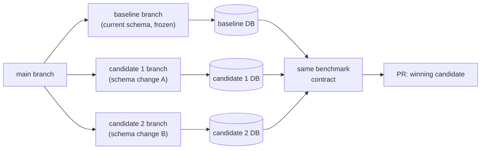

import { BulletPointsCard, Callout } from "@/components/mdx";

# Overview

Most slow ClickHouse queries are a schema problem, not a query problem. Reordering the `ORDER BY` to match your filter patterns, switching the table engine, or adding a materialized view can make a bigger difference than rewriting SQL.

This workflow gives your coding agent a performance testing harness to try those changes against the query you want to speed up. All benchmarking runs on databases isolated from production, and you review the results before anything ships.

## What does the performance testing harness do?

The harness runs a controlled experiment on your behalf. It applies each candidate schema change on its own git branch, then uses Fiveonefour preview branches to deploy and benchmark that change against an isolated ClickHouse database. Every candidate is compared back to a frozen baseline using the same test. The agent picks the best performer and opens a pull request with the evidence.
<Callout
  type="info"
  title="Don't have a MooseStack project yet?"
  href="/moosestack/getting-started/from-clickhouse"
  icon="Database"
  ctaLabel="Start from ClickHouse"
>
Start by bootstrapping a MooseStack project from your existing ClickHouse database, then return here once you have a project the agent can run against.
</Callout>

<BulletPointsCard
  title="Why the workflow is structured this way"
  bulletStyle="bullet"
  uppercase={false}
  bullets={[
    {
      title: "Why is the baseline frozen?",
      description:
        "If the baseline branch picks up new commits while candidates are running, the comparison is no longer apples to apples. Freezing the baseline means every candidate is measured against the exact same schema and data state.",
    },
    {
      title: "Why does each candidate get its own database?",
      description:
        "ClickHouse schema changes like reordering an ORDER BY can trigger background data rewrites. If two candidates shared a database, one rewrite could interfere with the other's benchmark results. Isolation removes that variable.",
    },
    {
      title: "Why use the same benchmark contract everywhere?",
      description:
        "If the query, scenarios, or thresholds change between runs, you cannot tell whether a latency improvement came from the schema change or from a looser test. Running the same package against every database keeps the comparison honest.",
    },
    {
      title: "Why does the workflow stop at a PR?",
      description:
        "The experiment proves which schema change is faster in preview. It does not answer whether the migration is safe for production, whether a backfill is needed, or whether a phased rollout makes more sense. Those decisions are yours to make during PR review.",
    },
  ]}
/>

## What is in the performance testing harness?

The harness is made up of four pieces that `514 agent init` installs into your repo.

<BulletPointsCard
  title="What the harness provides"
  bulletStyle="check"
  uppercase={false}
  bullets={[
    {
      title: "A performance optimization skill",
      description:
        "Tells the agent what to do at each stage of the optimization workflow and what evidence to collect. The tutorial covers each stage in detail.",
    },
    {
      title: "ClickHouse best practices rules",
      description:
        "Ground the agent's schema proposals. When the agent sees a full table scan, these rules help it propose specific changes like reordering a sorting key to match your filter columns, rather than guessing.",
    },
    {
      title: "A benchmark test package",
      description:
        "Scaffolded into your repo during setup. The package captures the slow query, wraps it with filter scenarios, and sets performance thresholds. The agent runs this package against every preview database so the only variable is the schema.",
    },
    {
      title: "514 Platform tools",
      description:
        "Let your agent provision, connect to, and tear down the isolated ClickHouse databases needed for each optimization candidate.",
    },
  ]}
/>

<Callout
  type="info"
  title="Ready to start?"
  href="/guides/optimize-clickhouse-performance/tutorial"
  icon="Rocket"
  ctaLabel="Start the tutorial"
>
Budget roughly 30 minutes end to end for a first run. The tutorial walks you through setup, the optimization workflow, and PR review.
</Callout>
