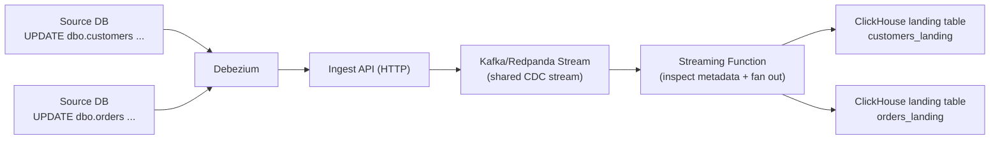

import {
  CTACards,
  CTACard,
  Callout,
  BulletPointsCard,
  ToggleBlock,
  CustomizePanel,
  CustomizeGrid,
  SelectField,
  ConditionalContent,
  CommunityCallout,
  FileTree,
} from "@/components/mdx";

# Improving the Performance of Your Dashboards

<Callout type="info" title="TL;DR">
* Slow dashboards are usually a database architecture problem, not a frontend or charting library problem.
* Running analytical queries on your transactional database degrades your entire application's performance and reliability.
* Moving these analytical queries to ClickHouse yields 10–100x faster dashboards

This guide will:

1. Help you recognize when OLTP has become your analytics bottleneck
2. Show an incremental path to move analytical workloads to OLAP
3. Walk through shipping the change end-to-end with MooseStack + ClickHouse
</Callout>

<CTACards columns={2}>
  <CTACard
    title="Overview"
    description="Business context, warning signs, and what success looks like"
    ctaLink="#overview"
    ctaLabel="Read first"
    Icon="Eye"
  />
  <CTACard
    title="Tutorial"
    description="Step-by-step: port dashboard logic to ClickHouse via MooseStack"
    ctaLink="#tutorial-migrate-your-dashboard-to-clickhouse"
    ctaLabel="Start building"
    Icon="Rocket"
  />
</CTACards>

## Overview

### What this guide is for

The root cause of slow dashboards is usually analytical queries (aggregations, wide table scans, complex joins) running on your existing transactional database, competing with the core transactional workloads that power the rest of your application.

You'll know you're hitting this when you see one (or more) of these symptoms:

<BulletPointsCard
  title="Common symptoms"
  bulletStyle="x"
  bullets={[
    {
      title: "Charts/metrics take 5+ seconds to load",
      description: "Users stare at spinners past the 3-second attention threshold, causing them to lose focus, abandon tasks, or complain about a slow product."
    },
    {
      title: "Small report changes are expensive",
      description: "Adding a new report or filter is too risky and complex to build, so engineering prioritizes other features instead."
    },
    {
      title: "Reporting traffic overwhelms production OLTP",
      description: "Analytics queries cause collateral damage to core app workflows."
    }
  ]}
/>

This guide lays out a step-by-step path to offload those analytical workloads to a purpose-built analytical database (ClickHouse), incrementally, without needing to rearchitect your existing application.

At a high level, you'll:

1. Stand up ClickHouse and replicate the data your dashboards need
2. Set up a local development workflow that supports ClickHouse-backed analytics
3. Migrate one dashboard/report at a time by translating OLTP queries to ClickHouse
4. Ship your changes to production on Boreal Cloud

### Why this matters

Customer-facing analytics becomes mission-critical once users depend on it to understand their behavior, progress, or outcomes. Slow or unreliable dashboards drive down engagement: lower retention, higher churn, and direct revenue impact as users stop trusting your product for insights. Fast dashboards do the opposite—they encourage exploration, increase repeat usage, and let customers interact with your data in ways you can't predict upfront.

<Callout type="info" title="Case study: F45's LionHeart experience">
LionHeart is where F45's most engaged members track workout performance and progress. Their original OLTP-backed implementation meant they had to ship reports as static images rather than interactive charts.

After migrating the analytics backend to an OLAP architecture (Fiveonefour stack), LionHeart shipped fast, interactive dashboards in weeks:

- **Outcome:** [70% increase in user satisfaction, and over 1 full star increase in the F45 App Store rating](https://www.fiveonefour.com/blog/case-study-f45)
</Callout>

### Why you haven’t solved it yet

Most teams don't start with a dedicated analytical database (OLAP), and it's often the right call early on.

<BulletPointsCard
  title="Why teams delay adopting OLAP"
  bulletStyle="default"
  bullets={[
    {
      title: "The OLTP path is the highest-ROI path early on",
      description: "Your transactional database already powers your core application workflows. Early on, it can handle analytics queries too, so adding a second database delivers little marginal value."
    },
    {
      title: "Performance doesn't degrade right away",
      description: "OLTP-backed analytics can look \"fine\" until data volume and concurrency cross a threshold (typically 10-50M rows, depending on query complexity and concurrent users)."
    },
    {
      title: "Shipping the first version is fastest on existing infrastructure",
      description: "The quickest path to value is usually building reporting directly on the systems you already run and understand."
    },
    {
      title: "A second database is a real operational commitment",
      description: "Adding OLAP introduces new reliability, cost, security, and ownership concerns—not just a new query engine."
    },
    {
      title: "Most OLAP stacks weren’t built for modern software engineering workflows",
      description: "Tooling can feel data-engineering-native, slowing adoption when the builders are primarily software engineering teams building on a application stack (e.g., Next.js, React, Ruby on Rails, etc.)."
    }
  ]}
/>

While it's common to delay adopting OLAP, there's an inflection point at which it becomes a real business risk. OLAP migrations are non-trivial and can take months with traditional data engineering tooling. If you wait too long to start or choose tooling with a steep learning curve, you may not move fast enough to fix the problem before users start churning. 

<Callout type="info" title="Feeling daunted? This is designed to be incremental">
You don't need to migrate your entire analytics stack at once. In this guide, you'll translate **one dashboard/report at a time**: replicate only the data you need, model it in ClickHouse, and cut over reads when you’re confident.

If you get stuck on a schema design decision or an especially complex query, join the [Moose community Slack](https://join.slack.com/t/moose-community/shared_invite/zt-2fjh5n3wz-cnOmM9Xe9DYAgQrNu8xKxg) and we’ll help you map out the next step.
</Callout>

### When to pull the trigger

Users want more metrics, filters, breakdowns, or longer time ranges in their dashboards, but engineering can't deliver these seemingly small changes without risking the transactional workloads your core product depends on. Load times creep up. Customers complain. Before long, those complaints surface in retention metrics, support tickets, and sales calls.

Throwing more hardware at the problem either isn't possible or is prohibitively expensive. Even when feasible, this approach only buys temporary relief. The underlying issue is certain to resurface.

### What success looks like

You'll have migrated to ClickHouse successfully if you see a measurable impact on both product velocity and system reliability.

Dashboards stay fast as data grows, instead of degrading over time. Analytical workloads run on dedicated infrastructure, so your transactional database can focus on what it does best.

Engineering can ship new dashboards, metrics, and breakdowns as routine product work—not risky, backlog-bound projects. Features that used to require careful capacity planning become straightforward additions.


## Tutorial: Migrate Your Dashboard to ClickHouse

This tutorial assumes you already have a dashboard or report running in production, and you want to make it faster using OLAP best practices.

Your source database (Postgres or SQL Server) remains your transactional system of record, and your application continues writing to it as usual. CDC (ClickPipes or Debezium) streams changes into ClickHouse in real time so dashboards can read from ClickHouse instead of competing with OLTP workloads.

MooseStack is where you define your ClickHouse analytics layer **in code**. You’ll build views/materializations on top of the CDC-replicated raw tables and keep your existing dashboard APIs and request/response contracts the same—only the backing queries change.

By the end of this guide you’ll have:

1. A real-time replication pipeline feeding production ClickHouse from your source database.
2. A MooseStack project that defines ClickHouse resources (views, materialized views, serving tables) on top of the CDC-replicated raw tables, plus the query/API handlers your dashboard will call.
3. A local dev workflow for evolving those resources safely, and a Boreal-backed deploy workflow with preview environments + migration plans so you can validate changes before merging to `main`.

<Callout type="info" title="Starting from scratch?" href="/guides/chat-in-your-app" ctaLabel="Get started">
If you’re building a new dashboard or data-connected chat (not migrating an existing dashboard), start with [Chat in Your App](/guides/chat-in-your-app).
</Callout>

### Customize this tutorial

<CustomizePanel
  title="Where does your current data live?"
  description="Select the database you use today so we can show the right way to replicate this data into ClickHouse"
>
  <CustomizeGrid columns={1}>
    <SelectField
      id="source-database"
      label="Source database"
      options={[
        { value: "sqlserver", label: "SQL Server" },
        { value: "postgres", label: "Postgres" },
      ]}
      defaultValue="postgres"
      persist
    />
    <SelectField
      id="os"
      label="Operating System"
      options={[
        { value: "macos", label: "macOS or Linux" },
        { value: "windows", label: "Windows (WSL 2)" },
      ]}
      defaultValue="macos"
      persist
    />
  </CustomizeGrid>
</CustomizePanel>

You'll work through:

<ConditionalContent whenId="source-database" whenValue="postgres">
1. [Set up ClickHouse Cloud ClickPipes](#set-up-clickhouse-cloud-clickpipes-postgres-cdc) to replicate your Postgres tables into ClickHouse.
2. [Add MooseStack to your repo](#add-moosestack-to-your-project) and run `moose db pull` to generate typed models for the ClickPipes-owned tables.
3. [Connect Boreal](#deploy-your-moosestack-project-to-boreal) so pull requests get preview environments and migration plans.
4. [Migrate one dashboard component](#migrate-a-dashboard-component-to-clickhouse) using ClickHouse-native resources (views, materialized views, serving tables).
5. [Go to production](#going-to-production) using the preview environment and reviewed migrations.
</ConditionalContent>

<ConditionalContent whenId="source-database" whenValue="sqlserver">
1. [Add MooseStack to your repo](#add-moosestack-to-your-project) (you’ll define the Debezium ingest pipeline in this project).
2. [Connect Boreal](#deploy-your-moosestack-project-to-boreal) so pull requests get preview environments and migration plans.
3. [Prepare your local dev environment](#prepare-your-local-development-environment) to work with ClickHouse.
4. [Set up Debezium CDC](#set-up-change-data-capture-cdc) to stream SQL Server changes into ClickHouse via your MooseStack ingest API.
5. [Migrate one dashboard component](#migrate-a-dashboard-component-to-clickhouse) using ClickHouse-native resources (views, materialized views, serving tables).
6. [Go to production](#going-to-production) using the preview environment and reviewed migrations.
</ConditionalContent>

<Callout type="info" title="AI-assisted Development">
We recommend using an AI copilot to accelerate the migration to handle complex query translations. However, you can complete every step manually if you prefer. Any AI-enabled editor (Claude Code, Cursor, Codex, Opencode, GitHub Copilot, Windsurf, etc.) will work. Editors that support MCPs can make this workflow even faster.
</Callout>

**Language:** This guide is written for TypeScript developers. Python developers can follow along—the concepts translate directly, and MooseStack supports both languages. The main differences are syntax and framework-specific patterns. 

<CommunityCallout title="Want Python Examples?">
If you'd like to see Python-specific examples, let us know in our Slack community and we'll prioritize creating them.
</CommunityCallout>

<ConditionalContent whenId="source-database" whenValue="postgres">
### Set up ClickHouse Cloud ClickPipes (Postgres CDC)

ClickPipes is a managed service from ClickHouse Cloud that mirrors changes from Postgres into ClickHouse in real time. If you're already using ClickPipes and your replicated tables are present in ClickHouse, you can skip this step.

Set up ClickPipes first so the replicated raw tables exist in ClickHouse:
- [Create a new ClickHouse Cloud Account](https://auth.clickhouse.cloud/u/signup)
- [Docs for Setting up ClickPipes CDC with Postgres](https://clickhouse.com/docs/cloud/reference/billing/clickpipes/postgres-cdc)

<Callout type="info" title="ClickPipes owns the raw tables">
ClickPipes creates and manages the replicated raw tables in ClickHouse. MooseStack reads from those tables and creates its own ClickHouse resources (views, materialized views, serving tables) alongside them. MooseStack does not rewrite or migrate ClickPipes-owned tables.

In MooseStack, you’ll treat ClickPipes tables as **externally managed**. See [External Tables](/moosestack/olap/external-tables).
</Callout>

<CommunityCallout type="info" title="Not using ClickPipes?">
If your CDC provider lands tables in ClickHouse (for example, Debezium, Supabase Live, or a custom pipeline), you can follow the same workflow: pull the table schemas into code as external models, then build ClickHouse-native views/materializations on top. If you want help mapping your setup to MooseStack, join the [MooseStack community](https://join.slack.com/t/moose-community/shared_invite/zt-2fjh5n3wz-cnOmM9Xe9DYAgQrNu8xKxg).
</CommunityCallout>

Once your ClickPipes pipeline is running and you can see replicated tables in ClickHouse Cloud, continue to [**Add MooseStack to your Project**](#add-moosestack-to-your-project). In that step, you’ll initialize `moosestack/` and run `moose db pull` to generate typed models for the ClickPipes-owned tables.

</ConditionalContent>

### Add MooseStack to your Project

<BulletPointsCard
  title="Prerequisites"
  bulletStyle="check"
  compact={true}
  divider={false}
  bullets={[
    {
      title: "Node.js 20+",
      description: "Check your version with `node --version`.",
      link: { text: "Download", href: "https://nodejs.org/en/download", external: true }
    },
    {
      title: "Docker Desktop",
      description: "For local ClickHouse and Redpanda. Make sure it's running before proceeding.",
      link: { text: "Download", href: "https://docs.docker.com/desktop/", external: true }
    },
    {
      title: "Install Moose CLI",
      description: "Install Moose CLI using the installer below.",
    }
  ]}
/>

<ConditionalContent whenId="os" whenValue="windows">
:::include /shared/prerequisites/wsl-setup.mdx
</ConditionalContent>


<Callout type="info" title="Install Moose CLI">
Run the installer:

```bash
bash -i <(curl -fsSL https://fiveonefour.com/install.sh) moose
```

<Callout type="info" title="Make sure to restart your terminal after installing MooseStack.">
MooseStack is installed globally, so you need to restart your terminal to make the `moose` command available.
</Callout>
</Callout>

This guide assumes a monorepo with your existing application (for example, a Next.js frontend with an API backend). You'll add MooseStack as a workspace package in a subdirectory (we'll call it `moosestack/`).

#### Step 1: Initialize MooseStack in a subdirectory

First, decide where you want the `moosestack/` package to live in your monorepo. Then `cd` to that directory and run:

```shell
moose init moosestack typescript-empty
```

<Callout type="info" title="Different monorepo layouts">
If your repo keeps packages under a folder like `packages/`, `cd packages` first (or update the `pnpm-workspace.yaml` entry in the next step to match where you created `moosestack/`).
</Callout>

#### Step 2: Update your PNPM workspace configuration

Edit your root `pnpm-workspace.yaml` to include the `moosestack` directory:

```yaml
packages:
  - .                    # Your main app (e.g., Next.js)
  - moosestack           # MooseStack project
```

#### Step 3: Configure the MooseStack package

Add or update these top-level fields in `moosestack/package.json` so other packages in your monorepo can import from `"moosestack"` cleanly. Leave the rest of the file unchanged.

```json title="moosestack/package.json"
{
  "name": "moosestack",
  "private": true,
  "main": "./dist/index.js",
  "types": "./dist/index.d.ts",
  "exports": {
    ".": {
      "types": "./dist/index.d.ts",
      "default": "./dist/index.js"
    }
  }
}
```

<Callout type="info" title="When do you need to build?">
If another workspace package imports from `"moosestack"`, run a build once so `dist/` exists:

```bash
pnpm -C moosestack build
```
</Callout>

#### Step 4: Add the pnpm configuration to your root package.json

Edit your root `package.json` to add the `pnpm.onlyBuiltDependencies` section (this ensures required native/built dependencies are handled correctly by PNPM):

```json
{
  "pnpm": {
    "onlyBuiltDependencies": [
      "@confluentinc/kafka-javascript",
      "@514labs/kafka-javascript"
    ]
  }
}
```

<ConditionalContent whenId="source-database" whenValue="postgres">
#### Step 5: Pull ClickPipes tables into your MooseStack project (external models)

Now that your project directory exists, generate TypeScript models for the ClickPipes-owned tables in ClickHouse.

From the `moosestack/` directory you created above:

```shell
# Save your ClickHouse credentials as an env var (treat this like a secret)
export CLICKHOUSE_URL="<YOUR_CLICKHOUSE_CLOUD_HTTPS_URL>"

# Pull ClickPipes-owned table schemas into a clearly named external models file
moose db pull \
  --clickhouse-url "$CLICKHOUSE_URL" \
  --file-path app/clickpipesExternalModels.ts
```

<Callout type="info" title="Optional: store credentials in a .env file">
If you prefer, you can store the URL in a `.env` file (for example, `moosestack/.env`). The Moose runtime loads `.env` at runtime, but the CLI does not automatically load it, so you still need to source/export it before running `moose db pull`:

```bash
echo "CLICKHOUSE_URL=<YOUR_CLICKHOUSE_CLOUD_HTTPS_URL>" >> .env
set -a; source .env; set +a
```
</Callout>

<Callout type="info" title="Make sure Moose loads your ClickPipes external models">
`moose db pull` writes a file at `app/clickpipesExternalModels.ts`. Import it once from `app/index.ts` so Moose can discover those table definitions (we use an export here so other code can import these tables too):

```ts filename="app/index.ts" copy
export * from "./clickpipesExternalModels";
```
</Callout>

<Callout type="info" title="These ClickPipes tables are externally managed">
The tables replicated by ClickPipes are owned and mutated by ClickPipes, not your MooseStack project. `moose db pull` generates `EXTERNALLY_MANAGED` table definitions that mirror ClickPipes-owned schemas so you can write type-safe queries, views, and materialized views against them without taking ownership of their lifecycle.

In TypeScript, you’ll see this reflected in the generated table config:

```ts copy
lifeCycle: LifeCycle.EXTERNALLY_MANAGED
```

For details, see [External Tables](/moosestack/olap/external-tables).
</Callout>

To make this repeatable, add this script to the `scripts` section in `moosestack/package.json`:

```json title="moosestack/package.json"
{
  "scripts": {
    "db:pull:clickpipes": "moose db pull --clickhouse-url \"$CLICKHOUSE_URL\" --file-path app/clickpipesExternalModels.ts"
  }
}
```
</ConditionalContent>

You should now have MooseStack configured in your monorepo and ready to deploy.

Next you'll connect your repo (via GitHub) to [Boreal](https://boreal.cloud) so deployments happen through your normal Git workflow. When you open a pull request, Boreal deploys your `moosestack/` branch to a preview environment, creates a separate ClickHouse preview database (so you don’t touch your main one), and produces a migration plan of the ClickHouse changes your branch would apply.

Later in this guide, you’ll use the preview environment + migration plan to validate your work. When you merge to `main`, Boreal applies the reviewed migrations to your main ClickHouse database.

### Deploy your MooseStack project to Boreal

This guide uses Boreal to manage deployment of your MooseStack project to production. 

<BulletPointsCard
  title="Why set up Boreal now?"
  bulletStyle="check"
  bullets={[
    {
      title: "Preview Environments and Migration Planning",
      description: "When you open a feature branch and PR later in this guide, Boreal can automatically provision a preview environment and generate a migration plan for the code changes in your branch. This ensures your code changes are safe and you can apply them to your main ClickHouse database with confidence."
    }
  ]}
/>

#### Step 1: Create New Boreal Project

Go to [boreal.cloud](https://boreal.cloud) and sign in to your account. If you don't have an account, click the `Sign Up` button to create one.

<Callout type="info" title="Don't have a Boreal account?" ctaLabel="Sign Up" href="https://boreal.cloud/sign-up">
If you don't have a Boreal account, go to [boreal.cloud](https://boreal.cloud) and sign up for an account. Once you're signed up, you'll land on the `Projects` page.
</Callout>

From your account dashboard, click the `New Project` button to create a new project.

#### Step 2: Define project details


On the “Import Existing Project” page, confirm the basic settings Boreal will use to build and deploy this repo:

- `Name`: this field should contain the desired project name. By default it shows the repository name; update it if necessary.

- `Project Root`: set the directory within the repository that contains your MooseStack project (for example, the folder that contains your Moose config like `project.toml`). If this is a monorepo, make sure you pick the specific subfolder for the app you’re deploying (e.g., `moosestack/`).

Once these fields look correct, click `Next` to proceed.

#### Step 3: Select data services


The next screen configures the data services your deploys will use. In practice, this sets:

- where main-branch deployments apply schema changes, and
- where pull-request preview environments provision isolated databases.

You can accept the default managed services, or connect existing infrastructure.

<ConditionalContent whenId="source-database" whenValue="postgres">
Since you are using ClickHouse Cloud, select `Customize` to connect to your existing ClickHouse Cloud instance.

#### Step 4: Configure ClickHouse connection


If you chose `Customize`, open the ClickHouse configuration and select `Connect to existing ClickHouse instance`. Then fill out the form:

- `Host`: enter the hostname of your ClickHouse instance (e.g., your-instance.clickhouse.cloud).
- `Port`: specify the port number (for ClickHouse Cloud this is commonly 8443).
- `User & Password`: supply the credentials for your ClickHouse user. 

<Callout type="info" title="Admin Role Required">
This user must have the `admin` role. This is required in order to create preview database instances for each preview environment.
</Callout>
- `Connection Name`: give this connection an identifiable name (e.g., “Prod ClickHouse Cloud”) for future reference.

Click `Test Connection` to verify connectivity. If the test fails, fix the connection details before continuing.

If you intend to use this connection for other projects, toggle `Use as Default`.

Finally, click `Add connection` to finish the setup.

#### Step 5: Set the main-branch database target


Next, choose the database that `main` branch deployments should target. This is the primary ClickHouse database your MooseStack-defined resources will live in: when you merge changes into your repository’s main branch, schema changes will be applied here.

<Callout type="info" title="Boreal + ClickPipes: what Moose will (and won’t) change">
If you're using ClickPipes, the replicated raw tables in ClickHouse are created and managed by ClickPipes. Moose (and Boreal) creates and migrates **Moose-defined** ClickHouse resources (views, materialized views, serving tables) alongside them—Moose does not rewrite or manage ClickPipes-owned tables. In your MooseStack project, model ClickPipes-owned tables as `EXTERNALLY_MANAGED` in a dedicated file like `app/clickpipesExternalModels.ts` (generated via `moose db pull`).
</Callout>

In the database selector, choose the database you created in ClickHouse Cloud (the same one your CDC pipeline will write into).

</ConditionalContent>

#### Complete deployment

Click `Deploy` to run the initial build and create the first deployment for this repo. This will redirect you to the `Deployments` page. Typically, it will take around 1-2 minutes to deploy.

Once the deployment completes, you’ll be redirected to the project overview page.

For the next section, you will need to copy the ClickHouse HTTPS connection string. You can locate this by clicking on the `Database` button in the top right corner of your project overview dashboard, and then copying the ClickHouse HTTPS connection string located at the bottom of the panel. 


### Prepare your local development environment

In this section you'll create a feature branch, run the Moose development server (`moose dev`) so ClickHouse and Redpanda run locally in Docker, and optionally install the MCP server and LSP so your copilot can query the database. Once this is done, you'll use the connection string you copied from Boreal to seed your local ClickHouse and start the migration (translating OLTP queries, adding materialized views, and wiring the API). PRs from this branch will get a Boreal preview environment automatically.

If you are not already in a terminal, open a new terminal and navigate to your repository.

#### Step 1: Create a branch

Create a new branch in your repo to isolate your changes. When you open a pull request from this branch, you’ll get a preview environment you can use to validate changes before merging.

```shell
git checkout -b <your-branch-name>
```

#### Step 2: Run your Moose development server

Ensure Docker Desktop is running first.  


Navigate to your MooseStack project directory and run the development server:

```shell
cd moosestack  # or wherever your moose project is
pnpm install
moose dev
```

If the development server runs correctly, you'll see a list of the available API endpoints print:

```
📍 Available Routes:
  Base URL: http://localhost:4000

  Static Routes:
  METHOD  ENDPOINT                                           DESCRIPTION
  ------  --------                                           -----------
  GET     /admin/inframap                                    Admin: Get infrastructure map
  GET     /admin/reality-check                               Admin: Reality check - provides a diff when drift is detected between the running instance of moose and the db it is connected to
  GET     /health                                            Health check endpoint
  GET     /ready                                             Readiness check endpoint
...

```

And your local services will be running in Docker containers:  


#### Step 3: Set up developer and agent tooling (optional)

We optionally recommend setting up your development environment with the following add-ons to let your AI copilot query your local database, inspect infrastructure, and validate SQL directly. These are not required, but can help you get the most out of your development environment.

**[Moose Dev MCP server](https://docs.fiveonefour.com/moosestack/moosedev-mcp?lang=typescript)**: 

Lets your AI copilot query your local ClickHouse database, inspect logs, and explore infrastructure using natural language. Your copilot can verify query results, debug issues, and validate migrations without you copying/pasting commands.

:::include /shared/prerequisites/install-mcp.mdx

**Language Server (LSP) for MooseStack TypeScript**: 
The [Moose LSP for Typescript](https://github.com/514-labs/moosestack-lsp) enables SQL validation and syntax highlighting for `sql` strings in Typescript objects in your Moose project. 
Install the extension via your IDE marketplace:
- [VS Code Marketplace](https://marketplace.visualstudio.com/items?itemName=514-labs.moosestack-lsp)
- [Cursor Marketplace](https://open-vsx.org/extension/514-labs/moosestack-lsp)

<Callout type="info" title="Alpha release">
This feature is currently in alpha and has the following known limitation:
- Nested SQL and SQL fragments will be incorrectly highlighted as errors. 
If you would like access to experiment with this feature, let us know!
</Callout> 

<ConditionalContent whenId="source-database" whenValue="sqlserver">
### Set up Change Data Capture (CDC)

#### Debezium (SQL Server CDC)

This section assumes you already have a MooseStack project in your repo (from the earlier **Add MooseStack** step), since you'll define the CDC ingest pipeline in that project.

For your dashboards to show accurate, real-time data, your ClickHouse analytics database needs to stay in sync with your production SQL Server database. Change Data Capture (CDC) streams every insert, update, and delete in real time. Your reports always reflect the latest state without custom sync jobs or batch ETL scripts.

This section walks you through setting up CDC using Debezium. Before you start, make sure you have your SQL Server connection credentials (host, port, username, password, database name).

You'll complete 3 main steps:

1. Configure SQL Server for CDC
2. Configure ingestion pipelines to land CDC events into ClickHouse tables (via MooseStack)
3. Deploy Debezium Server to your environment

#### How CDC works

CDC turns row-level changes in SQL Server into an ordered stream of change events that your MooseStack-defined ingestion pipeline receives and routes into ClickHouse landing tables. This diagram shows the high-level data flow:



<ToggleBlock openText="Expected CDC overhead (storage/CPU/I/O/memory)" closeText="Hide CDC overhead estimates">
#### Storage Impact

Primarily driven by change volume (rows changed / day) and retention period

| Component | Expected Impact |
| :---- | :---- |
| Tracking tables (`cdc.*_CT`) | ~10-30% of source table sizes (not 2x) |
| Retention | Default 3 days, then auto-purged |
| Transaction log | May grow if capture job lags |

#### CPU Impact

Primarily driven by change rate (changes / sec) and the number of CDC-enabled tables

| Component | Expected Overhead |
| :---- | :---- |
| CDC Capture Job | Low additional CPU |
| Multiple tables | Low-moderate (well within normal) |
| Polling interval (e.g. 2-min) | Negligible (just reads) |

#### I/O Impact

Primarily driven by write volume to tracking tables and transaction log read rate

| Operation | Expected Overhead |
| :---- | :---- |
| Transaction log reads | Low additional read I/O |
| Tracking table writes | Low additional write I/O |
| Debezium queries (periodic) | Minimal - batched reads |

#### Memory Impact

Primarily driven by the number of CDC-enabled tables and their row size

| Component | Expected Overhead |
| :---- | :---- |
| Capture job buffers | Low, measured in MB |
| Tracking table indexes | Proportional to change volume |
</ToggleBlock>

#### SQL Server CDC Configuration

Configure your SQL Server for CDC before proceeding. For detailed setup instructions, see the [Debezium SQL Server Connector documentation](https://debezium.io/documentation/reference/stable/connectors/sqlserver.html#setting-up-sqlserver).

**Key steps:**

1. Enable CDC at the database level: `EXEC sys.sp_cdc_enable_db;`
2. Enable CDC on each table you want to track: `EXEC sys.sp_cdc_enable_table @source_schema = N'dbo', @source_name = N'your_table', @role_name = NULL;`
3. Verify SQL Server Agent is running (required for CDC capture jobs)

Once CDC is configured, proceed to set up the MooseStack ingestion pipeline below

#### Define your MooseStack ingestion pipeline

This section describes the CDC architecture used when Debezium cannot connect directly to Kafka (for example, due to firewall rules, network segmentation, or cloud provider restrictions). If your Debezium instance can reach Kafka directly, you can configure CDC to stream changes directly into Kafka topics instead of using the HTTP ingest pattern shown here.

In this architecture, all changes from your SQL Server database tables are captured using Debezium and sent to a single, Moose-managed Kafka (or Redpanda) Stream via a Moose-managed HTTP Ingest API endpoint *(there is no per-table endpoint or per-table ingest stream at this stage)*.

From there, CDC events are explicitly fanned out based on their metadata. Each SQL Server source table ultimately maps to:

* one table-specific Moose Stream, and  
* one downstream ClickHouse landing table.

This architecture implements a [Streaming Function](https://docs.fiveonefour.com/moosestack/streaming/consumer-functions?lang=typescript) that inspects each raw CDC event from the shared stream to identify the source table and routes it to the appropriate table-specific stream. Each of these streams feeds a corresponding ClickHouse table.

To summarize, the high level data flow is:

* Debezium → single ingest API endpoint  
* Ingest API → shared CDC stream  
* Streaming function → table-specific streams  
* Table-specific streams → ClickHouse tables


<BulletPointsCard
  title="Prerequisites"
  bulletStyle="check"
  compact={true}
  bullets={[
    "SQL Server CDC is enabled and working",
    "MooseStack is running locally",
    "You can reach the Moose Ingest API from your Debezium environment",
    "Port 443 is available for egress",
  ]}
/>

If CDC is not enabled yet, complete the **SQL Server CDC Configuration** section first.

##### Step 1: Define a pipeline to receive CDC events from Debezium

Copy the code below into `moosestack/app/cdc/DebeziumChangeEvent.model.ts`. It defines the `DebeziumChangeEvent` payload shape and wires up an `IngestApi` + `Stream` with a Dead Letter Queue (DLQ) so failed events are captured for inspection.

```ts filename="moosestack/app/cdc/DebeziumChangeEvent.model.ts" copy
import { IngestApi, Stream, DeadLetterQueue, Int64 } from "@514labs/moose-lib";

/**
 * Debezium SQL Server Change Event Structure
 * Documentation: https://debezium.io/documentation/reference/stable/connectors/sqlserver.html
 *
 * This model represents the standardized event structure sent by Debezium
 * for all change data capture events from SQL Server.
 */

export interface DebeziumSource {
  version: string;
  connector: string;
  name: string;
  ts_ms: Int64; // Timestamp in milliseconds (epoch)
  snapshot?: string;
  db: string;
  sequence?: string;
  schema: string;
  table: string;
  change_lsn?: string;
  commit_lsn?: string;
  event_serial_no?: number;
}

export interface DebeziumTransaction {
  id?: string;
  total_order?: number;
  data_collection_order?: number;
}

/**
 * Main Debezium Change Event Payload
 * The 'before' and 'after' fields contain the actual row data
 * and their shape varies by table, so we use Record<string, any>
 */
export interface DebeziumChangeEvent {
  // Row data before the change (null for INSERT operations)
  before?: Record<string, any> | null;

  // Row data after the change (null for DELETE operations)
  after?: Record<string, any> | null;

  // Source metadata identifying where this change came from
  source: DebeziumSource;

  // Operation type: 'c' = create, 'u' = update, 'd' = delete, 'r' = read (snapshot)
  op: string;

  // Timestamp in milliseconds
  ts_ms: Int64;

  // Transaction metadata (optional)
  transaction?: DebeziumTransaction | null;
}

/**
 * Full Debezium Event Envelope (what actually gets POSTed by Debezium)
 * Debezium sends events with both schema and payload wrapped together
 */
export interface DebeziumEventEnvelope {
  schema?: Record<string, any>;
  payload: DebeziumChangeEvent;
}

/**
 * Stream for CDC events - fans out to table-specific streams via streaming function
 */
export const DebeziumChangeEventStream = new Stream<DebeziumEventEnvelope>("DebeziumChangeEvent");

/**
 * Dead Letter Queue for failed Debezium events
 */
export const DebeziumChangeEventDLQ = new DeadLetterQueue<DebeziumEventEnvelope>(
  "DebeziumChangeEvent_DLQ"
);

/**
 * Ingestion API endpoint for Debezium CDC events
 * Creates: POST /ingest/DebeziumChangeEvent
 *
 * Debezium sends events here, which flow through the streaming function
 * to fan out to table-specific Redpanda topics.
 */
export const DebeziumChangeEventIngestApi = new IngestApi<DebeziumEventEnvelope>(
  "DebeziumChangeEvent",
  {
    destination: DebeziumChangeEventStream,
    deadLetterQueue: DebeziumChangeEventDLQ,
  }
);
```

##### Step 2: Map source tables to Moose Streams

Before implementing the streaming function, define an explicit mapping between SQL Server source table names and their corresponding Moose Streams.

```typescript filename="moosestack/app/cdc/tableStreamMap.ts" copy
import { ProductStream } from "../models/Product.model";
import { CustomerStream } from "../models/Customer.model";
import { OrderStream } from "../models/Order.model";
import { OrderItemStream } from "../models/OrderItem.model";

export const TABLE_STREAM_MAP: Record<string, any> = {
  products: ProductStream,
  customers: CustomerStream,
  orders: OrderStream,
  order_items: OrderItemStream,
};
```

This mapping is what makes the fan-out deterministic and ensures each source table's changes flow through the correct stream and into the correct ClickHouse table.

##### Step 3: Add streaming function to the API endpoint

This function acts as our fanout point.

When cdc events are posted from Debezium, we need to read the table name from the payload and route the cdc event to the correct stream.

**File location:** `moosestack/app/cdc/processDebeziumEvent.ts`

```ts
import {
  DebeziumEventEnvelope,
  DebeziumChangeEventStream,
} from "./DebeziumChangeEvent.model";
import { TABLE_STREAM_MAP } from "./tableStreamMap";

/**
 * Process and route CDC events to table-specific Redpanda topics
 *
 * ReplacingMergeTree CDC fields:
 * - ts_ms: Version column from payload.ts_ms (used to determine newest row)
 * - isDeleted: 1 for delete operations, 0 otherwise (ReplacingMergeTree collapses deleted rows)
 */
export default async function processDebeziumEvent(envelope: DebeziumEventEnvelope): Promise<void> {
  console.log(`[CDC] Processing event: ${JSON.stringify(envelope)}`);

  const event = envelope.payload;
  const { source, op, before, after, ts_ms } = event;

  const sourceTable = source.table;
  const targetStream = TABLE_STREAM_MAP[sourceTable];

  // Unknown table - log and skip
  if (!targetStream) {
    console.warn(`[CDC] Unknown table: ${sourceTable}`);
    return;
  }

  // Determine data and deleted flag based on operation type
  let rowData: Record<string, any> | null = null;
  let isDeleted: number = 0;

  switch (op) {
    case "c": // CREATE
    case "r": // READ (snapshot)
    case "u": // UPDATE
      rowData = after ?? null;
      isDeleted = 0;
      break;
    case "d": // DELETE - use 'before' data since 'after' is null for deletes
      rowData = before ?? null;
      isDeleted = 1;
      break;
    default:
      console.warn(`[CDC] Unknown op: ${op} for ${sourceTable}`);
      return;
  }

  if (!rowData) {
    console.warn(`[CDC] No data in ${op} event for ${sourceTable}`);
    return;
  }

  // Add CDC metadata columns for ReplacingMergeTree
  // Ensure isDeleted is explicitly UInt8 (0 or 1) for ClickHouse
  // Use bitwise OR with 0 to ensure it's an integer, not Float64
  const data = {
    ...rowData,
    ts_ms: ts_ms, // Version column - determines which row is newest
    isDeleted: (isDeleted | 0) as 0 | 1, // isDeleted flag - 1 for deletes, 0 otherwise (UInt8)
  };

  // Publish directly to table's Redpanda topic
  try {
    await targetStream.send(data);
    console.log(
      `[CDC] ${op.toUpperCase()} ${sourceTable} → Redpanda topic (ts_ms=${ts_ms}, isDeleted=${isDeleted})`
    );
  } catch (error: any) {
    console.error(`[CDC] Failed to publish ${sourceTable}:`, error.message);
    throw error; // Trigger DLQ
  }
}

// Wire up the streaming function
DebeziumChangeEventStream.addConsumer(processDebeziumEvent);
```

##### Step 4: Deploy Debezium Server

Debezium Server can be deployed using Kubernetes, Docker Compose, or as a standalone service. For deployment options and detailed configuration, see the [Debezium Server documentation](https://debezium.io/documentation/reference/stable/operations/debezium-server.html).

**Key configuration for MooseStack integration:**

Your Debezium `application.properties` must include:
- `debezium.sink.type=http` — Use HTTP sink to send events to Moose
- `debezium.sink.http.url=<YOUR_MOOSE_INGEST_URL>/ingest/DebeziumChangeEvent` — Your Moose Ingest API endpoint
- `debezium.source.connector.class=io.debezium.connector.sqlserver.SqlServerConnector` — SQL Server connector

<Callout type="info" title="Example deployment manifests">
For complete Kubernetes deployment examples with MooseStack, see our [CDC examples repository](https://github.com/514-labs/moose-examples).
</Callout>
</ConditionalContent>

### Migrate a dashboard component to ClickHouse

In this section, you'll take an existing dashboard component that's currently served by an OLTP-backed API endpoint and switch it to an OLAP-backed implementation (ClickHouse + MooseStack). Concretely, you'll update the existing backend handler so it reads from the ClickHouse tables you've just built, instead of querying your OLTP database.

The rest of your application stays the same: routing, auth, request/response contracts, and frontend behavior. For each component you migrate, you'll add a small function in your MooseStack project that builds and runs the ClickHouse query, importing your `OlapTable` objects so column access is type-safe. Then you'll repoint the existing API handler to call that new OLAP function in place of the original OLTP query logic.

This guide follows a three-phase migration pattern:

1. [**Parity (raw translation)**](#phase-1-parity-translation-oltp-clickhouse-parity-function): Do a direct, SQL-for-SQL translation of your OLTP logic into ClickHouse so the endpoint returns the same result as the original OLTP endpoint. The goal here is correctness, not perfect OLAP code.
2. [**Precompute (make it OLAP-native)**](#phase-2-performance-optimization-materialized-views): Refactor that raw query by shifting joins and upfront transformations to Materialized Views and prepared tables. This makes reads cheaper and the model easier to extend.
3. [**Serve (semantic/query layer)**](#phase-3-serve-the-materialized-view-to-your-frontend): Layer a query/semantic model over those prepared tables so defining dashboard metrics, group-bys, filters, and other controls becomes clean, reusable, and maintainable, so you don't have to rewrite raw dynamic SQL in every handler.

#### (Recommended) Build a copilot context pack

Copy the starter kit to create a dedicated workspace to compile all the context your copilot needs to migrate each component. It includes a template for a `context-map.md` file (a worksheet that tracks the location of relevant files in your codebase for each component) and a full example to help your copilot complete each phase of the migration.

```bash
pnpm dlx tiged 514-labs/moose/examples/dashboard-migration moosestack/context
```

As you complete each phase of this guide, you will attach the required input files in your initial prompt to your copilot. From there, the copilot will update the workspace files as it completes the steps in this guide. 

#### Choose the component to migrate

Pick a specific dashboard component or report to migrate. You'll work through one component at a time.

#### Phase 1: Parity translation (OLTP → ClickHouse parity function)

The goal of this phase is to reproduce your existing API behavior exactly by translating your existing handler/query logic into ClickHouse SQL using the MooseStack `sql` tagged template literal and executing it via the Moose client.

<CopilotCallout
  title="Copy Checkpoints as Copilot Prompt"
  contentFile="/shared/guides/performant-dashboards/phase-1-checkpoints.mdx"
  systemPrompt="You are helping me migrate one dashboard endpoint from OLTP to ClickHouse (MooseStack). Goal: Phase 1 parity — translate the existing handler/query logic into ClickHouse SQL that returns the exact same JSON contract. Work sequentially and stop after each checkpoint."
  buttonLabel="Copy Prompt"
>
Attach the following files as context alongside the prompt:

- `moosestack/context/dashboard-migration/<component>/` — the context directory for this component
- Your existing backend endpoint handler (e.g. Express route, Fastify handler) that serves the dashboard data
- The OLTP query file(s) that the handler calls (e.g. SQL builder, ORM query, raw query function)

Make sure you have your local development server running (`moose dev`).
</CopilotCallout>

:::include /shared/guides/performant-dashboards/phase-1-checkpoints.mdx

#### Phase 2: Performance optimization (Materialized Views)

Phase 1 got you a working ClickHouse parity translation. The translated query function returns the right shape and results, but it’s often not the cleanest or fastest way to query in ClickHouse.

In this phase, you’ll optimize the parity translation by turning it into two OLAP-native building blocks:

- **A serving table**: a flattened, pre-joined, precomputed table designed for reads (your API queries this).
- **A Materialized View (MV)**: write-time logic that continuously populates the serving table from your source tables.

The end state is that your API reads from the serving table with lightweight, request-driven logic (filters, grouping, column selection), and does not have any joins, CTEs, or heavy reshaping logic.

<CopilotCallout
  title="Copy Checkpoints as Copilot Prompt"
  contentFile="/shared/guides/performant-dashboards/phase-2-checkpoints.mdx"
  systemPrompt="Goal: improve the read-performance of this query by designing a serving table and Materialized View that pre-computes the joins and aggregations from the parity query. Inputs: you are provided with a query function that executes a translated ClickHouse SQL query based on the API request parameters. The attached context directory contains links to the current query function, source model paths, and test cases. Work sequentially and stop after each checkpoint."
>
Attach the following files as context alongside the prompt:

- `moosestack/context/dashboard-migration/<component>/` — the context directory (context map, test cases from Phase 1)
- The parity query function from Phase 1 (e.g. `moosestack/app/queries/<component>-olap-translation.ts`)
- The MooseStack source table model files referenced in the parity query (e.g. `moosestack/app/models/*.ts`)

If anything isn't captured in the context directory yet (access-pattern notes, source table model paths), attach those files too.
</CopilotCallout>

:::include /shared/guides/performant-dashboards/phase-2-checkpoints.mdx

#### Phase 3: Serve the Materialized View to your frontend

In this phase, you will expose the serving table via an API endpoint that your frontend can call.

In this guide, you’ll use the Query Layer. It’s a small helper library that sits on top of Moose’s `sql` utility and `OlapTable` objects so you can define metrics, group-bys, filters, sorting, and pagination once and reuse them across handlers.

If you haven't already, run the following command to copy/paste the Query Layer source code into your project. This assumes you are in your MooseStack project root directory.

```bash
pnpm dlx tiged 514-labs/query-layer/src ./query-layer
```

<CopilotCallout
  title="Copy Checkpoints as Copilot Prompt"
  contentFile="/shared/guides/performant-dashboards/phase-3-checkpoints.mdx"
  systemPrompt="You are helping me with Phase 3 (Serve) of an OLTP → ClickHouse migration. Goal: expose the serving table via the Query Layer while preserving the existing API contract. Work sequentially and stop after each checkpoint."
>
Attach the following files as context alongside the prompt:

- `moosestack/context/dashboard-migration/<component>/` — the context directory (test cases, context map)
- `moosestack/app/models/<ServingTable>-mv.ts` — the serving table and MV file from Phase 2
- Your existing backend endpoint handler that currently calls the OLTP or parity query (e.g. Express route, Fastify handler)
- `moosestack/query-layer/` — the Query Layer source copied in the step above
</CopilotCallout>

:::include /shared/guides/performant-dashboards/phase-3-checkpoints.mdx

### Going to production

In this section, you'll apply your local changes to production. Complete these steps in order:

1. Generate and review the migration plan
2. Push your branch and open a pull request
3. Validate the preview environment
4. Merge the PR to deploy to production
5. Backfill new materialized views (if applicable)

<Callout type="info" title="Confirm Boreal project access">
To deploy to production (and to create branch preview environments), you need a Boreal project connected to the GitHub repo you’re working in. If you haven’t created a project yet, go back to [**Create your Boreal project**](#create-your-boreal-project-production-access) above and complete that setup first.
</Callout>

#### Step 1: Generate a migration plan

Return to your IDE and confirm the following before moving on:

* New queries and materialized views run locally successfully
* `moose dev` starts without errors
* All relevant APIs return the expected results

If all three checks pass, you're ready for the final pre-production step: ensuring your changes can deploy without breaking production. The migration plan shows exactly which database tables and views will be created, modified, or deleted. Review it to catch destructive changes (like accidental table drops) before they cause data loss.

Open your terminal (ensure you `cd` to your MooseStack project root). Then run:

**Command:**
```bash
moose generate migration --save --url <BOREAL_HOST> --token <BOREAL_ADMIN_API_BEARER_TOKEN>
```

**Parameters:**
* `BOREAL_HOST` is the host for your production deployment in Boreal. Copy it from the URL in your project overview dashboard:
  {/* image */}
* `BOREAL_ADMIN_API_BEARER_TOKEN` is sent in the request header when calling the Boreal Admin API at `BOREAL_HOST`. This is the API key. It is a secret and must not be committed to source control. Store it securely in a password manager.

After successfully running `moose generate migration` with the correct `--url` and `--token`, a new `/migrations` directory should appear at the root of your MooseStack project. Open the `plan.yaml` file in that directory and review it carefully.

##### Review the migration plan

[Review the migration plan to confirm which SQL resources will be created or modified](https://docs.fiveonefour.com/moosestack/migrate/plan-format?). Make sure it matches exactly what you intend to ship. As a rule of thumb:

* Expect mostly new tables and materialized views
* Carefully review schema changes to existing tables
* Avoid deleting existing tables at all costs

##### Look for new tables and materialized views

This is expected when optimizing queries. Any new materialized view should result in:

* A [`CreateTable` operation](https://docs.fiveonefour.com/moosestack/migrate/plan-format?lang=python#createtable) that creates the backing table for the view
* A [`SqlResource` operation](https://docs.fiveonefour.com/moosestack/migrate/plan-format?lang=python#rawsql) containing the `CREATE MATERIALIZED VIEW` statement, with the view explicitly writing `TO` that backing table

Seeing both confirms the Materialized View is being added cleanly and additively. For every new Materialized View in your branch, there should be exactly one `CreateTable` and one `SqlResource` defining it.

##### Watch closely for column changes

[Column-level changes](https://docs.fiveonefour.com/moosestack/migrate/plan-format#column-operations) are uncommon. If you encounter them:

* Pause and confirm the change is intentional
* Double-check your code for queries that reference affected columns

There are a [small number of cases where column changes are expected:](https://docs.fiveonefour.com/moosestack/migrate/plan-format#addtablecolumn)

* If you added a column to an existing materialized view, you should see a single [`AddTableColumn`](https://docs.fiveonefour.com/moosestack/migrate/plan-format#addtablecolumn) operation applied to the backing table for that view.
* If you renamed a column, the plan may show a [`DropTableColumn`](https://docs.fiveonefour.com/moosestack/migrate/plan-format#droptablecolumn) followed by an [`AddTableColumn`](https://docs.fiveonefour.com/moosestack/migrate/plan-format#addtablecolumn). If this rename was intentional, replace those two operations with a single [`RenameTableColumn`](https://docs.fiveonefour.com/moosestack/migrate/plan-format#renametablecolumn) operation instead.

Outside of these cases, column-level changes should be treated with caution, especially [`DropTableColumn`](https://docs.fiveonefour.com/moosestack/migrate/plan-format#droptablecolumn) or [`ModifyTableColumn`](https://docs.fiveonefour.com/moosestack/migrate/plan-format#modifytablecolumn) operations. These changes are strongly discouraged. Instead, stick to strictly additive migrations. Undo the delete or modification in your `OlapTable` object, and introduce a new column instead.

##### Sanity-check for `DropTable` operations

If you see any [`DropTable` operations](https://docs.fiveonefour.com/moosestack/migrate/plan-format?lang=python#droptable), proceed with extreme caution and review your changes carefully. They may indicate that an `OlapTable` or `MaterializedView` object defined in the codebase (and currently used in production) is being deleted, which can result in irreversible data loss if applied unintentionally.

If the plan shows changes you did not anticipate, stop and resolve that before proceeding.

Once the plan looks correct, you're ready to continue with preview and production rollout.

#### Step 2: Push your branch and open a pull request

Add the files you created above (or just the functional files if you don't want to commit your test scripts) and push to your version control. Create a Pull Request.

This branch will later be used in Boreal for a Branch Deployment, automatically triggered by creating the PR. 

##### Open a pull request and inspect the preview environment

At this point you should have:

- a reviewed `plan.yaml` that matches your intended changes, and
- a feature branch with your code changes ready to ship.

Commit your changes, push the branch to GitHub, and open a pull request targeting `main`.

When the PR is opened, Boreal creates an isolated preview environment for the branch. Your PR’s code and the generated `plan.yaml` are applied against a preview database so you can validate schema and behavior before you merge anything into `main`.

In the PR, confirm that **boreal-cloud bot** posts a comment.

{/* image */}

This confirms that:

- the repo is connected and authorized, and
- the preview deployment has started for this branch.

If the bot does not appear, double-check that the Boreal GitHub app is authorized for this repository and that the Boreal project is connected to the correct repo/root directory.

In the **boreal-cloud bot** comment, you’ll see a table. Click the link in the **Project** column (the link text will match your branch name). This opens the Boreal dashboard with the preview environment selected.

{/* image */}

From here, inspect the preview environment’s database state and verify the resources created by your migration plan match what you reviewed in `plan.yaml` (tables, views, and materialized views) before proceeding.

#### Step 3: Validate the preview environment

Query the staging ClickHouse database directly using ClickHouse's HTTPS interface to confirm tables and views match the migration plan.

Get the database HTTPS connection string from Boreal using the same steps you followed earlier. Make sure the Boreal dashboard is set to your feature branch, not `main`. You can confirm this by checking the branch selector in the left sidebar of the project dashboard.

##### Set the staging connection string locally

Create a temporary environment variable for your staging database URL:

**Command:**
```bash
export STAGING_DB=<your-staging-db-connection>
```

You can now safely use `$STAGING_DB` to run queries against the staging database via `curl`.

##### Inspect staging database tables

In a terminal, run:

**Command:**
```bash
curl -sS \
  $STAGING_DB \
  --data-binary 'SHOW TABLES'
```

**Expected Response:**

You should see a plain-text list of all tables in the staging database if the command executed successfully:

```
customers
products
orders
order_items
merchants
order_metrics_daily
...
```

Use this output to confirm that:

* All new tables and materialized views defined in `plan.yaml` exist
* No unexpected tables were created
* Existing tables remain unchanged unless explicitly intended

If the list of tables does not match what you reviewed in the migration plan, stop here and fix the issue before proceeding.

Do not merge until the preview environment reflects exactly the database resources and behavior you expect to see in production.

#### Step 4: Merge the PR to deploy to production

If everything lines up as you expect, you're ready to merge!

Merge your PR and now do the same thing: click the Boreal bot to view the deployment page. You should see the logs from the deployment and status there. The deployment should take a few minutes.

#### Step 5: Backfill new materialized views

If your migration introduces new Materialized Views, they populate only for new incoming data. Your dashboards will show incomplete or empty results for historical time ranges until you backfill. To make historical data available immediately, explicitly backfill the MVs from existing ClickHouse tables.

This step uses the same HTTPS + `curl` workflow as before, but targets the production (`main`) database and performs a write operation to apply the backfill.

##### Identify which materialized views need a backfill

Open the migration `plan.yml` you just shipped and find the new materialized views you created (look for the `CREATE MATERIALIZED VIEW` statements in `SqlResource`).

For each one, note two things:

* the materialized view name
* the backing table name it writes `TO`

##### Run the backfill (one MV at a time)

Backfilling is done by inserting historical rows into the MV's backing table using the same `SELECT` logic used by the view.

In a terminal, run:

**Command:**
```bash
curl -sS \
  '$BOREAL_CONNECTION_STRING' \
  --data-binary "
  INSERT INTO <mv_backing_table>
  SELECT ...
  "
```

Use the exact `SELECT` statement from the `CREATE MATERIALIZED VIEW` definition (or the underlying `SELECT` you used when building it) and paste it in place of `SELECT ...`.

##### Confirm the backfill worked

After each backfill, sanity check that the backing table now has rows:

**Command:**
```bash
curl -sS \
  $BOREAL_CONNECTION_STRING \
  --data-binary 'SELECT count() FROM <mv_backing_table>'
```

**Expected Response:**

If the count is non-zero (and roughly matches what you expect), the backfill is complete.

##### Repeat for each new MV you added

Only backfill the MVs introduced in this change. Avoid reprocessing older MVs unless you intentionally want to rebuild them.
