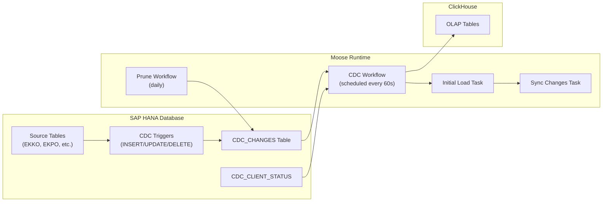

import { Callout, BulletPointsCard, ToggleBlock } from "@/components/mdx";

# SAP HANA CDC to ClickHouse

<Callout type="info" title="TL;DR">
* Trigger-based CDC captures INSERT/UPDATE/DELETE operations from SAP HANA tables in real-time
* Auto-generate Pydantic models from SAP HANA schema using the introspection CLI
* Initial load + incremental sync via Moose workflows with built-in retry logic
* Multi-client support enables independent progress tracking for different consumers

This guide walks you through setting up a complete CDC pipeline from SAP HANA to ClickHouse using Moose workflows.
</Callout>

## Overview

### What is CDC and Why Use It?

Change Data Capture (CDC) is a technique for tracking row-level changes (inserts, updates, deletes) in a source database and replicating them to a destination system. For SAP HANA to ClickHouse pipelines, CDC provides:

- **Real-time analytics**: Query the latest SAP data in ClickHouse without impacting production SAP HANA performance
- **Historical tracking**: Capture every change for audit trails and point-in-time analysis
- **Incremental sync**: Only transfer changed data, reducing bandwidth and processing time
- **Operational isolation**: Analytical workloads run on ClickHouse while SAP HANA handles transactions

### Architecture

This CDC implementation uses database triggers to capture changes, storing them in a dedicated CDC table that Moose workflows read and sync to ClickHouse.



### Key Concepts

**Trigger-Based Capture**: Database triggers fire on INSERT, UPDATE, and DELETE operations, serializing row data as JSON and writing to a central CDC_CHANGES table.

**Change Events**: Each captured change includes:
- `CHANGE_ID`: Auto-incrementing identifier for ordering
- `TRIGGER_TYPE`: Operation type (INSERT, UPDATE, DELETE)
- `OLD_VALUES` / `NEW_VALUES`: JSON-serialized row data
- `CHANGE_TIMESTAMP`: When the change occurred
- `TRANSACTION_ID`: SAP HANA transaction identifier

**Client Status Tracking**: The CDC_CLIENT_STATUS table tracks each consumer's progress through the change stream, enabling:
- Multiple independent consumers reading at different rates
- Resume from last position after failures
- Table-level status (NEW vs ACTIVE)

## Prerequisites

<BulletPointsCard
  title="Before you begin"
  bulletStyle="check"
  compact={true}
  bullets={[
    {
      title: "Python Moose project initialized",
      description: "Run `moose init my-project python` if you don't have one"
    },
    {
      title: "SAP HANA database access",
      description: "With privileges to create triggers and tables in the CDC schema"
    },
    {
      title: "Network connectivity",
      description: "Your Moose runtime must be able to reach SAP HANA on the configured port"
    },
    {
      title: "Familiarity with data warehouses guide",
      description: "This guide assumes you understand dimensional modeling and Moose workflows",
      link: { text: "Read the guide", href: "/guides/data-warehouses" }
    }
  ]}
/>

### Required Dependencies

Install the SAP HANA CDC connector and its dependencies:

```bash
pip install hdbcli moose-lib clickhouse-connect tenacity python-dotenv
```

| Package | Purpose |
|---------|---------|
| `hdbcli` | SAP HANA database driver |
| `moose-lib` | Moose framework library |
| `clickhouse-connect` | ClickHouse client for direct inserts |
| `tenacity` | Retry logic with exponential backoff |
| `python-dotenv` | Environment variable management |

## Quick Start

### 1. Install the Pipeline

Run the registry installer to download the SAP HANA CDC pipeline:

```bash
bash -i <(curl https://registry.514.ai/install.sh) --type pipeline sap_hana_cdc_to_clickhouse v1 514-labs python default
```

This creates a new directory with the complete pipeline including workflows, initialization scripts, and utilities.

### 2. Install Dependencies

Navigate to the pipeline directory and install Python dependencies:

```bash
cd sap_hana_cdc_to_clickhouse
pip install -r requirements.txt
```

### 3. Set Environment Variables

Create a `.env` file in your project root:

```bash
# SAP HANA Connection
SAP_HANA_HOST=your-sap-hana-host.com
SAP_HANA_PORT=30015
SAP_HANA_USERNAME=CDC_USER
SAP_HANA_PASSWORD=your-secure-password

# CDC Configuration
SAP_HANA_CLIENT_ID=moose_cdc_client
SAP_HANA_SOURCE_SCHEMA=SAPHANADB
SAP_HANA_CDC_SCHEMA=SAPHANADB
SAP_HANA_TABLES=EKKO,EKPO,MARA,VBAK,VBAP

# Optional: Retention for CDC table pruning
SAP_HANA_CDC_RETENTION_DAYS=7
```

<Callout type="warning" title="Security">
Never commit `.env` files to version control. Add `.env` to your `.gitignore` file.
</Callout>

### 4. Initialize CDC Infrastructure

Run the initialization script to create triggers and CDC tables in SAP HANA:

```bash
python init_cdc.py --init-all --tables EKKO,EKPO,MARA
```

This command:
1. Introspects table schemas from SAP HANA
2. Generates Pydantic models in `app/ingest/cdc.py`
3. Creates CDC_CHANGES and CDC_CLIENT_STATUS tables
4. Creates INSERT/UPDATE/DELETE triggers for each table

### 5. Start Moose Development Server

```bash
moose dev
```

The CDC workflow runs automatically every 60 seconds, performing:
1. Initial load for any NEW tables (full table copy)
2. Incremental sync of changes from the CDC_CHANGES table

### 6. Verify the Pipeline

Check that data is flowing:

```bash
# Query ClickHouse to verify data
moose query "SELECT count() FROM ekko"

# Check CDC status
moose query "SELECT * FROM CDC_CLIENT_STATUS WHERE CLIENT_ID = 'moose_cdc_client'"
```

## How CDC Works

### Trigger Creation

When you run `--create-database-triggers`, the connector creates three triggers per table:

```sql
-- Example: INSERT trigger for EKKO table
CREATE TRIGGER EKKO_INSERT_CDC_TRIGGER
AFTER INSERT ON SAPHANADB.EKKO
REFERENCING NEW ROW AS new_row
FOR EACH ROW
BEGIN
    DECLARE new_json NCLOB;
    SELECT :new_row."EBELN", :new_row."BUKRS", ... INTO new_json FROM DUMMY FOR JSON;

    INSERT INTO SAPHANADB.CDC_CHANGES (
        TABLE_SCHEMA, TABLE_NAME, TRIGGER_TYPE, TRANSACTION_ID, OLD_VALUES, NEW_VALUES
    ) VALUES (
        'SAPHANADB', 'EKKO', 'insert', CURRENT_UPDATE_TRANSACTION(), NULL, :new_json
    );
END
```

Similar triggers are created for UPDATE (capturing both old and new values) and DELETE (capturing old values).

### CDC_CHANGES Table Schema

```sql
CREATE TABLE CDC_CHANGES (
    CHANGE_ID BIGINT GENERATED ALWAYS AS IDENTITY PRIMARY KEY,
    TABLE_SCHEMA VARCHAR(128) NOT NULL,
    TABLE_NAME VARCHAR(128) NOT NULL,
    TRIGGER_TYPE VARCHAR(10) NOT NULL,  -- 'insert', 'update', 'delete'
    CHANGE_TIMESTAMP TIMESTAMP DEFAULT CURRENT_TIMESTAMP,
    TRANSACTION_ID VARCHAR(50) NOT NULL,
    OLD_VALUES NCLOB,  -- JSON for UPDATE/DELETE
    NEW_VALUES NCLOB   -- JSON for INSERT/UPDATE
)
```

### CDC_CLIENT_STATUS Table Schema

```sql
CREATE TABLE CDC_CLIENT_STATUS (
    CLIENT_ID VARCHAR(128) NOT NULL,
    SCHEMA_NAME VARCHAR(128) NOT NULL,
    TABLE_NAME VARCHAR(128) NOT NULL,
    LAST_PROCESSED_CHANGE_ID BIGINT DEFAULT 0,
    STATUS VARCHAR(128) NOT NULL,  -- 'new' or 'active'
    CREATED_AT TIMESTAMP DEFAULT CURRENT_TIMESTAMP,
    UPDATED_AT TIMESTAMP DEFAULT CURRENT_TIMESTAMP,
    PRIMARY KEY (CLIENT_ID, SCHEMA_NAME, TABLE_NAME)
)
```

### Table Status Lifecycle

Each table tracked by the CDC system goes through these states:

1. **NEW**: Table is registered but hasn't completed initial load
2. **ACTIVE**: Initial load complete, now processing incremental changes

The workflow handles this automatically:
- NEW tables trigger a full table scan and bulk insert
- ACTIVE tables only process changes after their `LAST_PROCESSED_CHANGE_ID`

## Workflows

### CDC Workflow

The main CDC workflow runs on a schedule (default: every 60 seconds) and orchestrates two tasks:

```python
# app/workflows/cdc.py

from moose_lib import Task, TaskConfig, Workflow, WorkflowConfig, TaskContext

def initial_load_task(ctx: TaskContext[None]) -> None:
    """Load full table data for any tables with status=NEW"""
    connector = get_connector()
    inserter = BatchChangeInserter()

    for table_status in connector.get_client_status():
        if table_status.status == TableStatus.NEW:
            # Paginate through all rows
            offset = 0
            while True:
                rows = connector.get_all_table_rows(
                    table_status.table_name,
                    page_size=100000,
                    offset=offset
                )
                if not rows:
                    break
                inserter.insert_table_data(table_status.table_name, rows)
                offset += len(rows)

            # Mark as ACTIVE after successful load
            connector.infrastructure.set_table_status_active(table_status.table_name)

def sync_changes_task(ctx: TaskContext[None]) -> None:
    """Process incremental changes from CDC_CHANGES table"""
    connector = get_connector()
    batch = connector.get_changes(limit=1000)

    if batch:
        inserter = BatchChangeInserter()
        inserter.insert(batch.changes)
        connector.update_client_status(batch)

# Wire up tasks with dependencies
initial_load_task_instance = Task[None, None](
    name="initial_load",
    config=TaskConfig(
        run=initial_load_task,
        on_complete=[sync_changes_task_instance]
    )
)

cdc_workflow = Workflow(
    name="cdc",
    config=WorkflowConfig(
        starting_task=initial_load_task_instance,
        retries=3,
        timeout=300,
        schedule="@every 60s"
    )
)
```

### Prune Workflow

To prevent the CDC_CHANGES table from growing indefinitely, a daily prune workflow deletes old entries:

```python
# app/workflows/prune.py

def prune_database_task(ctx: TaskContext[None]) -> None:
    retention_days = int(os.getenv("SAP_HANA_CDC_RETENTION_DAYS", "7"))
    connector = get_connector()
    result = connector.prune(older_than_days=retention_days)
    logger.info(f"Pruned {result.entries_deleted} entries older than {result.cutoff_timestamp}")

prune_workflow = Workflow(
    name="prune_database",
    config=WorkflowConfig(
        starting_task=prune_task_instance,
        retries=1,
        timeout="10m",
        schedule="@daily"
    )
)
```

## Configuration Options

### Environment Variables Reference

| Variable | Required | Default | Description |
|----------|----------|---------|-------------|
| `SAP_HANA_HOST` | Yes | `localhost` | SAP HANA server hostname |
| `SAP_HANA_PORT` | No | `30015` | SAP HANA server port |
| `SAP_HANA_USERNAME` | Yes | `SYSTEM` | Database username |
| `SAP_HANA_PASSWORD` | Yes | - | Database password |
| `SAP_HANA_CLIENT_ID` | No | `default_client` | Unique identifier for this CDC consumer |
| `SAP_HANA_TABLES` | Yes | - | Comma-separated list of tables to track |
| `SAP_HANA_SOURCE_SCHEMA` | No | `SAPHANADB` | Schema containing source tables |
| `SAP_HANA_CDC_SCHEMA` | No | `SAPHANADB` | Schema for CDC infrastructure tables |
| `SAP_HANA_CDC_RETENTION_DAYS` | No | `7` | Days to retain CDC entries before pruning |

### Views vs Tables Support

The CDC connector handles both tables and views, with an important distinction:

- **Tables**: Full CDC support with INSERT/UPDATE/DELETE triggers
- **Views**: Initial load only (no triggers, as views are read-only)

The connector automatically detects views and skips trigger creation:

```python
def setup_table_triggers(self) -> None:
    # Filter out views - only create triggers for tables
    tables_only = set(self._filter_tables_only(list(desired_tables)))

    for table in tables_only:
        if self._setup_table_cdc(cursor, table):
            self._update_table_status(cursor, table, TableStatus.NEW)
```

Views are still introspected and can be included in `SAP_HANA_TABLES`. They will receive an initial load but won't capture ongoing changes.

### Multi-Client Setup

Run multiple independent CDC consumers by using different `SAP_HANA_CLIENT_ID` values:

```bash
# Production analytics pipeline
SAP_HANA_CLIENT_ID=prod_analytics

# Real-time dashboard feed
SAP_HANA_CLIENT_ID=realtime_dashboard

# Data science sandbox
SAP_HANA_CLIENT_ID=ds_sandbox
```

Each client maintains its own progress through the change stream, enabling:
- Different sync frequencies
- Independent failure recovery
- Isolated testing without affecting production pipelines

## CLI Operations

The `init_cdc.py` script provides several operations:

### Full Initialization

```bash
python init_cdc.py --init-all --tables EKKO,EKPO,MARA
```

Equivalent to running `--generate-models` and `--create-database-triggers` together.

### Generate Models Only

```bash
python init_cdc.py --generate-models --tables EKKO,EKPO
```

Introspects SAP HANA schemas and generates Pydantic models without creating triggers. Useful for:
- Previewing generated code before deployment
- Regenerating models after schema changes

### Create Database Triggers Only

```bash
python init_cdc.py --create-database-triggers --tables EKKO,EKPO
```

Creates CDC infrastructure (tables and triggers) without regenerating models. Useful when models already exist.

### Reset CDC Status

```bash
python init_cdc.py --reset-cdc-status
```

Resets all tables to `NEW` status, triggering a full re-sync on next workflow run. Use with caution in production.

### Drop CDC Infrastructure

```bash
python init_cdc.py --drop-cdc
```

Removes all triggers and CDC tables. **This is destructive** and will lose all pending changes.

### Recreate CDC Infrastructure

```bash
python init_cdc.py --recreate-cdc-tables
```

Drops and recreates CDC infrastructure. Combines `--drop-cdc` followed by `--create-database-triggers`.

### Load Tables from File

```bash
python init_cdc.py --init-all --tables-from-file tables.txt
```

Where `tables.txt` contains one table name per line:

```
EKKO
EKPO
MARA
VBAK
VBAP
```

## Troubleshooting

### Common Issues

<ToggleBlock openText="Show troubleshooting guide" closeText="Hide troubleshooting guide">

**Connection Refused**

```
hdbcli.dbapi.Error: (-10709, 'Connection failed')
```

- Verify `SAP_HANA_HOST` and `SAP_HANA_PORT` are correct
- Check network connectivity: `telnet your-host 30015`
- Ensure the SAP HANA instance is running

**Insufficient Privileges**

```
hdbcli.dbapi.Error: insufficient privilege: CREATE TRIGGER
```

The CDC user needs these privileges:
```sql
GRANT CREATE ANY ON SCHEMA SAPHANADB TO CDC_USER;
GRANT INSERT, UPDATE, DELETE ON SCHEMA SAPHANADB TO CDC_USER;
GRANT SELECT ON SYS.TRIGGERS TO CDC_USER;
```

**Table Not Found**

```
ValueError: Table 'EKKO' not found in schema 'SAPHANADB'
```

- Verify the table exists: `SELECT * FROM TABLES WHERE TABLE_NAME = 'EKKO'`
- Check schema name matches `SAP_HANA_SOURCE_SCHEMA`
- Table names are case-sensitive in SAP HANA

**Trigger Already Exists**

```
hdbcli.dbapi.Error: trigger already exists
```

The connector checks for existing triggers before creation, but if you hit this:
```bash
python init_cdc.py --recreate-cdc-tables --tables EKKO
```

**Memory Errors During Initial Load**

For large tables, reduce the page size:

```python
# In your workflow, adjust page_size
rows = connector.get_all_table_rows(
    table_status.table_name,
    page_size=10000,  # Smaller batches
    offset=offset
)
```

**Stale Connection Errors**

The connector includes connection pool management with retry logic:

```python
connector.refresh_connection()
```

This is called automatically on connection errors, but you can trigger it manually if needed.

</ToggleBlock>

### Monitoring

Check CDC health by querying the status tables:

```sql
-- Overall CDC lag
SELECT
    (SELECT MAX(CHANGE_TIMESTAMP) FROM CDC_CHANGES) AS latest_change,
    (SELECT MAX(UPDATED_AT) FROM CDC_CLIENT_STATUS WHERE CLIENT_ID = 'moose_cdc_client') AS last_processed,
    SECONDS_BETWEEN(
        (SELECT MAX(UPDATED_AT) FROM CDC_CLIENT_STATUS WHERE CLIENT_ID = 'moose_cdc_client'),
        (SELECT MAX(CHANGE_TIMESTAMP) FROM CDC_CHANGES)
    ) AS lag_seconds
FROM DUMMY;

-- Pending changes per table
SELECT
    ct.TABLE_NAME,
    COUNT(*) AS pending_changes
FROM CDC_CHANGES ct
LEFT JOIN CDC_CLIENT_STATUS cs
    ON ct.TABLE_NAME = cs.TABLE_NAME
    AND cs.CLIENT_ID = 'moose_cdc_client'
WHERE ct.CHANGE_ID > COALESCE(cs.LAST_PROCESSED_CHANGE_ID, 0)
GROUP BY ct.TABLE_NAME;

-- CDC table size
SELECT COUNT(*) AS total_entries FROM CDC_CHANGES;
```

## Summary

You now have a complete CDC pipeline from SAP HANA to ClickHouse using Moose workflows. The key components are:

1. **Trigger-based capture**: Database triggers serialize changes to a CDC_CHANGES table
2. **Client status tracking**: Each consumer maintains its position independently
3. **Initial load + incremental sync**: Workflows handle both full table copies and ongoing changes
4. **Automatic pruning**: Daily cleanup prevents unbounded table growth

## Next Steps

- **Add more tables**: Update `SAP_HANA_TABLES` and rerun `--init-all`
- **Customize sync frequency**: Adjust `schedule="@every 60s"` in the workflow
- **Build dashboards**: Query your ClickHouse tables with Metabase or Grafana
- **Set up alerting**: Monitor CDC lag and trigger alerts when it exceeds thresholds

## Related Resources

- [Data Warehouses Guide](/guides/data-warehouses) - Build analytical data models
- [Moose Workflows](/moosestack/workflows) - Learn more about workflow orchestration
- [ClickHouse Configuration](/moosestack/configuration/clickhouse) - Tune ClickHouse settings
