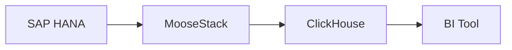

# SAP Reporting Without the Cost

SAP custom reporting costs $10K-50K per engagement. Data integration requires expensive proprietary ETL tools.

Build the same infrastructure in 2 hours on your local machine: MooseStack + ClickHouse.

## Architecture



## Configuration

```yaml
# moose-config.yaml
source:
  hostname: sap.example.com
  user: username
  password: password
  port: 30015
  tables: [MARA, MARC, MBEW]
destination: clickhouse://analytics
streaming: true
```

That's it. MooseStack handles CDC, schema, and streaming.

## Implementation

1. **Deploy CDC** (30 min) - Capture SAP changes in real-time
2. **Run Pipeline** (30 min) - Stream to ClickHouse warehouse
3. **Connect BI** (1 hour) - Build dashboards in Superset/Tableau/Power BI

**2 hours total** vs. 12 weeks with traditional consulting.

---

[INSERT: Used by X manufacturing companies to reduce SAP reporting costs by 85%]

## Get Started

→ Install: `pip install moosestack`
→ Plugin: [sap-hana-cdc-to-clickhouse]
→ Tutorials: [Coming soon]

<!-- Designer: This content fits on 1 page -->
