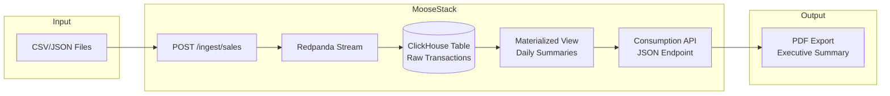

# Static Report Generation

This guide covers building data-intensive static reports—from understanding when they're the right choice to hands-on implementation with Moose and ClickHouse.

## What you'll learn

- Why static reports remain essential despite interactive dashboards
- Business use cases: compliance, data monetization, analyst workflows
- Define type-safe data models that auto-provision infrastructure
- Ingest CSV and JSON files into ClickHouse
- Create materialized views for pre-aggregated analytics
- Build parameterized APIs for report data
- Generate PDF reports from aggregated data

## How to use this guide

Different starting points depending on what you need:

**Business leaders and operations teams:** Read Parts 1-2 for the business case and use cases. Skim Part 3 for a concrete example, then hand off to developers.

**Developers:** Skip to Part 4 and start building. Parts 1-2 have business context if you need it later.

**Data engineers evaluating this approach:** Parts 1-2 cover the business case, Part 3 is a concrete scenario, Parts 4-8 are implementation, Part 9 explains the underlying concepts.

## Prerequisites

- Node.js 20+ (required for pdfmake 0.3)
- Docker Desktop running
- pnpm (`npm install -g pnpm`)
- Basic TypeScript and SQL knowledge

### Verify your environment

Before starting, confirm your tools are ready:

```bash
node --version   # Should be v20.x.x or higher
```

```bash
docker --version
docker info > /dev/null 2>&1 && echo "Docker is running" || echo "Docker is NOT running"
```

If Docker isn't running, start Docker Desktop before proceeding.

### Tips for success

**Keep `moose dev` running throughout the tutorial.** Use a dedicated terminal tab or window. If you accidentally close it, run `moose dev` again from the project directory.

**First startup takes longer.** Docker images download on first run (2-5 minutes depending on connection). Subsequent starts are much faster.

**Services need time to initialize.** After creating new APIs or views, wait 20-30 seconds before testing. Watch the `moose dev` terminal for compilation messages.

**File watching is automatic.** Save a file and the system rebuilds—no manual restart needed. Type errors block startup, so fix them before proceeding.

**Logs are invaluable for debugging.** All logs are stored in `~/.moose/YYYY-MM-DD-cli.log`. Watch in real-time:

```bash
tail -f ~/.moose/$(date +%Y-%m-%d)-cli.log
```

**Verify data at each stage.** Don't assume it worked—validate with queries. Test APIs with `curl` before running scripts that depend on them.

---

## Part 1: What are static reports?

Static reports are pre-generated snapshots of data, delivered as fixed artifacts—most commonly PDF or Excel files, though CSV exports and dashboard views are also common formats.

These reports capture what the data looked like at a specific moment in time, with a defined and unchanging scope, metric logic, and layout. Once generated, a static report remains frozen until it is explicitly regenerated.

### Key characteristics

- Pre-generated snapshots delivered as fixed artifacts (PDF, Excel, CSV)
- Capture point-in-time data with defined, unchanging scope and metric logic
- Provide a stable, frozen reference preferred by many stakeholders over interactive dashboards
- Support auditability, sign-off workflows, and compliance requirements
- Act as portable handoff layers for departments like Finance, Operations, and Compliance

### Why static reports matter

Despite the proliferation of interactive dashboards and real-time analytics tools, static reports remain essential to business operations:

| Reason | Business Value |
|--------|----------------|
| Stable reference points | Stakeholders prefer frozen documents they can review, annotate, and archive rather than dashboards that show different numbers each time |
| Reduced version confusion | When everyone references the same PDF from the same date, there's no ambiguity about which numbers are being discussed |
| Compliance and auditability | Regulatory requirements often mandate immutable records that can be retrieved and verified years later |
| Universal accessibility | Not everyone has system access—many stakeholders need a PDF they can email or an Excel file they can manipulate offline |
| Period-close reliability | Financial close processes depend on definitive snapshots that won't change after sign-off |

---

## Part 2: Business use cases

Understanding where static reports create value helps organizations prioritize their data infrastructure investments.

### Selling data assets to third parties

Static reports enable revenue generation through data monetization:

**Data archival and retrieval:**
- Medical patient record retrieval for healthcare providers and researchers
- Mortgage records and refinancing documentation for financial institutions
- Historical transaction records for audits and legal proceedings

**Data broker services:**
- Medical research records for pharmaceutical companies and academic institutions
- Vehicle history reports (CarFax-style) for automotive transactions
- Credit history reports for lending decisions
- Purchase history for marketing and customer analytics
- Real estate transaction history for property valuations

### Compliance and regulated reporting

For organizations in regulated industries, static reports provide critical capabilities:

- Immutable, versioned records that support approval workflows and retention policies
- External sharing capabilities without requiring system access
- Reproducibility through stored run metadata including dataset version, query parameters, pipeline run timestamp, and result hash
- Easy cross-department distribution while maintaining audit trails

### Analyst workflows

Many analysts and business users prefer working with exported data rather than interactive dashboards:

- Exporting curated datasets (not raw data) into Excel or Google Sheets
- Faster pivot table creation and data exploration
- Reconciliation workflows comparing multiple data sources
- Annotation and commentary that lives alongside the data

### Automations and operational handoffs

Static reports serve as predictable, machine-readable inputs to downstream processes:

- Email-to-ticket systems that process report contents
- Slack integrations that distribute key metrics
- RPA (Robotic Process Automation) tools that consume standardized formats
- System migrations enabling side-by-side comparison between old and new systems

### Understanding the challenges

Before investing in static report generation capabilities, understand the technical challenges:

| Challenge | Impact |
|-----------|--------|
| Data discovery | Teams spend hours finding duplicates, missing fields, and inconsistent definitions before reports can be generated |
| Data cleaning | Format inconsistencies, NULL handling, and duplicate entities cause report errors |
| Multiple formats | Same logical data arrives in different structures from different sources |
| Validation and trust | Without structured UAT and golden records, errors reach executives or regulators |
| Timing and orchestration | Reports generated before data is complete deliver flawed results |

### Evaluating solutions

When evaluating static report generation solutions, consider:

| Capability | What to Look For |
|------------|------------------|
| Data quality | Automated profiling, duplicate detection, validation rules |
| Format support | Native handling of Excel, PDF, CSV, JSON, XML |
| Audit trail | Complete lineage from source to report with timestamps |
| Scalability | OLAP-based processing for large datasets |
| Orchestration | Dependency management, freshness checks, retry logic |
| Self-service | User-friendly export interfaces with consistent formatting |

### Why Moose for static reports?

Moose addresses these challenges with a developer-first approach:

| Traditional Approach | With Moose |
|---------------------|------------|
| Manual ClickHouse setup | Data model → auto infrastructure |
| Custom ingestion code | Auto-generated `/ingest` API |
| Hand-written DDL | Type-safe schema from TypeScript |
| Slow iteration cycles | Hot reload, local-first development |
| Manual API boilerplate | Type-safe Consumption APIs |
| Risky production changes | Lifecycle management prevents accidents |

---

## Part 3: The scenario

### Apex Retail daily sales consolidation

You're a data engineer at Apex Retail, a chain with 12 stores across 4 regions. Each night, store POS (point-of-sale) systems export the day's sales as CSV or JSON files.

**The current process:** An analyst downloads files from each store, copies data into Excel, and emails a summary to regional managers. Takes 2 hours every morning. When the analyst is sick, reports don't go out.

**What you'll build:** A pipeline that ingests store uploads, stores them in ClickHouse, pre-aggregates daily summaries, and generates PDF reports. About 60 lines of TypeScript.

### Why automate?

| Factor | Manual | Automated |
|--------|--------|-----------|
| Time per report | 2 hours | < 1 minute |
| Annual analyst hours | 500+ | ~10 (maintenance) |
| Error rate | 5-10% | 0% |
| Availability | One person | 24/7 |
| Audit trail | None | Git history |
| Scalability | Linear | Constant |

Sound familiar?

- Reports late when the analyst is out
- "The numbers don't match" disputes
- Hours debugging Excel formulas
- Can't pull last Tuesday's numbers quickly

**Why not existing tools?**

| Approach | Problem |
|----------|---------|
| Excel macros | No version control, breaks when formats change |
| BI dashboards | Good for exploration, PDF export still needs code |
| Scheduled SQL | Raw SQL gets unmaintainable |
| Manual scripts | No streaming, no type safety |

**This approach:**
- Type-safe models catch schema mismatches at compile time
- Streaming ingestion via Redpanda
- Materialized views make queries instant
- Git history tracks all changes
- Same inputs produce same outputs

### Architecture



### End result

1. File loader script for CSV/JSON ingestion
2. Pre-computed daily aggregations (millisecond queries)
3. Parameterized API endpoint
4. PDF report generator

---

## Part 4: Setup and data model

### Step 1: Install Moose CLI

```bash
bash -i <(curl -fsSL https://fiveonefour.com/install.sh) moose
```

Verify:

```bash
moose --version
```

### Step 2: Initialize project

```bash
moose init sales-reports --language typescript
cd sales-reports
pnpm install
```

Moose uses pnpm workspaces. `npm install` won't work.

### Step 3: Start dev server

**Open a new terminal window** (or terminal tab) and run:

```bash
cd sales-reports
moose dev
```

> **Important:** `moose dev` runs continuously and doesn't exit. Keep this terminal open for the entire tutorial. You'll run all other commands (curl, scripts, etc.) in a separate terminal.

The dev server auto-reloads on file changes. First run may auto-upgrade the CLI to match moose-lib version.

#### Wait for services to start

**First startup takes 2-5 minutes** while Docker images download. Subsequent starts are faster (10-30 seconds).

Watch the terminal for these indicators that services are ready:
- `✓ ClickHouse is ready`
- `✓ Redpanda is ready`
- `HTTP server started on port 4000`

#### Verify services

In your **other terminal**, test the services:

```bash
# Test the API server
curl http://localhost:4000/health
```

Should return `{"status":"ok"}`.

```bash
curl http://localhost:18123/ping
```

Should return `Ok.`

If checks fail, wait another 20-30 seconds. Common startup issues:
- **Connection refused:** Services still initializing—wait longer
- **Docker errors:** Ensure Docker Desktop is running (check menu bar icon on Mac)

**What started:**

| Service | Port | Description |
|---------|------|-------------|
| HTTP Server | 4000 | API endpoints |
| ClickHouse | 18123 | Columnar database for analytics |
| Redpanda | 19092 | Message queue for data streaming (Kafka-compatible) |
| Temporal | 8080 | Scheduled task runner |

All in Docker. No cloud accounts needed.

> **Tip:** ClickHouse has a web UI at http://localhost:18123/play for running queries interactively—useful for debugging.

### Step 4: Define data model

Create `app/ingest/SalesTransaction.ts`:

```typescript
import { IngestPipeline } from "@514labs/moose-lib";

// Define the data model - matches store POS export format
export interface SalesTransaction {
  // Unique identifier
  transactionId: string;  // e.g., "TXN-W001-20250115-0001"

  // Timestamp - the star of time-series analytics
  saleTimestamp: Date;

  // Store & location
  storeId: string;             // e.g., "STORE-W001"
  region: string;              // West, East, Central, South

  // Product info
  productId: string;
  productCategory: string;     // Electronics, Clothing, Food, Home, Sports

  // Customer (optional - from loyalty card)
  customerId: string;

  // Transaction amounts
  quantity: number;
  unitPrice: number;
  totalAmount: number;
}

// IMPORTANT: Always include the type parameter <SalesTransaction> - it's required
// for the compiler plugin to generate the correct schema
export const salesPipeline = new IngestPipeline<SalesTransaction>("sales", {
  ingestApi: true,
  stream: true,
  table: {
    // Time-first ordering for efficient range queries
    // The first field becomes the primary key in ClickHouse
    orderByFields: ["saleTimestamp", "transactionId"],
  }
});
```

The `IngestPipeline` must include the type parameter. Without it: "Supply the type param T so that the schema is inserted by the compiler plugin."

This declaration creates:
- ClickHouse table matching the interface
- Redpanda stream
- REST endpoint at `/ingest/sales`

### Step 5: Export models

Update `app/index.ts`:

```typescript
export * from "./ingest/SalesTransaction";
```

> **Important:** Every new model, view, or API must be exported from `app/index.ts`. Forgetting this is a common mistake—without the export, tables and endpoints won't be created, and there won't be any errors in the logs.

#### Verify

Check the `moose dev` terminal for:

```
✓ Detected model changes
✓ Created table: sales
✓ Created stream: sales
✓ Registered API endpoint: /ingest/sales
```

If not visible, check that the file saved and look for TypeScript errors.

From that one interface, Moose inferred the ClickHouse schema, created the table with time-first ordering, set up a Redpanda topic, and generated a REST endpoint with validation.

### Step 6: Test ingestion

```bash
curl -X POST http://localhost:4000/ingest/sales \
  -H "Content-Type: application/json" \
  -d '{
    "transactionId": "TXN-W001-20250115-0001",
    "saleTimestamp": "2025-01-15T10:30:00Z",
    "storeId": "STORE-W001",
    "region": "West",
    "productId": "PROD-ELE-001",
    "productCategory": "Electronics",
    "customerId": "CUST-1001",
    "quantity": 2,
    "unitPrice": 299.99,
    "totalAmount": 599.98
  }'
```

Returns `{"success": true}`.

The data flows through Redpanda into ClickHouse.

Verify in ClickHouse (credentials are dev defaults, don't use in production):

```bash
curl -s "http://localhost:18123/?user=panda&password=pandapass" \
  -d "SELECT * FROM local.sales FORMAT Pretty"
```

---

## Part 5: File ingestion

Stores upload CSV or JSON files rather than calling APIs directly. Here's a file loader.

### Step 1: Install dependencies

```bash
pnpm add papaparse date-fns
pnpm add -D @types/papaparse ts-node
```

`ts-node` lets you run TypeScript files directly without compiling first.

### Step 2: Create file loader

Create `scripts/load-file.ts`:

```typescript
import Papa from "papaparse";
import fs from "fs";
import path from "path";

// Note: saleTimestamp can be string or Date because papaparse dynamicTyping
// converts ISO date strings to Date objects
interface SalesTransaction {
  transactionId: string;
  saleTimestamp: string | Date;
  storeId: string;
  region: string;
  productId: string;
  productCategory: string;
  customerId: string | null;  // null for customers without loyalty cards
  quantity: number;
  unitPrice: number;
  totalAmount: number;
}

async function loadFile(filePath: string): Promise<void> {
  const ext = path.extname(filePath).toLowerCase();
  const content = fs.readFileSync(filePath, "utf-8");

  let records: SalesTransaction[];

  if (ext === ".csv") {
    const { data } = Papa.parse<SalesTransaction>(content, {
      header: true,
      dynamicTyping: true,
    });
    // Filter empty rows and normalize fields
    records = data
      .filter((r) => r.transactionId)
      .map((r) => ({
        ...r,
        // papaparse dynamicTyping converts Date objects - convert back to ISO string
        saleTimestamp: r.saleTimestamp instanceof Date
          ? r.saleTimestamp.toISOString()
          : r.saleTimestamp,
        // papaparse dynamicTyping converts empty CSV fields to null
        // but the API expects empty strings for optional string fields
        customerId: r.customerId ?? "",
      }));
  } else if (ext === ".json") {
    const parsed = JSON.parse(content);
    const rawRecords: SalesTransaction[] = Array.isArray(parsed) ? parsed : [parsed];
    // Apply same normalization as CSV: filter empty rows and normalize fields
    records = rawRecords
      .filter((r) => r.transactionId)
      .map((r) => ({
        ...r,
        // Normalize null customerId to empty string (API expects string, not null)
        customerId: r.customerId ?? "",
      }));
  } else {
    throw new Error(`Unsupported file format: ${ext}`);
  }

  console.log(`Parsed ${records.length} records from ${filePath}`);

  // Send records to ingest API (collecting errors for partial failure handling)
  const errors: Array<{ index: number; error: string }> = [];
  for (let i = 0; i < records.length; i++) {
    const response = await fetch("http://localhost:4000/ingest/sales", {
      method: "POST",
      headers: { "Content-Type": "application/json" },
      body: JSON.stringify(records[i]),
    });

    if (!response.ok) {
      errors.push({ index: i, error: response.statusText });
    }
  }

  if (errors.length > 0) {
    console.error(`Failed to ingest ${errors.length} records:`, errors);
  }
  console.log(`Successfully loaded ${records.length - errors.length} of ${records.length} records`);
}

// CLI execution
const filePath = process.argv[2];
if (!filePath) {
  console.error("Usage: pnpm exec ts-node scripts/load-file.ts <path-to-file>");
  process.exit(1);
}

loadFile(filePath).catch(console.error);
```

This sends records one at a time. For production, batch them.

### Step 3: Create sample data

Create `sample-data/west-store-001.csv`:

```csv
transactionId,saleTimestamp,storeId,region,customerId,productId,productCategory,quantity,unitPrice,totalAmount
TXN-W001-20250115-0001,2025-01-15T09:15:00Z,STORE-W001,West,CUST-1001,PROD-ELE-001,Electronics,2,299.99,599.98
TXN-W001-20250115-0002,2025-01-15T09:32:00Z,STORE-W001,West,CUST-1002,PROD-CLO-015,Clothing,1,49.99,49.99
TXN-W001-20250115-0003,2025-01-15T10:05:00Z,STORE-W001,West,,PROD-FOO-042,Food,3,12.99,38.97
TXN-W001-20250115-0004,2025-01-15T10:45:00Z,STORE-W001,West,CUST-1003,PROD-HOM-008,Home,1,89.99,89.99
TXN-W001-20250115-0005,2025-01-15T11:20:00Z,STORE-W001,West,CUST-1004,PROD-SPO-022,Sports,2,34.99,69.98
TXN-W001-20250115-0006,2025-01-15T12:00:00Z,STORE-W001,West,,PROD-ELE-055,Electronics,1,149.99,149.99
TXN-W001-20250115-0007,2025-01-15T13:30:00Z,STORE-W001,West,CUST-1005,PROD-CLO-033,Clothing,3,29.99,89.97
TXN-W001-20250115-0008,2025-01-15T14:15:00Z,STORE-W001,West,CUST-1001,PROD-FOO-018,Food,5,8.99,44.95
TXN-W001-20250115-0009,2025-01-15T15:45:00Z,STORE-W001,West,CUST-1006,PROD-HOM-041,Home,1,199.99,199.99
TXN-W001-20250115-0010,2025-01-15T16:30:00Z,STORE-W001,West,,PROD-ELE-012,Electronics,1,599.99,599.99
```

Empty `customerId` = no loyalty card.

### Step 4: Load sample data

```bash
mkdir -p sample-data
# Create the CSV file above, then:
pnpm exec ts-node scripts/load-file.ts sample-data/west-store-001.csv
```

> **Tip:** You can also add a script to `package.json`: `"load-file": "ts-node scripts/load-file.ts"` and run `pnpm run load-file sample-data/west-store-001.csv`.

Output:
```
Parsed 10 records from sample-data/west-store-001.csv
Successfully loaded 10 records
```

Verify:

```bash
curl -s "http://localhost:18123/?user=panda&password=pandapass" \
  -d "SELECT count() FROM local.sales"
```

> **Note:** Running the file loader multiple times creates duplicate records—ClickHouse doesn't enforce unique constraints. To start fresh, stop `moose dev` and remove the project's Docker volumes. **Caution:** `docker volume prune` deletes *all* unused volumes on your machine. Instead, use `docker volume ls` to list volumes, identify the ones for your project (typically containing `clickhouse` or `redpanda`), and remove them selectively with `docker volume rm <volume_name>`.

### Step 5: Add validation (recommended)

Production data is messy. Add validation to catch issues early.

Add to `scripts/load-file.ts`:

```typescript
// Add this validation function before the loadFile function
import { parseISO, isValid } from "date-fns";

interface ValidationError {
  row: number;
  field: string;
  message: string;
}

function validateRecord(record: SalesTransaction, index: number): ValidationError[] {
  const errors: ValidationError[] = [];

  // Required fields
  if (!record.transactionId) {
    errors.push({ row: index, field: "transactionId", message: "Missing required field" });
  }
  if (!record.saleTimestamp) {
    errors.push({ row: index, field: "saleTimestamp", message: "Missing required field" });
  }
  if (!record.storeId) {
    errors.push({ row: index, field: "storeId", message: "Missing required field" });
  }

  // Date validation - handle both string and Date types
  // Note: papaparse dynamicTyping converts ISO dates to Date objects
  if (record.saleTimestamp) {
    let parsed: Date | null = null;
    if (record.saleTimestamp instanceof Date) {
      parsed = record.saleTimestamp;
    } else if (typeof record.saleTimestamp === "string") {
      parsed = parseISO(record.saleTimestamp);
    } else {
      errors.push({ row: index, field: "saleTimestamp", message: "Invalid date type" });
    }
    // Only validate parsed date if we successfully parsed it
    if (parsed !== null) {
      if (!isValid(parsed)) {
        errors.push({ row: index, field: "saleTimestamp", message: "Invalid date format (expected ISO 8601, e.g., 2025-01-15T09:00:00Z)" });
      } else if (parsed > new Date()) {
        errors.push({ row: index, field: "saleTimestamp", message: "Future dates not allowed" });
      }
    }
  }

  // Numeric validation - use Number.isFinite() to catch NaN/undefined
  if (!Number.isFinite(record.totalAmount)) {
    errors.push({ row: index, field: "totalAmount", message: "Amount must be a valid number" });
  } else if (record.totalAmount < 0) {
    errors.push({ row: index, field: "totalAmount", message: "Negative amount not allowed" });
  }

  if (!Number.isFinite(record.quantity)) {
    errors.push({ row: index, field: "quantity", message: "Quantity must be a valid number" });
  } else if (record.quantity <= 0) {
    errors.push({ row: index, field: "quantity", message: "Quantity must be positive" });
  }

  if (!Number.isFinite(record.unitPrice)) {
    errors.push({ row: index, field: "unitPrice", message: "Unit price must be a valid number" });
  }

  // Business rule validation - only check if all numeric fields are valid
  if (Number.isFinite(record.quantity) && Number.isFinite(record.unitPrice) && Number.isFinite(record.totalAmount)) {
    const expectedTotal = record.quantity * record.unitPrice;
    if (Math.abs(record.totalAmount - expectedTotal) > 0.01) {
      errors.push({
        row: index,
        field: "totalAmount",
        message: `Amount mismatch: expected ${expectedTotal.toFixed(2)}, got ${record.totalAmount}`
      });
    }
  }

  return errors;
}

// Then in loadFile(), add validation before sending:
// const validationErrors = records.flatMap((r, i) => validateRecord(r, i));
// if (validationErrors.length > 0) {
//   console.error("Validation errors:", validationErrors);
//   // Decide: skip invalid rows or abort entire file
// }
```

**Common issues:**

| Issue | Detection | Impact |
|-------|-----------|--------|
| Missing transaction ID | empty/null check | Duplicates, no lineage |
| Invalid date | `parseISO()` + `isValid()` | Silent filter failures |
| Negative amounts | `< 0` check | Wrong totals |
| Math errors | `quantity × unitPrice ≠ totalAmount` | Inconsistent reports |
| Future dates | `> now()` | Skewed analysis |

For production, reject entire files with errors rather than partial loads.

---

## Part 6: Time-series aggregation

Create a materialized view that pre-aggregates daily summaries.

### How ClickHouse materialized views work

- Views execute on INSERT, not on a schedule
- Data aggregates per batch, not globally
- Background merges consolidate eventually, but always use GROUP BY for accurate results
- SummingMergeTree only works for `sum()` and `count()`

### Step 1: Create materialized view

Create `app/views/DailySalesSummary.ts`:

```typescript
import { MaterializedView, sql } from "@514labs/moose-lib";
import { salesPipeline } from "../ingest/SalesTransaction";

// Define the aggregated data model
export interface DailySalesSummary {
  saleDate: Date;
  region: string;
  productCategory: string;
  transactionCount: number;
  totalQuantity: number;
  totalRevenue: number;
}

// Get table reference from pipeline (with null check for TypeScript)
const salesTable = salesPipeline.table;
if (!salesTable) {
  throw new Error("Sales table not configured in pipeline");
}

// Create materialized view with auto-created target table
export const dailySalesMV = new MaterializedView<DailySalesSummary>({
  tableName: "DailySalesSummary",
  materializedViewName: "DailySalesSummary_MV",
  orderByFields: ["saleDate", "region", "productCategory"],
  selectTables: [salesTable],
  selectStatement: sql`
    SELECT
      toStartOfDay(saleTimestamp) AS saleDate,
      region,
      productCategory,
      count() AS transactionCount,
      sum(quantity) AS totalQuantity,
      sum(totalAmount) AS totalRevenue
    FROM ${salesTable}
    GROUP BY saleDate, region, productCategory
  `,
});
```

`toStartOfDay()` truncates to daily granularity. ORDER BY `saleDate` first for efficient date-range queries. Always use GROUP BY when querying.

### Step 2: Update exports

Add to `app/index.ts`:

```typescript
export * from "./ingest/SalesTransaction";
export * from "./views/DailySalesSummary";
```

### Step 3: Verify

```bash
curl -s "http://localhost:18123/?user=panda&password=pandapass" \
  -d "SHOW TABLES FROM local"
```

Should show both `sales` and `DailySalesSummary`.

On each INSERT to `sales`, the materialized view (MV) runs and groups transactions by day, collapsing potentially millions of rows into one per day/region/category. Results land in `DailySalesSummary`. Since MVs aggregate per-batch, you need GROUP BY when querying.

**Performance difference:**

| Target | Rows | Query time |
|--------|------|------------|
| Raw transactions (1 year) | ~10M | 2-10 sec |
| Daily summaries (1 year) | ~1,500 | 10-50 ms |

That's 100x faster because aggregation happens once at insert time, not on every query.

### Step 4: Query aggregated data

Always use GROUP BY:

```bash
curl -s "http://localhost:18123/?user=panda&password=pandapass" -d "
  SELECT
    saleDate,
    region,
    sum(transactionCount) AS transactions,
    sum(totalRevenue) AS revenue
  FROM local.DailySalesSummary
  GROUP BY saleDate, region
  ORDER BY saleDate, region
  FORMAT Pretty
"
```

### ClickHouse time functions

| Function | Output | Use case |
|----------|--------|----------|
| `toStartOfHour(ts)` | `2025-01-15 10:00:00` | Intraday |
| `toStartOfDay(ts)` | `2025-01-15` | Daily |
| `toStartOfWeek(ts, 1)` | `2025-01-13` | Weekly (Monday) |
| `toStartOfMonth(ts)` | `2025-01-01` | Monthly |
| `toHour(ts)` | `10` | Hour-of-day |
| `toDayOfWeek(ts)` | `3` (Wed) | Day-of-week |

---

## Part 7: Report API

Build a consumption API with parameterized date ranges.

### Step 1: Create API

Create `app/apis/salesReport.ts`:

```typescript
import { Api } from "@514labs/moose-lib";
import { dailySalesMV } from "../views/DailySalesSummary";

// Define query parameters
export interface SalesReportParams {
  startDate: string;   // Format: YYYY-MM-DD
  endDate: string;     // Format: YYYY-MM-DD
  region?: string;     // Optional filter
}

// Define response interface
export interface SalesReportResponse {
  saleDate: string;
  region: string;
  productCategory: string;
  transactionCount: number;
  totalQuantity: number;
  totalRevenue: number;
}

// Create the API endpoint
export const salesReportApi = new Api<SalesReportParams, SalesReportResponse[]>(
  "sales-report",
  async ({ startDate, endDate, region }, { client, sql }) => {
    // Access the target table from the materialized view
    const targetTable = dailySalesMV.targetTable;

    // Build query with optional region filter
    // Note: We use separate queries for clarity. Production code could
    // consolidate these using conditional query building.
    let query;
    if (region) {
      query = sql`
        SELECT
          saleDate,
          region,
          productCategory,
          sum(transactionCount) AS transactionCount,
          sum(totalQuantity) AS totalQuantity,
          sum(totalRevenue) AS totalRevenue
        FROM ${targetTable}
        WHERE saleDate BETWEEN ${startDate} AND ${endDate}
          AND region = ${region}
        GROUP BY saleDate, region, productCategory
        ORDER BY saleDate DESC, totalRevenue DESC
      `;
    } else {
      query = sql`
        SELECT
          saleDate,
          region,
          productCategory,
          sum(transactionCount) AS transactionCount,
          sum(totalQuantity) AS totalQuantity,
          sum(totalRevenue) AS totalRevenue
        FROM ${targetTable}
        WHERE saleDate BETWEEN ${startDate} AND ${endDate}
        GROUP BY saleDate, region, productCategory
        ORDER BY saleDate DESC, totalRevenue DESC
      `;
    }

    const result = await client.query.execute<SalesReportResponse>(query);
    return result.json();
  }
);
```

### Step 2: Update exports

Add to `app/index.ts`:

```typescript
export * from "./ingest/SalesTransaction";
export * from "./views/DailySalesSummary";
export * from "./apis/salesReport";
```

Creates a REST endpoint at `/consumption/sales-report` with `startDate`, `endDate`, and optional `region` parameters. Queries the MV (fast), uses parameterized SQL (no injection), returns typed JSON.

PDF generator and dashboards both hit this endpoint.

### Step 3: Test

```bash
curl "http://localhost:4000/consumption/sales-report?startDate=2025-01-01&endDate=2025-01-31"
```

A successful response returns JSON like this:

```json
[
  {
    "saleDate": "2025-01-15",
    "region": "West",
    "productCategory": "Electronics",
    "transactionCount": 3,
    "totalQuantity": 4,
    "totalRevenue": 1349.96
  },
  {
    "saleDate": "2025-01-15",
    "region": "West",
    "productCategory": "Clothing",
    "transactionCount": 2,
    "totalQuantity": 4,
    "totalRevenue": 139.96
  }
]
```

If you get an empty array `[]`, verify data was ingested in Part 3 and the date range matches your data.

Filter by region:

```bash
curl "http://localhost:4000/consumption/sales-report?startDate=2025-01-15&endDate=2025-01-15&region=West"
```

---

## Part 8: PDF export

Transform JSON into PDF.

### Step 1: Install pdfmake

```bash
pnpm add pdfmake
pnpm add -D @types/pdfmake
```

> **Note:** This guide uses pdfmake 0.3.x which requires Node.js 20 LTS (Long-Term Support) or higher. The API changed significantly from version 0.2.x—see the [pdfmake 0.3 documentation](https://pdfmake.github.io/docs/0.3/) for details.

### Step 2: Create PDF generator

Create `scripts/generate-pdf-report.ts`:

```typescript
import { TDocumentDefinitions } from "pdfmake/interfaces";

// Use require for pdfmake as it doesn't have proper ESM exports
const pdfmake = require("pdfmake");

// Use standard PDF fonts (no external files needed)
// Note: In pdfmake 0.3, these are built-in standard fonts
const fonts = {
  Roboto: {
    normal: "Helvetica",
    bold: "Helvetica-Bold",
    italics: "Helvetica-Oblique",
    bolditalics: "Helvetica-BoldOblique",
  },
};

// Register fonts with pdfmake (required for pdfmake 0.3)
pdfmake.addFonts(fonts);

// Report data interface (matches API response)
interface SalesReportRow {
  saleDate: string;
  region: string;
  productCategory: string;
  transactionCount: number;
  totalQuantity: number;
  totalRevenue: number;
}

async function fetchReportData(
  startDate: string,
  endDate: string
): Promise<SalesReportRow[]> {
  const url = `http://localhost:4000/consumption/sales-report?startDate=${startDate}&endDate=${endDate}`;
  const response = await fetch(url);

  if (!response.ok) {
    throw new Error(`API request failed: ${response.statusText}`);
  }

  return response.json();
}

function aggregateByRegion(
  data: SalesReportRow[]
): Map<string, { revenue: number; transactions: number }> {
  const regionMap = new Map<string, { revenue: number; transactions: number }>();

  for (const row of data) {
    const existing = regionMap.get(row.region) || { revenue: 0, transactions: 0 };
    regionMap.set(row.region, {
      revenue: existing.revenue + row.totalRevenue,
      transactions: existing.transactions + row.transactionCount,
    });
  }

  return regionMap;
}

function aggregateByCategory(
  data: SalesReportRow[]
): Map<string, { revenue: number; transactions: number }> {
  const categoryMap = new Map<string, { revenue: number; transactions: number }>();

  for (const row of data) {
    const existing = categoryMap.get(row.productCategory) || {
      revenue: 0,
      transactions: 0,
    };
    categoryMap.set(row.productCategory, {
      revenue: existing.revenue + row.totalRevenue,
      transactions: existing.transactions + row.transactionCount,
    });
  }

  return categoryMap;
}

function formatCurrency(amount: number): string {
  return `$${amount.toLocaleString("en-US", { minimumFractionDigits: 2, maximumFractionDigits: 2 })}`;
}

async function generatePdf(
  data: SalesReportRow[],
  reportDate: string,
  outputPath: string
): Promise<void> {

  // Calculate totals
  const totalRevenue = data.reduce((sum, row) => sum + row.totalRevenue, 0);
  const totalTransactions = data.reduce(
    (sum, row) => sum + row.transactionCount,
    0
  );

  // Aggregate by region and category
  const regionData = aggregateByRegion(data);
  const categoryData = aggregateByCategory(data);

  // Sort regions by revenue descending
  const sortedRegions = Array.from(regionData.entries()).sort(
    (a, b) => b[1].revenue - a[1].revenue
  );

  // Sort categories by revenue descending
  const sortedCategories = Array.from(categoryData.entries()).sort(
    (a, b) => b[1].revenue - a[1].revenue
  );

  const docDefinition: TDocumentDefinitions = {
    content: [
      // Header
      { text: "APEX RETAIL", style: "companyName" },
      { text: "Daily Sales Summary", style: "reportTitle" },
      { text: reportDate, style: "reportDate" },
      {
        canvas: [
          { type: "line", x1: 0, y1: 5, x2: 515, y2: 5, lineWidth: 1 },
        ],
      },

      // Executive Summary
      {
        text: "EXECUTIVE SUMMARY",
        style: "sectionHeader",
        margin: [0, 15, 0, 10],
      },
      {
        columns: [
          {
            text: [
              { text: "Total Revenue: ", bold: true },
              formatCurrency(totalRevenue),
            ],
          },
          {
            text: [
              { text: "Transactions: ", bold: true },
              totalTransactions.toLocaleString(),
            ],
          },
        ],
        margin: [0, 0, 0, 15],
      },

      // Revenue by Region
      {
        text: "REVENUE BY REGION",
        style: "sectionHeader",
        margin: [0, 10, 0, 10],
      },
      {
        table: {
          headerRows: 1,
          widths: ["*", "auto", "auto", "auto"],
          body: [
            [
              { text: "Region", style: "tableHeader" },
              { text: "Revenue", style: "tableHeader" },
              { text: "Transactions", style: "tableHeader" },
              { text: "Share", style: "tableHeader" },
            ],
            ...sortedRegions.map(([region, stats]) => [
              region,
              { text: formatCurrency(stats.revenue), alignment: "right" as const },
              { text: stats.transactions.toLocaleString(), alignment: "right" as const },
              {
                text: `${totalRevenue > 0 ? ((stats.revenue / totalRevenue) * 100).toFixed(1) : "0.0"}%`,
                alignment: "right" as const,
              },
            ]),
          ],
        },
        layout: "lightHorizontalLines",
      },

      // Revenue by Category
      {
        text: "REVENUE BY CATEGORY",
        style: "sectionHeader",
        margin: [0, 20, 0, 10],
      },
      {
        table: {
          headerRows: 1,
          widths: ["*", "auto", "auto", "auto"],
          body: [
            [
              { text: "Category", style: "tableHeader" },
              { text: "Revenue", style: "tableHeader" },
              { text: "Transactions", style: "tableHeader" },
              { text: "Share", style: "tableHeader" },
            ],
            ...sortedCategories.map(([category, stats]) => [
              category,
              { text: formatCurrency(stats.revenue), alignment: "right" as const },
              { text: stats.transactions.toLocaleString(), alignment: "right" as const },
              {
                text: `${totalRevenue > 0 ? ((stats.revenue / totalRevenue) * 100).toFixed(1) : "0.0"}%`,
                alignment: "right" as const,
              },
            ]),
          ],
        },
        layout: "lightHorizontalLines",
      },
    ],

    footer: {
      text: `Generated: ${new Date().toISOString()} | Apex Retail Confidential`,
      style: "footer",
      margin: [40, 0],
    },

    styles: {
      companyName: { fontSize: 24, bold: true, alignment: "center" },
      reportTitle: {
        fontSize: 16,
        alignment: "center",
        margin: [0, 5, 0, 5],
      },
      reportDate: { fontSize: 12, alignment: "center", color: "gray" },
      sectionHeader: { fontSize: 12, bold: true },
      tableHeader: { bold: true, fillColor: "#eeeeee" },
      footer: { fontSize: 8, color: "gray", alignment: "center" },
    },
    defaultStyle: { font: "Roboto", fontSize: 10 },
    pageMargins: [40, 40, 40, 60],
  };

  // Create PDF using pdfmake 0.3 API
  const pdf = pdfmake.createPdf(docDefinition);

  // Use the promise-based write() method (pdfmake 0.3+)
  await pdf.write(outputPath);
  console.log(`PDF report saved to ${outputPath}`);
}

// Main execution
async function main() {
  const startDate = process.argv[2] || "2025-01-01";
  const endDate = process.argv[3] || "2025-12-31";
  const outputPath = process.argv[4] || "apex-retail-report.pdf";

  console.log(`Fetching report data from ${startDate} to ${endDate}...`);

  try {
    const data = await fetchReportData(startDate, endDate);

    if (data.length === 0) {
      console.log("No data found for the specified date range.");
      return;
    }

    console.log(`Generating PDF with ${data.length} data rows...`);
    await generatePdf(data, `${startDate} to ${endDate}`, outputPath);
  } catch (error) {
    console.error("Error generating report:", error);
    process.exit(1);
  }
}

main();
```

### Step 3: Generate report

With `moose dev` running, first verify the API returns data:

```bash
curl "http://localhost:4000/consumption/sales-report?startDate=2025-01-15&endDate=2025-01-15"
```

If the API returns valid JSON (not an empty `[]`), generate the PDF:

```bash
pnpm exec ts-node scripts/generate-pdf-report.ts 2025-01-15 2025-01-15 january-15-report.pdf
```

Expected output:

```
Fetching report data from 2025-01-15 to 2025-01-15...
Generating PDF with 5 data rows...
PDF report saved to january-15-report.pdf
```

> **Tip:** Always test the API with `curl` before running the PDF generator. If you see "No data found" or the script hangs, verify the API returns data for your date range.

### Step 4: Verify

**Actually open the PDF file** to verify formatting and data accuracy—the console output won't show layout issues. The PDF should contain:
- Header with company name and date range
- Executive summary (revenue, transactions)
- Revenue by region with percentages
- Revenue by category with percentages
- Footer with timestamp

PDF generates from pre-aggregated data, so it's fast regardless of raw transaction count.

---

## Part 9: How it works

### Why ClickHouse is fast

ClickHouse is columnar. It stores data differently from row-oriented databases like PostgreSQL.

**Row storage (PostgreSQL):**

```
Record 1: [txn_id=1, timestamp=..., store=W001, region=West, amount=599.98]
Record 2: [txn_id=2, timestamp=..., store=W001, region=West, amount=49.99]
Record 3: [txn_id=3, timestamp=..., store=W002, region=East, amount=89.99]
```

For `SELECT SUM(amount) FROM sales WHERE region='West'`:
1. Read every row from disk
2. Check region
3. Add matching amounts
4. Repeat millions of times

You read 100% of data to use 2% of it.

**Column storage (ClickHouse):**

```
txn_ids:    [1, 2, 3, ...]
timestamps: [2025-01-15T09:00, 2025-01-15T09:30, ...]
stores:     [W001, W001, W002, ...]
regions:    [West, West, East, ...]
amounts:    [599.98, 49.99, 89.99, ...]
```

Same query in ClickHouse:
1. Read only `region` column
2. Read only `amount` column
3. Scan both in parallel
4. Skip everything else

Read 2% of data, use 100% of it. 10-100x faster.

### Why materialized views beat batch jobs

Traditional: scheduled job (cron, Airflow) aggregates data hourly/daily.

```
Raw Data → [Wait for schedule] → Batch Job → Aggregated Table
```

Problems: data goes stale between runs, batch job rescans everything, failures leave gaps until next run, scaling means bigger windows or incremental logic.

**ClickHouse MVs:**

```
Raw Data → [INSERT triggers MV] → Aggregated Table (immediate)
```

1. INSERT into `sales`
2. MV's SELECT runs on new rows immediately
3. Results go into `DailySalesSummary`
4. Synchronous: MV updated by the time INSERT returns

Data stays current, no separate batch system to manage, scales with write volume, and a failed INSERT doesn't leave the MV in a bad state.

### Batch aggregation

MVs process batches, not global data. Multiple inserts for the same day/region/category create multiple rows.

Two inserts for West/Electronics:

```
Batch 1 (morning): 50 transactions → MV inserts [saleDate=2025-01-15, region=West, category=Electronics, count=50, revenue=5000]
Batch 2 (evening): 30 transactions → MV inserts [saleDate=2025-01-15, region=West, category=Electronics, count=30, revenue=3000]
```

Two rows for the same day/region/category. This is why GROUP BY is required:

```sql
-- Wrong: May return multiple rows per day/region
SELECT * FROM DailySalesSummary WHERE saleDate = '2025-01-15'

-- Correct: Consolidates all batches into final aggregates
SELECT saleDate, region, sum(transactionCount), sum(totalRevenue)
FROM DailySalesSummary
GROUP BY saleDate, region
```

SummingMergeTree auto-combines during background merges, but GROUP BY is still safe practice since merges are async.

### When to use what

| Strategy | When | Example |
|----------|------|---------|
| Raw queries | Ad-hoc, &lt;1M rows | Debugging |
| Materialized view | Repeated queries, predictable patterns | Dashboards |
| Pre-aggregated API | External consumers | PDF reports |

If you run the same aggregation twice, make an MV.

### Time-series patterns

**Order by time first:**

```typescript
orderByFields: ["saleTimestamp", "transactionId"]  // Good
orderByFields: ["transactionId", "saleTimestamp"]  // Bad for time queries
```

Time-first ORDER BY means date-range queries skip irrelevant blocks.

**Time granularity:**

| Granularity | Function | Rows/year | Use |
|-------------|----------|-----------|-----|
| Hourly | `toStartOfHour()` | ~8,760 | Intraday |
| Daily | `toStartOfDay()` | ~365 | Standard |
| Weekly | `toStartOfWeek()` | ~52 | Trends |
| Monthly | `toStartOfMonth()` | ~12 | Executive |

Finer = more rows = slower but more detail.

**Multiple levels:**

```
Raw transactions → Hourly MV → Daily MV → Monthly MV
```

Each level 10-30x smaller than the previous.

---

## Wrap-up

### What you built

```
CSV/JSON Files → Ingest API → ClickHouse Table → Materialized View → API → PDF
```

| Component | What it does |
|-----------|--------------|
| `SalesTransaction` model | Type-safe schema, creates ClickHouse table |
| File loader | Parses CSV/JSON, sends to ingest API |
| `DailySalesSummary` MV | Pre-aggregates at insert time |
| `sales-report` API | Date-range queries with filters |
| PDF generator | JSON to formatted PDF |

### Before vs after

**Before:** Analyst downloads 12 CSVs, copies to Excel, writes formulas, formats Word doc, emails PDF. 2+ hours daily. Breaks when analyst is out.

**After:** POS uploads to API, ClickHouse aggregates, API serves any date range, PDF generates in under a second. Runs unattended. Git tracks every change.

In this scenario, that's around 500 hours of manual Excel work eliminated (2 hours/day × 250 days). Your actual savings depend on your current process. The code is deterministic, so the same inputs produce the same outputs. And since it's just querying a database, adding more stores doesn't change how long reports take to generate.

### Performance

| Operation | Row DB | Moose + ClickHouse |
|-----------|--------|-------------------|
| Transaction scan | Seconds-minutes | Milliseconds |
| Daily aggregation | 10-30+ sec | &lt;100ms |
| Report generation | Minutes | &lt;1 sec |

### Next steps

- Add dimension tables (customer, product, store)
- Create hourly/weekly/monthly MVs
- Add Excel export with ExcelJS
- Schedule delivery with Temporal
- Deploy to Boreal Cloud

---

## Reference

### Sample queries

**Daily revenue by region:**

```sql
SELECT
  saleDate,
  region,
  sum(totalRevenue) AS revenue,
  sum(transactionCount) AS transactions
FROM local.DailySalesSummary
GROUP BY saleDate, region
ORDER BY saleDate DESC, revenue DESC;
```

**Hourly pattern (raw data):**

```sql
SELECT
  toHour(saleTimestamp) AS hour_of_day,
  count() AS transactions,
  sum(totalAmount) AS revenue
FROM local.sales
GROUP BY hour_of_day
ORDER BY hour_of_day;
```

**Top categories:**

```sql
SELECT
  productCategory,
  sum(totalRevenue) AS revenue,
  sum(transactionCount) AS transactions
FROM local.DailySalesSummary
WHERE saleDate BETWEEN '2025-01-01' AND '2025-01-31'
GROUP BY productCategory
ORDER BY revenue DESC
LIMIT 5;
```

### Project structure

```
sales-reports/
├── app/
│   ├── index.ts                    # Export all modules
│   ├── ingest/
│   │   └── SalesTransaction.ts     # IngestPipeline definition
│   ├── views/
│   │   └── DailySalesSummary.ts    # MaterializedView
│   └── apis/
│       └── salesReport.ts          # Consumption API
├── scripts/
│   ├── load-file.ts                # CSV/JSON file loader
│   └── generate-pdf-report.ts      # PDF generator
├── sample-data/
│   └── west-store-001.csv          # Sample transactions
├── moose.config.toml
├── package.json
└── tsconfig.json
```

### Configuration

`moose.config.toml`:

```toml
[project]
name = "sales-reports"
language = "typescript"

[features]
olap = true
streaming = true

[clickhouse_config]
db_name = "local"
host = "localhost"
host_port = 18123
native_port = 9000
user = "panda"
password = "pandapass"
use_ssl = false
```

### Troubleshooting

#### Setup

**EUNSUPPORTEDPROTOCOL:** Use `pnpm install`, not `npm install`.

**pnpm build warnings:** You'll see "Ignored build scripts" warnings—these are safe to ignore. They're security warnings about packages that want to run build scripts.

**Supply the type param T:** Add type parameter: `new IngestPipeline<SalesTransaction>(...)`.

**Primary key must be prefix of sorting key:** First field in `orderByFields` becomes primary key.

**Port 4000 or 18123 in use:**

```bash
# Find what's using the port
lsof -i :4000
lsof -i :18123

# Kill the process if needed
kill -9 <PID>
```

Stop other Moose projects before starting a new one.

**ClickHouse connection refused:** Wait 20-30 seconds for containers (longer on first startup). Verify:

```bash
curl http://localhost:18123/ping
```

Check Docker:

```bash
docker ps | grep clickhouse
```

**Docker not starting:** Run `docker info`. On Mac/Windows, check Docker Desktop is running (menu bar icon). If Docker stops mid-tutorial, all services fail with "connection refused" errors.

**Model not detected:** Check file saved, export in `app/index.ts`, TypeScript errors in terminal. Type errors block the dev server from processing changes.

**TypeScript errors blocking startup:** The `moose dev` terminal shows compilation errors. Fix all errors before proceeding—the system won't process new models or APIs until code compiles.

#### Data

**CSV date parsing fails:** Use ISO 8601 format (`YYYY-MM-DDTHH:MM:SSZ`).

| Wrong Format | Correct Format |
|--------------|----------------|
| `01/15/2025` (US format) | `2025-01-15T09:00:00Z` |
| `15-01-2025` (EU format) | `2025-01-15T09:00:00Z` |
| `2025-1-15` (no leading zeros) | `2025-01-15T09:00:00Z` |

**Ingestion error:** Verify JSON matches interface:

```bash
# Test with minimal valid payload
curl -X POST http://localhost:4000/ingest/sales \
  -H "Content-Type: application/json" \
  -d '{"transactionId":"TEST-001","saleTimestamp":"2025-01-15T10:00:00Z","storeId":"STORE-001","region":"West","productId":"PROD-001","productCategory":"Electronics","customerId":"","quantity":1,"unitPrice":10.00,"totalAmount":10.00}'
```

Type mismatches: `quantity` must be number not `"1"`, `totalAmount` must be number not `"10.00"`.

**Duplicate IDs:** ClickHouse doesn't enforce uniqueness. Check:

```sql
SELECT transactionId, count() as cnt
FROM local.sales
GROUP BY transactionId
HAVING cnt > 1
```

Deduplicate with GROUP BY or subquery. `FINAL` only works with ReplacingMergeTree/CollapsingMergeTree.

#### Queries

**MV returns unexpected results:** MVs aggregate per-batch. Use GROUP BY:

```sql
-- Wrong (may show partial aggregates)
SELECT * FROM local.DailySalesSummary

-- Correct (consolidates partial aggregates)
SELECT
  saleDate,
  region,
  sum(transactionCount) AS transactionCount,
  sum(totalRevenue) AS totalRevenue
FROM local.DailySalesSummary
GROUP BY saleDate, region
```

**API returns empty:** Check date format (`YYYY-MM-DD` not `MM-DD-YYYY`). Verify data exists for the range.

**Query slow:** Check you're querying the MV not raw table. Check date filter uses indexed column. Run EXPLAIN.

#### PDF

**Not generating:** Check API accessible, fetch errors in output, pdfmake installed. PDF generation should complete in under 2 seconds—if it hangs, the API is probably not responding.

**Empty/malformed:** Check API response has data, date range has transactions.

**Test the API first:**

```bash
curl "http://localhost:4000/consumption/sales-report?startDate=2025-01-15&endDate=2025-01-15"
```

If this returns empty `[]`, verify data was ingested and the date range is correct.

#### Cleanup

**Stopping the dev server:** Press `Ctrl+C` in the `moose dev` terminal. Docker containers stop automatically.

**Starting over completely:** Stop `moose dev`, delete the project directory, and run `moose init` again.

**Reset data but keep code:** Stop `moose dev`, then remove the project's Docker volumes. **Caution:** `docker volume prune` deletes *all* unused volumes on your machine—not just this project's. Use `docker volume ls` to list volumes, identify yours (typically containing `clickhouse` or `redpanda`), and remove them with `docker volume rm <volume_name>`.

**Data persists across restarts:** If you stop and restart `moose dev`, your ingested data is still there—it's stored in Docker volumes.

### Resources

- [Moose docs](https://docs.fiveonefour.com/moose)
- [OLAP guide](https://docs.fiveonefour.com/moose/olap)
- [Materialized views](https://docs.fiveonefour.com/moose/building/materialized-views)
- [GitHub](https://github.com/514-labs/moosestack)
- [Quickstart](https://docs.fiveonefour.com/moose/getting-started/quickstart)
