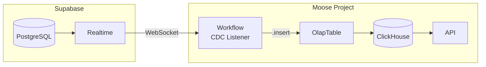

import { FileTree, CTACards, CTACard, Callout, BulletPointsCard, ToggleBlock } from "@/components/mdx";

# Real-Time CDC from Supabase to ClickHouse

<Callout type="info" title="TL;DR">
* Sync Supabase PostgreSQL changes to ClickHouse using Supabase Realtime
* Single Moose project: workflow listens for changes, inserts directly to ClickHouse

This guide will:

1. Walk through setting up Supabase Realtime for CDC
2. Build a Moose workflow that captures changes and inserts directly into ClickHouse
3. Create analytics APIs for your dashboards
</Callout>

<CTACards columns={3}>
  <CTACard
    title="Overview"
    description="Understand the architecture and when this pattern fits"
    ctaLink="#overview"
    ctaLabel="Read first"
    Icon="Eye"
  />
  <CTACard
    title="The Scenario"
    description="Workforce platform with labor cost dashboards"
    ctaLink="#the-scenario"
    ctaLabel="See example"
    Icon="BinaryTree"
  />
  <CTACard
    title="Tutorial"
    description="Step-by-step: Supabase → Moose → ClickHouse"
    ctaLink="#tutorial"
    ctaLabel="Build now"
    Icon="Rocket"
  />
</CTACards>

---

## Overview

{/*
CONTENT TO WRITE:
- What is CDC and why it matters (brief)
- Why Supabase Realtime is a good fit (built-in, no extra infrastructure)
- Link to data-warehouses/performant-dashboards guides for OLTP vs OLAP deep dive

WHEN THIS MAKES SENSE (be honest - PostgreSQL handles a lot):
- Threshold: ~10-50M rows + complex joins + concurrent dashboard users
- "OLTP-backed analytics can look 'fine' until data volume and concurrency cross a threshold"
- Trigger: engineering can't deliver small dashboard changes without risking transactional workloads
- Reference performant-dashboards "Why you haven't solved it yet" section for nuance

TONE REFERENCE (from performant-dashboards):
- "analytical queries (aggregations, wide table scans, complex joins) running on your existing transactional database, competing with the core transactional workloads"
- "Load times creep up. Customers complain."
*/}

### The Scenario

{/*
CONTENT TO WRITE:
- Expand on the scenario: workforce platform, time tracking, labor cost dashboards
- Problem: dashboard queries (joins, aggregations) compete with transactional workload
- Data model: projects table, time_entries table (keep simple - 2 tables)
*/}

You're building a construction workforce platform on Supabase. Workers clock hours from job sites, managers track labor costs against project budgets. The app handles day-to-day operations fine, but dashboard queries — joining time entries with projects, aggregating by week, calculating costs — compete with the transactional workload and slow down the whole app.

**Goal:** Fast labor cost analytics without impacting the operational database.

### Architecture



**Key design decisions:**

- **OlapTable.insert()** - Direct inserts to ClickHouse, schema managed by Moose
- **ReplacingMergeTree** - Handles UPDATE/DELETE by keeping latest version per record
- **Single Moose project** - Workflow, tables, and APIs all in one place

---

## Prerequisites

{/*
- Supabase project (free tier works)
- Node.js 20+, Docker Desktop, pnpm
- Environment setup instructions
*/}

---

## Tutorial

### Part 1: Set up Supabase

{/*
CONTENT TO WRITE:
- SQL to create projects and time_entries tables
- Enable Realtime: `alter publication supabase_realtime add table ...`
- Get credentials (URL, service key)
*/}

### Part 2: Initialize Moose project

{/*
CONTENT TO WRITE:
- moose init, pnpm add @supabase/supabase-js
- .env.local setup
- Project structure overview
*/}

### Part 3: Create data models and tables

{/*
CONTENT TO WRITE:
- CDC metadata pattern: cdc_id, cdc_operation, cdc_timestamp
- Why ReplacingMergeTree (handles updates/deletes)
- OlapTable definitions (not IngestPipeline - direct insert is simpler)

Key code pattern:
```typescript
export const TimeEntryTable = new OlapTable<TimeEntryWithCDC>("time_entries", {
  orderByFields: ["project_id", "id"],
  engine: ClickHouseEngines.ReplacingMergeTree,
});
```
*/}

### Part 4: Build the CDC workflow

{/*
CONTENT TO WRITE:
- Supabase Realtime subscription (channel, postgres_changes)
- Transform payload to CDC format (add cdc_id, cdc_operation, cdc_timestamp)
- Direct insert: `await TimeEntryTable.insert([record])`
- Long-running workflow with Temporal (24h timeout, auto-restart)

Key code pattern:
```typescript
const channel = supabase
  .channel("cdc-changes")
  .on("postgres_changes", { event: "*", table: "time_entries" },
    async (payload) => {
      const record = toCDCRecord(payload);
      await TimeEntryTable.insert([record]);
    }
  )
  .subscribe();
```
*/}

### Part 5: Create analytics API

{/*
CONTENT TO WRITE:
- API for labor costs by project
- Query pattern: filter out DELETEs, use FINAL for deduplication
- Example endpoint: /api/labor-costs?days=30
*/}

### Part 6: Test the pipeline

{/*
CONTENT TO WRITE:
- Start moose dev, trigger workflow
- Insert data in Supabase, verify in ClickHouse
- Query the analytics API
*/}

---

## How it works

{/*
CONTENT TO WRITE:
- Supabase Realtime: logical replication → WebSocket
- ReplacingMergeTree: keeps latest row by ORDER BY key, merges in background
- Query patterns: WHERE cdc_operation != 'DELETE', use FINAL or argMax()
*/}

---

## Troubleshooting

{/*
CONTENT TO WRITE:
- Supabase Realtime connection issues
- Workflow not starting
- Data not appearing in ClickHouse
- Duplicate records (expected before merge - use FINAL)
*/}

---

## Next steps

- Add more tables to the workflow
- Create materialized views for pre-aggregation
- Deploy to Boreal Cloud

---

## Reference

### Project structure

<FileTree>
  <FileTree.Folder name="construction-analytics" defaultOpen>
    <FileTree.Folder name="app" defaultOpen>
      <FileTree.File name="index.ts" />
      <FileTree.Folder name="models">
        <FileTree.File name="types.ts" />
      </FileTree.Folder>
      <FileTree.Folder name="tables">
        <FileTree.File name="index.ts" />
      </FileTree.Folder>
      <FileTree.Folder name="workflows">
        <FileTree.File name="supabase-cdc.ts" />
      </FileTree.Folder>
      <FileTree.Folder name="apis">
        <FileTree.File name="labor-costs.ts" />
      </FileTree.Folder>
    </FileTree.Folder>
    <FileTree.File name="moose.config.toml" />
    <FileTree.File name=".env.local" />
  </FileTree.Folder>
</FileTree>

### Resources

- [Supabase Realtime documentation](https://supabase.com/docs/guides/realtime/postgres-changes)
- [Moose Workflows documentation](/moosestack/workflows)
- [Moose OlapTable documentation](/moosestack/olap)
- [ClickHouse ReplacingMergeTree](https://clickhouse.com/docs/en/engines/table-engines/mergetree-family/replacingmergetree)
