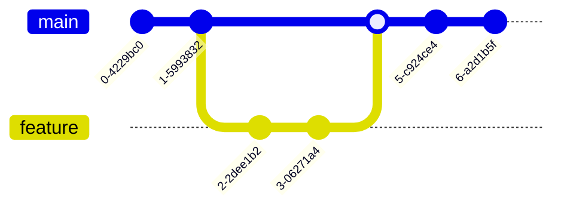

# Mermaid Diagram Test Guide

This guide tests various mermaid diagram types to ensure proper rendering support.

## Flowchart Example

This example uses `maxHeight="800px"` to limit vertical size.

## Sequence Diagram

## Class Diagram

This example uses `maxHeight="400px"` to limit vertical size.

## State Diagram

This example uses `maxHeight="350px"` to limit vertical size.

## Entity Relationship Diagram

## Gantt Chart

## Git Graph

## Pie Chart

## Architecture Diagram

## Next Steps

This guide demonstrates various mermaid diagram types. If all diagrams render correctly, mermaid support is working properly.
