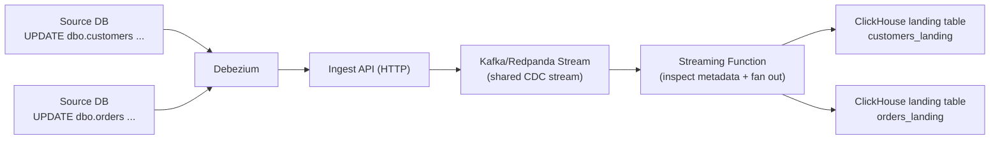

<ConditionalContent whenId="source-database" whenValue="sqlserver">

### Set up Change Data Capture (CDC)

#### Debezium (SQL Server CDC)

This section assumes you already have a MooseStack project in your repo (from the earlier **Add MooseStack** step), since you'll define the CDC ingest pipeline in that project.

For your dashboards to show accurate, real-time data, your ClickHouse analytics database needs to stay in sync with your production SQL Server database. Change Data Capture (CDC) streams every insert, update, and delete in real time. Your reports always reflect the latest state without custom sync jobs or batch ETL scripts.

This section walks you through setting up CDC using Debezium. Before you start, make sure you have your SQL Server connection credentials (host, port, username, password, database name).

You'll complete 3 main steps:

1. Configure SQL Server for CDC
2. Configure ingestion pipelines to land CDC events into ClickHouse tables (via MooseStack)
3. Deploy Debezium Server to your environment

#### How CDC works

CDC turns row-level changes in SQL Server into an ordered stream of change events that your MooseStack-defined ingestion pipeline receives and routes into ClickHouse landing tables. This diagram shows the high-level data flow:



<ToggleBlock openText="Expected CDC overhead (storage/CPU/I/O/memory)" closeText="Hide CDC overhead estimates">
#### Storage Impact

Primarily driven by change volume (rows changed / day) and retention period

| Component                    | Expected Impact                        |
| :--------------------------- | :------------------------------------- |
| Tracking tables (`cdc.*_CT`) | ~10-30% of source table sizes (not 2x) |
| Retention                    | Default 3 days, then auto-purged       |
| Transaction log              | May grow if capture job lags           |

#### CPU Impact

Primarily driven by change rate (changes / sec) and the number of CDC-enabled tables

| Component                     | Expected Overhead                 |
| :---------------------------- | :-------------------------------- |
| CDC Capture Job               | Low additional CPU                |
| Multiple tables               | Low-moderate (well within normal) |
| Polling interval (e.g. 2-min) | Negligible (just reads)           |

#### I/O Impact

Primarily driven by write volume to tracking tables and transaction log read rate

| Operation                   | Expected Overhead        |
| :-------------------------- | :----------------------- |
| Transaction log reads       | Low additional read I/O  |
| Tracking table writes       | Low additional write I/O |
| Debezium queries (periodic) | Minimal - batched reads  |

#### Memory Impact

Primarily driven by the number of CDC-enabled tables and their row size

| Component              | Expected Overhead             |
| :--------------------- | :---------------------------- |
| Capture job buffers    | Low, measured in MB           |
| Tracking table indexes | Proportional to change volume |

</ToggleBlock>

#### SQL Server CDC Configuration

Configure your SQL Server for CDC before proceeding. For detailed setup instructions, see the [Debezium SQL Server Connector documentation](https://debezium.io/documentation/reference/stable/connectors/sqlserver.html#setting-up-sqlserver).

**Key steps:**

1. Enable CDC at the database level: `EXEC sys.sp_cdc_enable_db;`
2. Enable CDC on each table you want to track: `EXEC sys.sp_cdc_enable_table @source_schema = N'dbo', @source_name = N'your_table', @role_name = NULL;`
3. Verify SQL Server Agent is running (required for CDC capture jobs)

Once CDC is configured, proceed to set up the MooseStack ingestion pipeline below

#### Define your MooseStack ingestion pipeline

This section describes the CDC architecture used when Debezium cannot connect directly to Kafka (for example, due to firewall rules, network segmentation, or cloud provider restrictions). If your Debezium instance can reach Kafka directly, you can configure CDC to stream changes directly into Kafka topics instead of using the HTTP ingest pattern shown here.

In this architecture, all changes from your SQL Server database tables are captured using Debezium and sent to a single, Moose-managed Kafka (or Redpanda) Stream via a Moose-managed HTTP Ingest API endpoint _(there is no per-table endpoint or per-table ingest stream at this stage)_.

From there, CDC events are explicitly fanned out based on their metadata. Each SQL Server source table ultimately maps to:

- one table-specific Moose Stream, and
- one downstream ClickHouse landing table.

This architecture implements a [Streaming Function](https://docs.fiveonefour.com/moosestack/streaming/consumer-functions?lang=typescript) that inspects each raw CDC event from the shared stream to identify the source table and routes it to the appropriate table-specific stream. Each of these streams feeds a corresponding ClickHouse table.

To summarize, the high-level data flow is:

- Debezium → single ingest API endpoint
- Ingest API → shared CDC stream
- Streaming function → table-specific streams
- Table-specific streams → ClickHouse tables

<BulletPointsCard
  title="Prerequisites"
  bulletStyle="check"
  compact={true}
  bullets={[
    "SQL Server CDC is enabled and working",
    "MooseStack is running locally",
    "You can reach the Moose Ingest API from your Debezium environment",
    "Port 443 is available for egress",
  ]}
/>

If CDC is not enabled yet, complete the **SQL Server CDC Configuration** section first.

##### Step 1: Define a pipeline to receive CDC events from Debezium

Copy the code below into `moosestack/app/cdc/DebeziumChangeEvent.model.ts`. It defines the `DebeziumChangeEvent` payload shape and wires up an `IngestApi` + `Stream` with a Dead Letter Queue (DLQ) so failed events are captured for inspection.

```ts filename="moosestack/app/cdc/DebeziumChangeEvent.model.ts" copy
import { IngestApi, Stream, DeadLetterQueue, Int64 } from "@514labs/moose-lib";

/**
 * Debezium SQL Server Change Event Structure
 * Documentation: https://debezium.io/documentation/reference/stable/connectors/sqlserver.html
 *
 * This model represents the standardized event structure sent by Debezium
 * for all change data capture events from SQL Server.
 */

export interface DebeziumSource {
  version: string;
  connector: string;
  name: string;
  ts_ms: Int64; // Timestamp in milliseconds (epoch)
  snapshot?: string;
  db: string;
  sequence?: string;
  schema: string;
  table: string;
  change_lsn?: string;
  commit_lsn?: string;
  event_serial_no?: number;
}

export interface DebeziumTransaction {
  id?: string;
  total_order?: number;
  data_collection_order?: number;
}

/**
 * Main Debezium Change Event Payload
 * The 'before' and 'after' fields contain the actual row data
 * and their shape varies by table, so we use Record<string, any>
 */
export interface DebeziumChangeEvent {
  // Row data before the change (null for INSERT operations)
  before?: Record<string, any> | null;

  // Row data after the change (null for DELETE operations)
  after?: Record<string, any> | null;

  // Source metadata identifying where this change came from
  source: DebeziumSource;

  // Operation type: 'c' = create, 'u' = update, 'd' = delete, 'r' = read (snapshot)
  op: string;

  // Timestamp in milliseconds
  ts_ms: Int64;

  // Transaction metadata (optional)
  transaction?: DebeziumTransaction | null;
}

/**
 * Full Debezium Event Envelope (what actually gets POSTed by Debezium)
 * Debezium sends events with both schema and payload wrapped together
 */
export interface DebeziumEventEnvelope {
  schema?: Record<string, any>;
  payload: DebeziumChangeEvent;
}

/**
 * Stream for CDC events - fans out to table-specific streams via streaming function
 */
export const DebeziumChangeEventStream = new Stream<DebeziumEventEnvelope>(
  "DebeziumChangeEvent",
);

/**
 * Dead Letter Queue for failed Debezium events
 */
export const DebeziumChangeEventDLQ =
  new DeadLetterQueue<DebeziumEventEnvelope>("DebeziumChangeEvent_DLQ");

/**
 * Ingestion API endpoint for Debezium CDC events
 * Creates: POST /ingest/DebeziumChangeEvent
 *
 * Debezium sends events here, which flow through the streaming function
 * to fan out to table-specific Redpanda topics.
 */
export const DebeziumChangeEventIngestApi =
  new IngestApi<DebeziumEventEnvelope>("DebeziumChangeEvent", {
    destination: DebeziumChangeEventStream,
    deadLetterQueue: DebeziumChangeEventDLQ,
  });
```

##### Step 2: Map source tables to Moose Streams

Before implementing the streaming function, define an explicit mapping between SQL Server source table names and their corresponding Moose Streams.

```typescript filename="moosestack/app/cdc/tableStreamMap.ts" copy
import { ProductStream } from "../models/Product.model";
import { CustomerStream } from "../models/Customer.model";
import { OrderStream } from "../models/Order.model";
import { OrderItemStream } from "../models/OrderItem.model";

export const TABLE_STREAM_MAP: Record<string, any> = {
  products: ProductStream,
  customers: CustomerStream,
  orders: OrderStream,
  order_items: OrderItemStream,
};
```

This mapping is what makes the fan-out deterministic and ensures each source table's changes flow through the correct stream and into the correct ClickHouse table.

##### Step 3: Add streaming function to the API endpoint

This function acts as our fanout point.

When cdc events are posted from Debezium, we need to read the table name from the payload and route the cdc event to the correct stream.

**File location:** `moosestack/app/cdc/processDebeziumEvent.ts`

```ts
import {
  DebeziumEventEnvelope,
  DebeziumChangeEventStream,
} from "./DebeziumChangeEvent.model";
import { TABLE_STREAM_MAP } from "./tableStreamMap";

/**
 * Process and route CDC events to table-specific Redpanda topics
 *
 * ReplacingMergeTree CDC fields:
 * - ts_ms: Version column from payload.ts_ms (used to determine newest row)
 * - isDeleted: 1 for delete operations, 0 otherwise (ReplacingMergeTree collapses deleted rows)
 */
export default async function processDebeziumEvent(
  envelope: DebeziumEventEnvelope,
): Promise<void> {
  console.log(`[CDC] Processing event: ${JSON.stringify(envelope)}`);

  const event = envelope.payload;
  const { source, op, before, after, ts_ms } = event;

  const sourceTable = source.table;
  const targetStream = TABLE_STREAM_MAP[sourceTable];

  // Unknown table - log and skip
  if (!targetStream) {
    console.warn(`[CDC] Unknown table: ${sourceTable}`);
    return;
  }

  // Determine data and deleted flag based on operation type
  let rowData: Record<string, any> | null = null;
  let isDeleted: number = 0;

  switch (op) {
    case "c": // CREATE
    case "r": // READ (snapshot)
    case "u": // UPDATE
      rowData = after ?? null;
      isDeleted = 0;
      break;
    case "d": // DELETE - use 'before' data since 'after' is null for deletes
      rowData = before ?? null;
      isDeleted = 1;
      break;
    default:
      console.warn(`[CDC] Unknown op: ${op} for ${sourceTable}`);
      return;
  }

  if (!rowData) {
    console.warn(`[CDC] No data in ${op} event for ${sourceTable}`);
    return;
  }

  // Add CDC metadata columns for ReplacingMergeTree
  // Ensure isDeleted is explicitly UInt8 (0 or 1) for ClickHouse
  // Use bitwise OR with 0 to ensure it's an integer, not Float64
  const data = {
    ...rowData,
    ts_ms: ts_ms, // Version column - determines which row is newest
    isDeleted: (isDeleted | 0) as 0 | 1, // isDeleted flag - 1 for deletes, 0 otherwise (UInt8)
  };

  // Publish directly to table's Redpanda topic
  try {
    await targetStream.send(data);
    console.log(
      `[CDC] ${op.toUpperCase()} ${sourceTable} → Redpanda topic (ts_ms=${ts_ms}, isDeleted=${isDeleted})`,
    );
  } catch (error: any) {
    console.error(`[CDC] Failed to publish ${sourceTable}:`, error.message);
    throw error; // Trigger DLQ
  }
}

// Wire up the streaming function
DebeziumChangeEventStream.addConsumer(processDebeziumEvent);
```

##### Step 4: Deploy Debezium Server

Debezium Server can be deployed using Kubernetes, Docker Compose, or as a standalone service. For deployment options and detailed configuration, see the [Debezium Server documentation](https://debezium.io/documentation/reference/stable/operations/debezium-server.html).

**Key configuration for MooseStack integration:**

Your Debezium `application.properties` must include:

- `debezium.sink.type=http` — Use HTTP sink to send events to Moose
- `debezium.sink.http.url=<YOUR_MOOSE_INGEST_URL>/ingest/DebeziumChangeEvent` — Your Moose Ingest API endpoint
- `debezium.source.connector.class=io.debezium.connector.sqlserver.SqlServerConnector` — SQL Server connector

<Callout type="info" title="Example deployment manifests">
For complete Kubernetes deployment examples with MooseStack, see our [CDC examples repository](https://github.com/514-labs/moose-examples).
</Callout>
</ConditionalContent>
