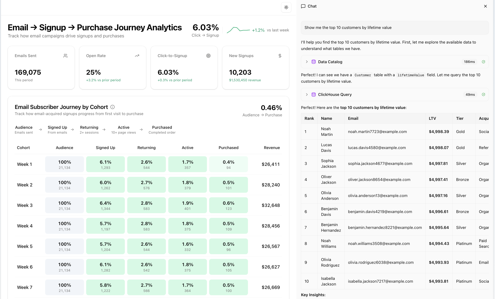

# CDP Analytics

A Customer Data Platform (CDP) demo application that tracks customer journeys from acquisition through conversion, with AI-powered data exploration.



## Prerequisites

| Tool | Version | Install |
|------|---------|---------|
| **Node.js** | v20+ | [nodejs.org](https://nodejs.org/) or `brew install node` |
| **pnpm** | v8+ | `npm install -g pnpm` |
| **Docker** | v20+ | [docker.com](https://www.docker.com/get-started/) - must be running |
| **Moose CLI** | latest | `bash -i <(curl -fsSL https://fiveonefour.com/install.sh) moose` |

For the AI chat feature, you'll also need an [Anthropic API key](https://console.anthropic.com/).

## What This Is

This project demonstrates a journey-centric CDP built on modern data infrastructure:

- **Email Campaign Analytics Dashboard** - Track the funnel from emails sent → opened → clicked → signed up
- **AI Chat Interface** - Ask natural language questions about your customer data
- **Real-time Data Pipeline** - Ingest, process, and query customer events at scale

## Architecture

```
┌─────────────────────┐  REST API   ┌─────────────────────┐
│   Next.js Web App   │────────────▶│  MooseStack Service │
│   (Dashboard + AI)  │  MCP Tools  │  (Express + Moose)  │
└─────────────────────┘             └─────────────────────┘
        :3000                                :4000
                                              │
                                    ┌─────────┴─────────┐
                                    ▼                   ▼
                              ClickHouse            Redpanda
                              (Analytics)           (Streaming)
```

**Two apps in a pnpm monorepo:**

| Package | Purpose | Port |
|---------|---------|------|
| `packages/moosestack-service/` | Data platform with REST APIs and MCP server | 4000 |
| `packages/web-app/` | Next.js dashboard with AI chat | 3000 |

### Type-Safe Data Flow

Types are shared across the stack via pnpm workspace - change a type in the backend and get immediate IDE feedback in the frontend:

```
Backend (moosestack-service)
├── models.ts ─────────── Customer, Event, Session interfaces
├── analytics.ts ──────── API response types (CohortData, etc)
└── views/cohort-metrics.ts ── Materialized view for fast queries
         │
         ▼
package.json exports: "." → index.ts (re-exports all)
         │
         ▼
Frontend (web-app)
└── lib/api.ts ────────── import type { ... } from "moosestack-service"
         │
         ▼
Dashboard components use shared types with IDE autocomplete
```

## Quick Start

### 1. Clone, Install and Configure

```bash
npx degit 514-labs/moosestack/examples/cdp-analytics cdp-analytics
cd cdp-analytics

pnpm install

# Copy environment files
cp packages/moosestack-service/.env.{example,local}
cp packages/web-app/.env.{example,local}

# Generate API authentication tokens
cd packages/moosestack-service
moose generate hash-token
```

### 2. Set Environment Variables

**`packages/moosestack-service/.env.local`**

```
MCP_API_KEY=<ENV API Key from hash-token output>
```

**`packages/web-app/.env.local`**

```
ANTHROPIC_API_KEY=<your Anthropic API key>
MCP_API_TOKEN=<Bearer Token from hash-token output>
MCP_SERVER_URL=http://localhost:4000
NEXT_PUBLIC_API_URL=http://localhost:4000
```

### 3. Run

`cd` back to the project root.

```bash
pnpm dev
```

Open [http://localhost:3000](http://localhost:3000) to see the dashboard.

## What You Can Do

### Dashboard

View email campaign analytics with:

- **Metric Cards** - Emails sent, open rate, click rate, signups
- **Journey Funnel** - Visualize drop-off at each stage
- **Performance Chart** - Track trends over time
- **Segment Breakdowns** - By campaign and device type

### AI Chat

Ask questions in natural language:

- "What tables exist in the database?"
- "Show me the top 10 customers by lifetime value"
- "How many events happened last week?"
- "What's the conversion rate by acquisition channel?"

The AI uses MCP tools to query ClickHouse and return results.

## Data Models

Six core models for CDP analytics:

| Model | Key Fields |
|-------|------------|
| **Customer** | customerId, email, acquisitionChannel, lifetimeValue, customerTier |
| **Event** | eventId, customerId, eventType, pageUrl, utmSource/Medium/Campaign |
| **Session** | sessionId, customerId, trafficSource, hasConversion, conversionValue |
| **Transaction** | transactionId, customerId, totalAmount, status, isFirstPurchase |
| **TransactionItem** | itemId, transactionId, productSku, quantity, lineTotal |
| **Product** | productSku, productName, category, price, avgRating |

## API Reference

### REST Analytics Endpoints

| Endpoint | Description |
|----------|-------------|
| `GET /analytics/funnel` | Email journey funnel with conversion rates |
| `GET /analytics/metrics` | Key performance metrics |
| `GET /analytics/cohorts` | Weekly cohort journey progression |
| `GET /analytics/conversion-trend` | 8-week conversion sparkline |
| `GET /analytics/performance` | Weekly performance data |
| `GET /analytics/segments/campaigns` | Signups by campaign |
| `GET /analytics/segments/devices` | Clicks by device type |

### MCP Tools

| Tool | Description |
|------|-------------|
| `query_clickhouse` | Execute read-only SQL queries |
| `get_data_catalog` | Discover tables and schemas |

## Data Ingestion Patterns

This project demonstrates multiple ways to ingest data into the CDP:

### 1. REST API (Real-time)

POST events directly to the ingest endpoints:

```bash
curl -X POST http://localhost:4000/ingest/Event \
  -H "Content-Type: application/json" \
  -d '{"eventId": "...", "customerId": "...", ...}'
```

Available endpoints: `/ingest/Customer`, `/ingest/Event`, `/ingest/Session`, `/ingest/Transaction`, `/ingest/TransactionItem`, `/ingest/Product`

### 2. Batch Import Workflow

Import historical data from CSV files using a Moose Workflow:

```bash
cd packages/moosestack-service
pnpm dev:batch-import '{"csvPath": "/path/to/transactions.csv"}'
```

See `app/workflows/batch-import.ts` for implementation.

### 3. Scheduled Sync Workflow

Automatically sync data from external APIs on a schedule:

- Runs every 5 minutes (configurable cron)
- Simulates fetching from external product catalog API
- See `app/workflows/scheduled-sync.ts`

```bash
moose workflow list  # View scheduled workflows
```

### 4. Webhook Receiver (Segment Format)

Receive and transform Segment-format events:

```bash
# Track event
curl -X POST http://localhost:4000/segment/webhook \
  -H "Content-Type: application/json" \
  -d '{"type": "track", "event": "Button Clicked", "userId": "user-123", ...}'

# Identify event
curl -X POST http://localhost:4000/segment/webhook \
  -H "Content-Type: application/json" \
  -d '{"type": "identify", "userId": "user-123", "traits": {"email": "..."}, ...}'

# Test with sample events
pnpm dev:test-webhook
```

See `app/apis/segment-webhook.ts` for implementation.

### 5. Change Data Capture (CDC)

For real-time sync from operational databases (PostgreSQL, MySQL, MongoDB), see:

- Placeholder: `app/workflows/cdc-placeholder.ts`
- Documentation: <https://docs.fiveonefour.com/moosestack/capture-data-changes>

## Extending

### Add a New Journey

APIs follow a separation of concerns pattern (routes → services → types):

1. **Add types** in `app/types/analytics.ts`
2. **Add service function** in `app/services/analyticsService.ts` (business logic)
3. **Add thin route** in `app/apis/analytics.ts` (just calls service)
4. **Create visualization** in `packages/web-app/src/features/dashboard/`

See `CLAUDE.md` for detailed examples.

### Add a New Data Source

1. Create a new model in `app/ingest/models.ts`
2. Set up ingestion via POST to `/ingest/{ModelName}`
3. Build queries and views for analytics

### Add New AI Tools

Register tools in `app/apis/mcp.ts`:

```typescript
server.tool(
  "my_tool",
  "Description of what this tool does",
  { param: z.string().describe("Parameter description") },
  { title: "My Tool" },
  async ({ param }) => ({
    content: [{ type: "text", text: JSON.stringify(result) }]
  })
);
```

## Deployment

### Backend (Boreal)

1. Push to GitHub
2. Connect repo to [Boreal](https://boreal.cloud)
3. Set environment variables
4. Deploy

### Frontend (Vercel)

1. Import repo to Vercel
2. Set root directory to `packages/web-app`
3. Add environment variables:
   - `NEXT_PUBLIC_API_URL` = your Boreal API URL
   - `MCP_API_TOKEN` = your API token
   - `ANTHROPIC_API_KEY` = your Anthropic key
4. Deploy

## Development Commands

```bash
pnpm dev          # Run both services
pnpm dev:moose    # Backend only
pnpm dev:web      # Frontend only
```

### Generate Demo Data

Populate the database with realistic sample data (10,000 customers, realistic conversion funnels):

```bash
cd packages/moosestack-service
pnpm generate-mock-data
```

### Test Ingest Patterns

```bash
cd packages/moosestack-service

# Batch import from CSV
pnpm dev:batch-import '{"csvPath": "./data/sample-transactions.csv"}'

# Test Segment webhook
pnpm dev:test-webhook

# View workflow status
moose workflow list
```

## Tech Stack

- **Backend**: MooseStack, Express.js, ClickHouse, Redpanda, MCP SDK
- **Frontend**: Next.js 16, React 19, Recharts, Radix UI, TailwindCSS
- **AI**: Anthropic Claude (Haiku), AI SDK, MCP Protocol

## Learn More

- [MooseStack Documentation](https://docs.fiveonefour.com/moosestack)
- [MooseStack Examples](https://github.com/514-labs/moosestack/tree/main/examples)
- [Model Context Protocol](https://modelcontextprotocol.io)

## Troubleshooting

### Port 4000 in use

Edit `packages/moosestack-service/moose.config.toml`:

```toml
[server]
port = 4001
```

### API connection errors

Verify environment variables are set and services are running. Check that `NEXT_PUBLIC_API_URL` matches your backend URL.
