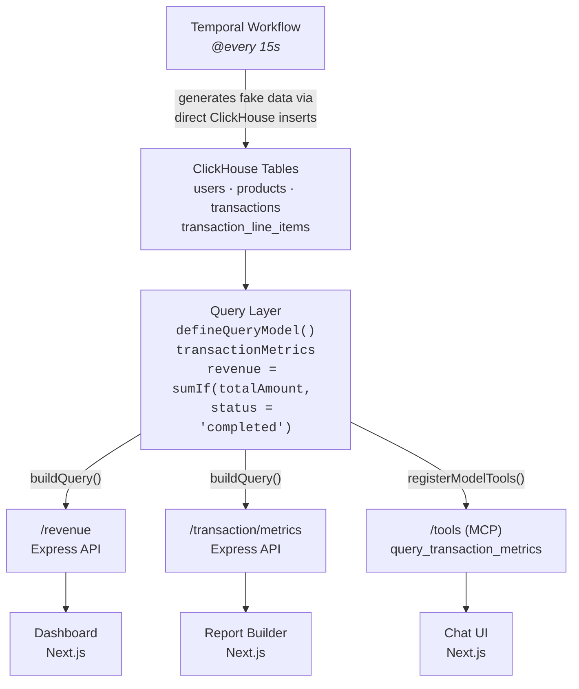

# Financial Query Layer

> Define metrics once, consume them everywhere — REST APIs, MCP tools, and AI chat all return consistent answers.

| | |
|---|---|
| **Moose Features** | Query Layer (`defineQueryModel`), MCP Integration, REST APIs (Express), Temporal Workflows, Report Builder UI |
| **Data Source** | Synthetic financial transactions (generated every 15s via Temporal workflow) |
| **Stack** | MooseStack + Next.js + ClickHouse |
| **Difficulty** | Intermediate |

A financial services data surface with three access patterns over the same ClickHouse data:

1. **MCP** — AI chat with SQL generation via the Model Context Protocol
2. **Dashboard** — hand-crafted Express API endpoints powering a Next.js revenue dashboard
3. **Report Builder** — interactive query builder UI powered by `buildQuery()` with selectable metrics, dimensions, and filters

Companion demo for the blog post [Define one, project everywhere: a metrics layer for ClickHouse with MooseStack](https://clickhouse.com/blog/metrics-layer-with-fiveonefour). Built with [MooseStack](https://docs.fiveonefour.com) — see the [step-by-step guide](https://docs.fiveonefour.com/guides/chat-in-your-app/tutorial?lang=typescript) to build it yourself.


**Left — [without query layer (`7da601e`)](https://github.com/514-labs/financial-query-layer-demo/tree/7da601e):** AI generates SQL against raw tables, misses `WHERE status = 'completed'`, and inflates revenue. Dashboard says $546M, chat says $754M. ([standalone](bad-prompt.gif))

**Right — with query layer (`main`):** Revenue is defined once as `sumIf(totalAmount, status = 'completed')`. Dashboard and chat both show $770M. ([standalone](good-prompt.gif))

## Quick Start

### Prerequisites

| Tool | Version | Install |
|------|---------|---------|
| **Node.js** | v20+ | [nodejs.org](https://nodejs.org/) |
| **pnpm** | v8+ | `npm install -g pnpm` |
| **Docker** | v20+ | [docker.com](https://www.docker.com/get-started/) - must be running |
| **Moose CLI** | latest | see below |

For the AI chat feature, you'll also need an [Anthropic API key](https://console.anthropic.com/).

Install MooseStack (and optionally the 514 hosting) CLIs:

```bash
bash -i <(curl -fsSL https://fiveonefour.com/install.sh) moose,514
```

### 1. Clone and Install

```bash
git clone --depth 1 https://github.com/514-labs/moose.git
cd moose/examples/financial-query-layer

pnpm install
```

### 2. Configure Environment

```bash
cp packages/moosestack-service/.env.{example,local}
cp packages/web-app/.env.{example,local}
```

Generate auth tokens:

```bash
cd packages/moosestack-service
moose generate hash-token
```

Set environment variables (`moose generate hash-token` outputs a key pair — hash goes to backend, token goes to frontend):

| Variable | File | Value |
|---|---|---|
| `MCP_API_KEY` | `packages/moosestack-service/.env.local` | `ENV API Key` (hash) from `moose generate hash-token` |
| `MCP_API_TOKEN` | `packages/web-app/.env.local` | `Bearer Token` from `moose generate hash-token` |
| `ANTHROPIC_API_KEY` | `packages/web-app/.env.local` | Your [Anthropic API key](https://console.anthropic.com/) |

### 3. Run

```bash
pnpm dev          # Both services
pnpm dev:moose    # Backend only
pnpm dev:web      # Frontend only
```

### 4. Set Up Agent Skills (optional)

If you want to use MooseStack skills with your AI copilot, bootstrap them with:

```bash
514 agent init
```

This installs the following skills:

- **ClickHouse Best Practices** — Schema design, query optimization, and insert strategy rules with MooseStack-specific examples
- **514 CLI** — Interact with the 514 platform (login, link project, check deployments, browse docs)
- **514 Debug** — Debug 514 deployments (check status, tail logs, find slow queries, run diagnostics)
- **514 Perf Optimize** — Guided ClickHouse performance optimization workflow with benchmarking

If you start your copilot now, you will have the MooseStack Skills, LSP, and MCPs up and running.

- Dashboard: http://localhost:3000
- Report Builder: http://localhost:3000/builder
- Revenue API: http://localhost:4000/revenue/by-region
- Transaction Metrics API: http://localhost:4000/transaction/metrics
- MCP endpoint: http://localhost:4000/tools
- Temporal UI: http://localhost:8080

### Ports

Make sure the following ports are free before running `pnpm dev`. Change them in `packages/moosestack-service/moose.config.toml` if needed.

| Service | Port |
|---|---|
| Next.js web app | 3000 |
| MooseStack HTTP/MCP | 4000 |
| Management API | 5001 |
| Temporal | 7233 |
| Temporal UI | 8080 |
| ClickHouse HTTP | 18123 |
| ClickHouse native | 9000 |

## Data Architecture



Compare with the [pre-query-layer architecture (`7da601e`)](https://github.com/514-labs/financial-query-layer-demo/blob/7da601e/README.md#data-architecture), where the dashboard used hand-written SQL and the MCP server exposed free-form `query_clickhouse` with no shared metric definitions.

**Workflow → Tables**: A Temporal workflow runs every 15 seconds, generating ~1k transactions and ~5k line items per run with randomized volumes, weighted status distributions, and price variation.

**Tables → Query Layer**: The `transactionMetrics` query model defines revenue as `sumIf(totalAmount, status = 'completed')` — the single source of truth for all metric calculations.

**Query Layer → Dashboard API**: The `/revenue` Express endpoint uses `buildQuery(transactionMetrics)` to query ClickHouse. The dashboard renders the results with tooltips showing the metric definition.

**Query Layer → Report Builder API**: The `/transaction/metrics` endpoint accepts dynamic `metrics`, `dimensions`, and `filter.*` query params, all resolved through `buildQuery()`. The report builder UI at [`/builder`](http://localhost:3000/builder) lets users pick any combination of metrics and dimensions interactively.

The report builder discovers its UI dynamically from the query model via `/transaction/schema` — adding a new metric, dimension, or filter to `transactionMetrics` in [`transaction-metrics.ts`](packages/moosestack-service/app/query-models/transaction-metrics.ts) automatically makes it available in the report builder with no frontend changes. Filter values (e.g. regions, currencies) are fetched as `DISTINCT` values from ClickHouse at schema load time.


**Query Layer → MCP**: The `/tools` MCP server registers `query_transaction_metrics` via `registerModelTools()`. The AI chat calls this tool instead of writing free-form SQL, ensuring it uses the same metric definitions as the dashboard.

## Adding a Metric with AI

Because the query model is the single source of truth, adding a new metric is a one-line change — and with the MooseStack dev harness, you can ask an AI coding agent to do it:

> **Prompt:** "add a metric for median transaction amounts"

The agent adds the metric to `transaction-metrics.ts`:

```typescript
medianTransactionAmount: {
  agg: sql`medianIf(totalAmount, status = 'completed')`,
  as: "medianTransactionAmount",
  description: "Median transaction amount (completed only)",
},
```

That single addition propagates to all four consumers automatically:

1. **MCP tool** — `query_transaction_metrics` now accepts `medianTransactionAmount` as a metric
2. **Schema endpoint** — `/transaction/schema` returns it in the metrics list
3. **REST API** — `/transaction/metrics?metrics=medianTransactionAmount` works immediately
4. **Report builder UI** — the new metric appears as a selectable chip with no frontend changes

https://github.com/user-attachments/assets/df03f8c1-0557-4238-977c-fda09842e215

## Schema Design

See [SCHEMA.md](SCHEMA.md) for full table schemas, column types, and ordering keys.

## Metrics Layer

See [metrics-layer.md](metrics-layer.md) for the full reference — all metrics, dimensions, filters, the OlapTable they pull from, and where they are consumed (MCP, REST APIs, report builder).

## Connecting MCP Clients

The MCP server at `/tools` exposes `query_clickhouse` and `get_data_catalog`. Connect any MCP client:

### Claude Code

```bash
claude mcp add --transport http moose-tools http://localhost:4000/tools --header "Authorization: Bearer <your_bearer_token>"
```

### mcp.json (Cursor, Claude Desktop, etc.)

```json
{
  "mcpServers": {
    "moose-tools": {
      "transport": "http",
      "url": "http://localhost:4000/tools",
      "headers": {
        "Authorization": "Bearer <your_bearer_token>"
      }
    }
  }
}
```

Replace `<your_bearer_token>` with the Bearer Token from `moose generate hash-token`.

## Troubleshooting

### Port Already in Use

Update `packages/moosestack-service/moose.config.toml`:

```toml
[http_server_config]
port = 4001
```

### "ANTHROPIC_API_KEY not set"

Add your key to `packages/web-app/.env.local` and restart the Next.js dev server.

### CORS Errors

Ensure the MooseStack backend is running — the `/revenue` API includes CORS middleware for cross-origin requests from the frontend.

## Learn More

- [Chat in Your App Tutorial](https://docs.fiveonefour.com/guides/chat-in-your-app/tutorial?lang=typescript)
- [MooseStack Documentation](https://docs.fiveonefour.com)
- [Model Context Protocol](https://modelcontextprotocol.io)
