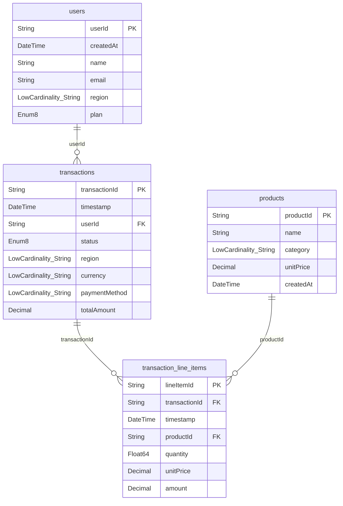

# Schema Design

Four tables generating data via a Temporal workflow every 15 seconds. All models are defined in [`app/ingest/models.ts`](packages/moosestack-service/app/ingest/models.ts).



## [users](packages/moosestack-service/app/ingest/models.ts#L12)

<details>
<summary>MooseStack definition</summary>

```typescript
/**
 * Customer account in the platform.
 *
 * Each user belongs to a single geographic region and subscription plan.
 * The `region` field is the primary join key to `transactions` and is
 * used as a top-level dimension in revenue reporting.
 */
export interface User {
  /** Unique identifier for the user (UUID). */
  userId: string;
  /** Account creation timestamp. */
  createdAt: Date;
  /** Full display name. */
  name: string;
  /** Email address (unique per user). */
  email: string;
  /** Geographic region: NA-East, NA-West, EU-West, EU-Central, APAC, LATAM. */
  region: string & LowCardinality;
  /** Subscription tier. */
  plan: "free" | "pro" | "enterprise";
}

export const UserTable = new OlapTable<User>("users", {
  orderByFields: ["region", "userId"],
});
```

</details>

<details>
<summary>DESCRIBE TABLE users</summary>

```
   ┌─name──────┬─type───────────────────┬─default_type─┬─default_expression─┬─comment────────────────────────────────────────────────────────────────┬─codec_expression─┬─ttl_expression─┐
1. │ userId    │ String                 │              │                    │ Unique identifier for the user (UUID).                                 │                  │                │
2. │ createdAt │ DateTime('UTC')        │              │                    │ Account creation timestamp.                                            │                  │                │
3. │ name      │ String                 │              │                    │ Full display name.                                                     │                  │                │
4. │ email     │ String                 │              │                    │ Email address (unique per user).                                       │                  │                │
5. │ region    │ LowCardinality(String) │              │                    │ Geographic region: NA-East, NA-West, EU-West, EU-Central, APAC, LATAM. │                  │                │
6. │ plan      │ LowCardinality(String) │              │                    │ Subscription tier.                                                     │                  │                │
   └───────────┴────────────────────────┴──────────────┴────────────────────┴────────────────────────────────────────────────────────────────────────┴──────────────────┴────────────────┘
```

</details>

## [products](packages/moosestack-service/app/ingest/models.ts#L43)

<details>
<summary>MooseStack definition</summary>

```typescript
/**
 * Product in the catalog.
 *
 * Products are grouped by category and have a fixed list price (`unitPrice`).
 * The actual price at time of purchase is stored on the line item, not here.
 */
export interface Product {
  /** Unique identifier for the product (UUID). */
  productId: string;
  /** Human-readable product name. */
  name: string;
  /** Product category: Electronics, Software, Services, Hardware, Consulting. */
  category: string & LowCardinality;
  /** List price in USD. */
  unitPrice: Decimal<10, 2>;
  /** When the product was added to the catalog. */
  createdAt: Date;
}

export const ProductTable = new OlapTable<Product>("products", {
  orderByFields: ["category", "productId"],
});
```

</details>

<details>
<summary>DESCRIBE TABLE products</summary>

```
   ┌─name──────┬─type───────────────────┬─default_type─┬─default_expression─┬─comment──────────────────────────────────────────────────────────────────┬─codec_expression─┬─ttl_expression─┐
1. │ productId │ String                 │              │                    │ Unique identifier for the product (UUID).                                │                  │                │
2. │ name      │ String                 │              │                    │ Human-readable product name.                                             │                  │                │
3. │ category  │ LowCardinality(String) │              │                    │ Product category: Electronics, Software, Services, Hardware, Consulting. │                  │                │
4. │ unitPrice │ Decimal(10, 2)         │              │                    │ List price in USD.                                                       │                  │                │
5. │ createdAt │ DateTime('UTC')        │              │                    │ When the product was added to the catalog.                               │                  │                │
   └───────────┴────────────────────────┴──────────────┴────────────────────┴──────────────────────────────────────────────────────────────────────────┴──────────────────┴────────────────┘
```

</details>

## [transactions](packages/moosestack-service/app/ingest/models.ts#L77)

<details>
<summary>MooseStack definition</summary>

```typescript
/**
 * Financial transaction header.
 *
 * Represents a single purchase event. The `status` field is critical for
 * business metrics — **revenue is defined as the sum of `totalAmount`
 * where `status = 'completed'`**. Other statuses (pending, failed, refunded)
 * are excluded from revenue calculations.
 *
 * `totalAmount` is denormalized (sum of line item amounts) so revenue
 * queries don't require a JOIN to `transaction_line_items`.
 */
export interface Transaction {
  /** Unique identifier for the transaction (UUID). */
  transactionId: string;
  /** When the transaction occurred. */
  timestamp: Date;
  /** Foreign key to `users.userId`. */
  userId: string;
  /**
   * Transaction lifecycle status.
   * - `pending`   — awaiting processing
   * - `completed` — successfully settled (counts toward revenue)
   * - `failed`    — payment declined or error
   * - `refunded`  — reversed after completion
   */
  status: "pending" | "completed" | "failed" | "refunded";
  /** Geographic region (denormalized from user for efficient filtering). */
  region: string & LowCardinality;
  /** ISO currency code. */
  currency: string & LowCardinality;
  /** Payment instrument used. */
  paymentMethod: string & LowCardinality;
  /** Sum of all line item amounts for this transaction (in `currency`). */
  totalAmount: Decimal<10, 2>;
}

export const TransactionTable = new OlapTable<Transaction>("transactions", {
  orderByFields: ["userId", "timestamp"],
});
```

</details>

<details>
<summary>DESCRIBE TABLE transactions</summary>

```
┌─name──────────┬─type───────────────────┬─comment─────────────────────────────────────────────────────────────┐
1. │ transactionId │ String                 │ Unique identifier for the transaction (UUID).                       │
2. │ timestamp     │ DateTime('UTC')        │ When the transaction occurred.                                      │
3. │ userId        │ String                 │ Foreign key to `users.userId`.                                      │
4. │ status        │ LowCardinality(String) │ Transaction lifecycle status.                                      ↴│
   │               │                        │↳- `pending`   — awaiting processing                                ↴│
   │               │                        │↳- `completed` — successfully settled (counts toward revenue)       ↴│
   │               │                        │↳- `failed`    — payment declined or error                          ↴│
   │               │                        │↳- `refunded`  — reversed after completion                           │
5. │ region        │ LowCardinality(String) │ Geographic region (denormalized from user for efficient filtering). │
6. │ currency      │ LowCardinality(String) │ ISO currency code.                                                  │
7. │ paymentMethod │ LowCardinality(String) │ Payment instrument used.                                            │
8. │ totalAmount   │ Decimal(10, 2)         │ Sum of all line item amounts for this transaction (in `currency`).  │
   └───────────────┴────────────────────────┴─────────────────────────────────────────────────────────────────────┘
```

</details>

## [transaction_line_items](packages/moosestack-service/app/ingest/models.ts#L119)

<details>
<summary>MooseStack definition</summary>

```typescript
/**
 * Individual line item within a transaction.
 *
 * Each transaction has 1–8 line items. The `amount` field is
 * `quantity × unitPrice` at time of purchase (unitPrice may differ
 * from the product's current list price).
 */
export interface TransactionLineItem {
  /** Unique identifier for the line item (UUID). */
  lineItemId: string;
  /** Foreign key to `transactions.transactionId`. */
  transactionId: string;
  /** Inherited from parent transaction. */
  timestamp: Date;
  /** Foreign key to `products.productId`. */
  productId: string;
  /** Units purchased. */
  quantity: number;
  /** Price per unit at time of purchase (may differ from catalog price). */
  unitPrice: Decimal<10, 2>;
  /** Total for this line: quantity × unitPrice. */
  amount: Decimal<10, 2>;
}

export const TransactionLineItemTable = new OlapTable<TransactionLineItem>(
  "transaction_line_items",
  {
    orderByFields: ["transactionId", "timestamp"],
  },
);
```

</details>

<details>
<summary>DESCRIBE TABLE transaction_line_items</summary>

```
   ┌─name──────────┬─type────────────┬─default_type─┬─default_expression─┬─comment─────────────────────────────────────────────────────────────┬─codec_expression─┬─ttl_expression─┐
1. │ lineItemId    │ String          │              │                    │ Unique identifier for the line item (UUID).                         │                  │                │
2. │ transactionId │ String          │              │                    │ Foreign key to `transactions.transactionId`.                        │                  │                │
3. │ timestamp     │ DateTime('UTC') │              │                    │ Inherited from parent transaction.                                  │                  │                │
4. │ productId     │ String          │              │                    │ Foreign key to `products.productId`.                                │                  │                │
5. │ quantity      │ Float64         │              │                    │ Units purchased.                                                    │                  │                │
6. │ unitPrice     │ Decimal(10, 2)  │              │                    │ Price per unit at time of purchase (may differ from catalog price). │                  │                │
7. │ amount        │ Decimal(10, 2)  │              │                    │ Total for this line: quantity × unitPrice.                          │                  │                │
   └───────────────┴─────────────────┴──────────────┴────────────────────┴─────────────────────────────────────────────────────────────────────┴──────────────────┴────────────────┘
```

</details>
