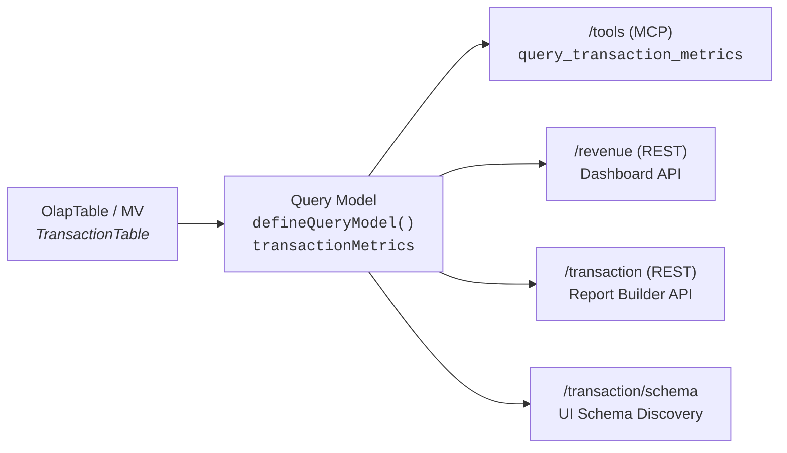

# Metrics Layer

The metrics layer is a semantic query model that defines **what** financial metrics mean and **how** they are calculated. It is defined once and consumed by every surface in the application.



## Source Definition

**File:** [`packages/moosestack-service/app/query-models/transaction-metrics.ts`](packages/moosestack-service/app/query-models/transaction-metrics.ts)

```typescript
export const transactionMetrics = defineQueryModel({
  name: "query_transaction_metrics",
  table: TransactionTable,
  // metrics, dimensions, filters ...
});
```

**Underlying table:** `TransactionTable` — an `OlapTable<Transaction>` defined in [`app/ingest/models.ts`](packages/moosestack-service/app/ingest/models.ts), ordered by `(userId, timestamp)`.

The `Transaction` interface provides the raw columns:

| Column | Type | Notes |
|---|---|---|
| `transactionId` | `string` | UUID primary key |
| `timestamp` | `Date` | When the transaction occurred |
| `userId` | `string` | FK to users |
| `status` | `"pending" \| "completed" \| "failed" \| "refunded"` | Lifecycle state — **critical for metric definitions** |
| `region` | `string & LowCardinality` | Geographic region (denormalized from user) |
| `currency` | `string & LowCardinality` | ISO currency code |
| `paymentMethod` | `string & LowCardinality` | Payment instrument |
| `totalAmount` | `Decimal<10, 2>` | Sum of line item amounts |

## Metrics

All dollar metrics filter on `status = 'completed'` — **revenue excludes pending, failed, and refunded transactions by definition**.

| Metric | ClickHouse Expression | Description | Defined at |
|---|---|---|---|
| `revenue` | `sumIf(totalAmount, status = 'completed')` | Total revenue (completed only) | [`transaction-metrics.ts:64`](packages/moosestack-service/app/query-models/transaction-metrics.ts#L64) |
| `totalTransactions` | `count()` | All transactions regardless of status | [`transaction-metrics.ts:71`](packages/moosestack-service/app/query-models/transaction-metrics.ts#L71) |
| `completedTransactions` | `countIf(status = 'completed')` | Settled transactions | [`transaction-metrics.ts:76`](packages/moosestack-service/app/query-models/transaction-metrics.ts#L76) |
| `failedTransactions` | `countIf(status = 'failed')` | Failed transactions | [`transaction-metrics.ts:81`](packages/moosestack-service/app/query-models/transaction-metrics.ts#L81) |
| `refundedTransactions` | `countIf(status = 'refunded')` | Refunded transactions | [`transaction-metrics.ts:86`](packages/moosestack-service/app/query-models/transaction-metrics.ts#L86) |
| `pendingTransactions` | `countIf(status = 'pending')` | Pending transactions | [`transaction-metrics.ts:91`](packages/moosestack-service/app/query-models/transaction-metrics.ts#L91) |
| `refundedAmount` | `sumIf(totalAmount, status = 'refunded')` | Dollar total of refunds | [`transaction-metrics.ts:96`](packages/moosestack-service/app/query-models/transaction-metrics.ts#L96) |
| `pendingAmount` | `sumIf(totalAmount, status = 'pending')` | Dollar total of pending | [`transaction-metrics.ts:101`](packages/moosestack-service/app/query-models/transaction-metrics.ts#L101) |
| `avgTransactionAmount` | `avgIf(totalAmount, status = 'completed')` | Mean completed amount | [`transaction-metrics.ts:106`](packages/moosestack-service/app/query-models/transaction-metrics.ts#L106) |
| `medianTransactionAmount` | `medianIf(totalAmount, status = 'completed')` | Median completed amount | [`transaction-metrics.ts:111`](packages/moosestack-service/app/query-models/transaction-metrics.ts#L111) |
| `regionCount` | `uniqExactIf(region, status = 'completed')` | Distinct regions with completed transactions | [`transaction-metrics.ts:116`](packages/moosestack-service/app/query-models/transaction-metrics.ts#L116) |

## Dimensions

Dimensions control the `GROUP BY` clause. Column dimensions map directly to table columns; expression dimensions are computed at query time.

| Dimension | Type | Source | Description | Defined at |
|---|---|---|---|---|
| `region` | column | `region` | NA-East, NA-West, EU-West, EU-Central, APAC, LATAM | [`transaction-metrics.ts:34`](packages/moosestack-service/app/query-models/transaction-metrics.ts#L34) |
| `currency` | column | `currency` | USD, EUR, GBP | [`transaction-metrics.ts:38`](packages/moosestack-service/app/query-models/transaction-metrics.ts#L38) |
| `paymentMethod` | column | `paymentMethod` | credit_card, debit_card, bank_transfer, paypal, crypto | [`transaction-metrics.ts:42`](packages/moosestack-service/app/query-models/transaction-metrics.ts#L42) |
| `day` | expression | `toDate(timestamp)` | Calendar day | [`transaction-metrics.ts:46`](packages/moosestack-service/app/query-models/transaction-metrics.ts#L46) |
| `hour` | expression | `toStartOfHour(timestamp)` | Hour bucket | [`transaction-metrics.ts:51`](packages/moosestack-service/app/query-models/transaction-metrics.ts#L51) |
| `month` | expression | `toStartOfMonth(timestamp)` | Month bucket | [`transaction-metrics.ts:56`](packages/moosestack-service/app/query-models/transaction-metrics.ts#L56) |

Note: `status` is intentionally **not** a dimension. Business logic is baked into the metrics themselves (e.g. `revenue` only counts completed), so grouping by status would conflict with those definitions.

## Filters

Categorical filters (region, currency, paymentMethod) support `eq` and `in` operators. The timestamp filter supports `gte` and `lte` for range queries.

| Filter | Column | Operators | Values | Defined at |
|---|---|---|---|---|
| `region` | `region` | `eq`, `in` | Fetched as DISTINCT from ClickHouse at runtime | [`transaction-metrics.ts:124`](packages/moosestack-service/app/query-models/transaction-metrics.ts#L124) |
| `currency` | `currency` | `eq`, `in` | Fetched as DISTINCT from ClickHouse at runtime | [`transaction-metrics.ts:129`](packages/moosestack-service/app/query-models/transaction-metrics.ts#L129) |
| `paymentMethod` | `paymentMethod` | `eq`, `in` | Fetched as DISTINCT from ClickHouse at runtime | [`transaction-metrics.ts:134`](packages/moosestack-service/app/query-models/transaction-metrics.ts#L134) |
| `timestamp` | `timestamp` | `gte`, `lte` | Free-form date range | [`transaction-metrics.ts:139`](packages/moosestack-service/app/query-models/transaction-metrics.ts#L139) |

Filter values for categorical filters are **not hardcoded** — the `/transaction/schema` endpoint queries ClickHouse for distinct values using `buildQuery().dimensions([filterId])`, so new values (e.g. a new region) appear automatically.

## Consumers

The query model is consumed in four places. All use the same metric definitions — no surface can calculate revenue differently.

### 1. MCP Tool — `query_transaction_metrics`

**File:** [`app/apis/mcp.ts`](packages/moosestack-service/app/apis/mcp.ts) (line 441)

```typescript
registerModelTools(
  server,
  [transactionMetrics] as unknown as QueryModelBase[],
  mooseUtils.client.query,
);
```

Auto-registers `query_transaction_metrics` as an MCP tool on the `/tools` endpoint. AI assistants call this tool instead of writing free-form SQL — the tool generates the SQL with correct metric definitions enforced.

### 2. Dashboard REST API — `/revenue/by-region`

**File:** [`app/apis/revenue.ts`](packages/moosestack-service/app/apis/revenue.ts)

```typescript
const data = await buildQuery(transactionMetrics)
  .metrics(["revenue"])
  .dimensions(["region"])
  .orderBy(["revenue", "DESC"])
  .execute(client.query);
```

A hand-crafted endpoint that uses `buildQuery()` with fixed parameters. Powers the revenue-by-region dashboard chart.

### 3. Report Builder REST API — `/transaction/metrics`

**File:** [`app/apis/transaction.ts`](packages/moosestack-service/app/apis/transaction.ts) (line 21)

```
GET /transaction/metrics?metrics=revenue,completedTransactions&dimensions=region&filter.currency.in=USD,EUR
```

A dynamic endpoint that accepts `metrics`, `dimensions`, and `filter.*` query params, all resolved through `buildQuery()`. Powers the interactive report builder UI.

### 4. Schema Endpoint — `/transaction/schema`

**File:** [`app/apis/transaction.ts`](packages/moosestack-service/app/apis/transaction.ts) (line 83)

Returns the full model schema (metrics, dimensions, filters, defaults) as JSON. The report builder UI fetches this on load to render its controls dynamically — adding a metric, dimension, or filter to `transaction-metrics.ts` makes it appear in the UI with no frontend changes.

## Defaults

| Setting | Value |
|---|---|
| Default metrics | `revenue`, `totalTransactions`, `completedTransactions` |
| Default dimensions | (none — returns a summary row) |
| Default limit | 100 |
| Max limit | 1000 |
| Sortable fields | `revenue`, `totalTransactions`, `completedTransactions`, `avgTransactionAmount`, `day`, `month` |

## Adding a New Metric

Add a metric definition to the `metrics` object in `transaction-metrics.ts`:

```typescript
myNewMetric: {
  agg: sql`sumIf(totalAmount, someCondition)`,
  as: "myNewMetric",
  description: "What this metric measures",
},
```

That's it. The MCP tool, REST APIs, schema endpoint, and report builder UI all pick it up automatically.

https://github.com/user-attachments/assets/df03f8c1-0557-4238-977c-fda09842e215
