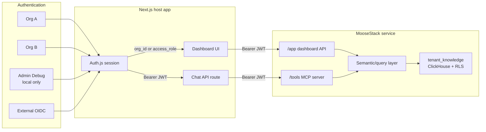

# TypeScript Agent Template

This template gives you a production-shaped TypeScript starter for building organization-aware agents on MooseStack.

It combines:
- a Moose service with JWT-backed RLS and MCP tools
- a Next.js app with chat, mock email/password auth for local development, and dashboard views
- a single-agent chat experience by default, plus optional reference multi-agent runtime code
- AI Elements primitives for the generic chat shell
- Moose-owned app APIs backed by query-layer models
- a shared agent runtime package for provider/model/tool orchestration
- a reusable Langfuse collector package for host-side observability sinks
- a shared contracts package for frontend/service DTOs
- Langfuse-compatible tracing from the web app
- optional Bedrock provider and Guardrails wiring

## Why Moose + Next.js

This template is intentionally not "just Next.js with a few route handlers."

- Next.js is the app host. It owns auth/session handling, the UI, server-rendered pages, and the chat route that talks to the shared agent runtime.
- Moose is the data-service runtime. It owns the typed data model, tenant isolation, semantic/query models, app-facing service APIs, and MCP tools over the same data surface.

That split matters once your app needs more than a thin UI over an existing API:

- you want typed ingest models that become real tables and services instead of hand-written backend glue
- you want row-level security and tenant scoping enforced close to the data
- you want a semantic layer for metrics, filters, and read models instead of burying analytics logic inside route handlers
- you want the same backend surface to power dashboards, chat tools, and external MCP clients
- you want the data plane to stay usable even if the frontend changes

If you only need a simple UI over an existing backend, plain Next.js is often enough. This template is for the case where the application also needs a real data service: modeled data, organization-aware reads, analytics-style queries, and tool-accessible APIs.

## Overview



Authentication establishes identity. Authorization determines whether the request is organization-scoped (`org_id`) or uses the local-only `Admin Debug` bypass for troubleshooting.

## Optional Multi-Agent Reference Flow

The runtime package still includes a simple multi-agent reference flow:

- `supervisor` classifies the latest user request and selects one specialist
- one specialist (`catalog-researcher`, `knowledge-analyst`, or `metrics-investigator`) investigates with the authenticated MCP tools
- `narrator` rewrites the specialist's working notes into the final user-facing answer

The generated app uses the single-agent runtime by default. The multi-agent flow remains in the workspace as reference code for teams that want to keep or extend it.

Start with these files if you want to customize the pattern:

- `packages/agent-runtime/src/index.ts` - shared runtime plus the reference supervisor -> specialist -> narrator orchestration
- `packages/web-app/src/lib/chat-agent.ts` - Next-hosted adapter that injects auth, tracing, and guardrails into the runtime
- `packages/agent-runtime/src/prompts/multi-agent.ts` - reference supervisor/specialist/narrator prompts

## Prerequisites

- Moose CLI installed and available on your `PATH`
- Node.js `>=20 <25`
- `pnpm` `10.33+`
- `curl` for startup readiness checks
- One local container runtime: Docker Desktop / Docker Engine, or Finch
- Provider credentials if you want chat to be usable immediately: `ANTHROPIC_API_KEY`, `OPENAI_API_KEY`, or AWS Bedrock credentials plus `BEDROCK_MODEL_ID`

`pnpm dev:start` runs the workspace build first, then auto-detects Docker or Finch, prefers Docker when both are ready, and passes the selected container CLI to the spawned Moose process.

If you run `pnpm dev:moose` or `moose dev` directly with Finch, set `MOOSE_DEV__CONTAINER_CLI_PATH=finch` or add `[dev] container_cli_path = "finch"` to `~/.moose/config.toml`.

## Quickstart

```bash
moose init <project-name> typescript-agent
cd <project-name>
pnpm install
pnpm env:prepare
pnpm dev:start
```

`pnpm env:prepare` creates `packages/moosestack-service/.env.local` and `packages/web-app/.env.local` from the checked-in examples. It also generates a random `AUTH_SECRET` plus a local RSA keypair used for the built-in local mock login flow.

`packages/web-app/.env.local` is intentionally not checked in. The generated app ships with safe defaults in `packages/web-app/.env.example`, and `pnpm env:prepare` writes the project-local secrets into `.env.local`.

`pnpm dev:start` runs the workspace build, checks Docker or Finch, waits for the Moose service and MCP endpoint to come up, then starts the web app.

In a third terminal, seed starter data:

```bash
pnpm seed
```

`pnpm seed` prints a short summary showing how many records were inserted and the current totals per tenant.

Open `http://localhost:3000`, sign in with one of the local mock accounts, look up the generated password in `packages/web-app/.env.local`, then use the dashboard and chat panel.

Before committing, run:

```bash
pnpm build
pnpm build:service
pnpm test
pnpm lint
pnpm format
```

## Compatible Versions

This template pins its external package versions centrally in `pnpm-workspace.yaml`, and the workspace `package.json` files consume them via `catalog:` references.

The AI SDK v6 stack in this template is currently pinned to these compatible versions:

| Package | Pinned version | Notes |
| --- | --- | --- |
| `pnpm` | `10.33.0` | Template `packageManager` |
| `ai` | `6.0.138` | Core AI SDK v6 line |
| `@ai-sdk/react` | `3.0.140` | React bindings compatible with `ai@6` |
| `@ai-sdk/amazon-bedrock` | `4.0.83` | Bedrock provider compatible with `ai@6` |
| `@ai-sdk/anthropic` | `3.0.64` | Anthropic provider compatible with `ai@6` |
| `@ai-sdk/openai` | `3.0.48` | OpenAI provider compatible with `ai@6` |
| `@ai-sdk/mcp` | `1.0.30` | MCP client bridge used by the shared runtime |
| `zod` | `4.3.6` | Web app and shared runtime validation |
| `zod` via `catalog:zod3` | `3.25.76` | `packages/moosestack-service` stays on the v3 line required by its MCP stack |

The workspace also overrides transitive `tar` to `7.5.7` so generated apps stay on a patched archive dependency across the full workspace.

## Manual Template Testing

Templates should be tested from a generated app, not in-place inside this repository.

From the monorepo root:

```bash
cargo build --package moose-cli
node scripts/package-templates.js
```

Then initialize the template in a temp directory:

```bash
MOOSE_CLI="${MOOSE_CLI:-$(pwd)/target/debug/moose-cli}"
TMP_DIR="$(mktemp -d /tmp/typescript-agent-XXXXXX)"
cd "$TMP_DIR"
"$MOOSE_CLI" init my-agent typescript-agent
cd my-agent
pnpm install
```

If you prefer to use a CLI from your `PATH` instead of the just-built local binary, set `MOOSE_CLI=moose-cli` before running the snippet.

Run the generated app checks:

```bash
pnpm test
pnpm build
pnpm build:service
```

For a full local smoke test:

```bash
pnpm env:prepare
pnpm dev:start
```

In a third terminal:

```bash
pnpm seed
```

Then verify:

- `http://localhost:3000` renders the landing page
- local email/password sign-in works for the seeded mock users
- org-scoped users only see their own records, while the local admin can inspect both tenants
- streamed chat responses stay single-agent by default; `[AGENT:...]` handoff markers only appear if you switch back to the optional multi-agent flow
- chat tool calls follow the same authenticated access scope as the dashboard
- `http://localhost:4000/tools` requires a bearer JWT with `org_id`, or the local admin debug JWT with `access_role=admin_debug`

## Local Development

Local development uses the built-in local mock login flow:

- `MOOSE_AUTH_MODE=local` enables the mock email/password sign-in page in the web app
- org-scoped mock users sign in with short-lived JWTs carrying `org_id`
- `admin@template.com` signs in with a short-lived JWT carrying `access_role=admin_debug`
- Moose verifies that JWT using the RSA public key in `packages/moosestack-service/.env.local` (`MOOSE_JWT__SECRET`)
- org-scoped users stay limited by the same row policy across dashboard APIs and MCP tools
- the admin mock user bypasses tenant scoping for local troubleshooting only

Local mock accounts included by default:
- `user1@orgA.com` with password stored in `LOCAL_MOCK_PASSWORD_ORG_A_USER`
- `user2@orgB.com` with password stored in `LOCAL_MOCK_PASSWORD_ORG_B_USER`
- `admin@template.com` with password stored in `LOCAL_MOCK_PASSWORD_ADMIN`

## Environment Variables

### Required

Run `pnpm env:prepare` first, then update `packages/web-app/.env.local` as needed:

| Variable | Purpose |
| --- | --- |
| `AUTH_SECRET` | Auth.js session secret |
| `AI_PROVIDER` | `anthropic`, `openai`, or `bedrock` |
| `ANTHROPIC_MODEL_ID` | Optional Anthropic model override |
| `MOOSE_SERVICE_URL` | Moose service base URL, usually `http://localhost:4000` |
| `OPENAI_MODEL_ID` | Optional OpenAI model override |

`MOOSE_SERVICE_URL` is the canonical setting. If you already have `MCP_SERVER_URL=http://.../tools`, the template still accepts it as a legacy alias and MCP-specific override.

In `packages/moosestack-service/.env.local`, you can also override the local ClickHouse defaults with:

| Variable | Purpose |
| --- | --- |
| `MOOSE_CLICKHOUSE_CONFIG__URL` | Existing ClickHouse connection URL |
| `MOOSE_CLICKHOUSE_CONFIG__DB_NAME` | Existing ClickHouse database name |
| `MOOSE_CLICKHOUSE_CONFIG__HOST` | Existing ClickHouse host |
| `MOOSE_CLICKHOUSE_CONFIG__HOST_PORT` | Existing ClickHouse HTTP port |
| `MOOSE_CLICKHOUSE_CONFIG__USER` | Existing ClickHouse username |
| `MOOSE_CLICKHOUSE_CONFIG__PASSWORD` | Existing ClickHouse password |
| `MOOSE_CLICKHOUSE_CONFIG__USE_SSL` | `true` / `false` for the HTTP connection |
| `MOOSE_CLICKHOUSE_CONFIG__NATIVE_PORT` | Existing ClickHouse native TCP port |

For local work, start with `pnpm env:prepare`, then update the provider-specific variables in `packages/web-app/.env.local` for the model backend you want to use.

### Provider-specific

| Provider | Variables |
| --- | --- |
| Anthropic | `ANTHROPIC_API_KEY`, optional `ANTHROPIC_MODEL_ID` |
| OpenAI | `OPENAI_API_KEY`, optional `OPENAI_MODEL_ID` |
| Bedrock | `AWS_REGION`, `BEDROCK_MODEL_ID`, optional `AWS_PROFILE` |

If `AI_PROVIDER=bedrock`, local development also needs AWS credential hints such as `AWS_PROFILE` or `AWS_ACCESS_KEY_ID` / `AWS_SECRET_ACCESS_KEY`. Otherwise the template marks Bedrock as unavailable and the chat panel stays disabled instead of failing silently.

When authoring custom MCP tools for Bedrock-backed chats, prefer `z.string()` plus explicit allowed-value descriptions over `z.enum()` in tool input schemas. Bedrock tool-schema compatibility is stricter than Anthropic/OpenAI, and this template keeps its built-in MCP tools on the safer string-based path.

### Optional Langfuse

| Variable | Purpose |
| --- | --- |
| `LANGFUSE_PUBLIC_KEY` | Enable real Langfuse tracing |
| `LANGFUSE_SECRET_KEY` | Enable real Langfuse tracing |
| `LANGFUSE_BASE_URL` | Defaults to `https://cloud.langfuse.com` |

### Optional production OIDC

Set these when replacing the local mock login flow with a real provider:

| Variable | Purpose |
| --- | --- |
| `MOOSE_AUTH_MODE=oidc` | Switch the web app to external OIDC mode |
| `OIDC_ISSUER` | OIDC issuer URL |
| `OIDC_CLIENT_ID` | OIDC client ID |
| `OIDC_CLIENT_SECRET` | OIDC client secret |
| `OIDC_ORG_CLAIM` | Claim used for RLS, defaults to `org_id` |

When moving to production OIDC, update the `[jwt]` issuer/audience in `packages/moosestack-service/moose.config.toml` and replace `MOOSE_JWT__SECRET` in `packages/moosestack-service/.env.local` with your real provider's PEM public key.

## Bedrock Guardrails

If `AI_PROVIDER=bedrock`:

- set `BEDROCK_GUARDRAIL_ID` to enable real Guardrails checks
- set `BEDROCK_GUARDRAIL_VERSION` if you do not want `DRAFT`
- if no guardrail is configured, the template falls back to a development-only mock adapter under `packages/web-app/src/dev/`

## What Gets Seeded

`pnpm seed` inserts:

- organization-scoped knowledge records for `org_a` and `org_b` in `tenant_knowledge`

The dashboard reads Moose-owned app APIs over that table, and the chat UI can inspect it through MCP. Langfuse remains the observability destination for chat/model traces.

By default, the MCP surface is allowlisted:

- `get_data_catalog` only returns the data components declared in `packages/moosestack-service/app/mcp/tool-access/exposed-surface.ts`
- the default exposed table set is derived from `tenantIsolation.config.tables`
- `query_tenant_knowledge_metrics` exposes organization-scoped grouped metrics over the semantic layer
- `list_tenant_knowledge_records` exposes organization-scoped recent/detail records over the semantic layer

## External MCP Clients

The template exposes a custom MCP server at `http://localhost:4000/tools`.

The custom MCP endpoint is derived from `MOOSE_SERVICE_URL` by default. Only set `MCP_SERVER_URL` when the MCP tools endpoint lives on a different URL or you need to point directly at a full `/tools` endpoint.

Use a bearer JWT from the same auth provider that the web app uses. For local dev, sign in through the app and inspect requests, or mint an equivalent JWT carrying `org_id` for organization-scoped access or `access_role=admin_debug` for the local debug path.

Example:

```json
{
  "mcpServers": {
    "moose-tools": {
      "transport": "http",
      "url": "http://localhost:4000/tools",
      "headers": {
        "Authorization": "Bearer <tenant_jwt>"
      }
    }
  }
}
```

## Files to Start With

- `packages/moosestack-service/app/auth/` — JWT claim parsing plus tenant/admin access context helpers
- `packages/moosestack-service/app/ingest/models.ts` — organization-scoped tables and row policies
- `packages/moosestack-service/app/semantic/` — Moose semantic models and dashboard read composition
- `packages/moosestack-service/app/http/dashboard/api.ts` — app-facing dashboard API endpoint
- `packages/moosestack-service/app/mcp/server.ts` — custom MCP transport and tool wiring
- `packages/web-app/src/components/ai-elements/` — reusable AI Elements chat primitives
- `packages/web-app/src/features/chat/` — Moose-specific wrappers, tool renderers, and chat panel wiring
- `packages/web-app/src/lib/chat-agent.ts` — Next-hosted adapter around the shared default runtime
- `packages/moosestack-service/app/mcp/tool-access/exposed-surface.ts` — allowlisted MCP catalog surface
- `packages/moosestack-service/test/` — unit tests for Moose-owned helpers like catalog exposure and semantic tool wiring
- `packages/moosestack-service/data/clickhouse/readonly-query.ts` — readonly ClickHouse access shared by semantic reads and MCP tools
- `packages/agent-runtime/src/index.ts` — shared agent runtime plus optional reference multi-agent execution flow
- `packages/agent-runtime/test/` — integration tests for shared runtime assembly and provider/tool wiring
- `packages/agent-observability-langfuse/src/index.ts` — reusable Langfuse trace collector implementation
- `packages/agent-contracts/` — shared contracts between frontend and service
- `packages/web-app/src/auth.ts` — authentication provider wiring plus optional OIDC
- `packages/web-app/src/authz/` — session-level authorization helpers for tenant vs admin debug access
- `packages/web-app/src/lib/id-token.ts` — shared ID token claim parsing
- `packages/web-app/src/dev/` — development-only mock login users and guardrail stubs
- `packages/web-app/src/lib/moose-service.ts` — authenticated service client for frontend reads
- `packages/web-app/src/features/chat/` — chat UI components
- `packages/web-app/test/` — unit tests for frontend/server host adapters and environment-driven wiring
- `vitest.config.ts` — root test projects and source aliases for source-first testing

Each workspace package also has its own README:

- `packages/agent-contracts/README.md`
- `packages/agent-runtime/README.md`
- `packages/agent-observability-langfuse/README.md`
- `packages/moosestack-service/README.md`
- `packages/web-app/README.md`

## Testing

The template ships with a root Vitest setup that is split into two test layers:

- `pnpm test:unit` runs fast unit tests for pure helpers and host adapters
- `pnpm test:integration` runs source-level integration tests for cross-package runtime assembly
- `pnpm test` runs both projects

The default convention is:

- `packages/*/test/**/*.unit.test.ts` for isolated unit tests
- `packages/*/test/**/*.integration.test.ts` for package-crossing integration tests

The workspace aliases point package imports like `agent-runtime`, `agent-contracts`, and `@/` to source files, so tests do not require a prior build step.

## Notes

- `pnpm env:prepare` creates local env files from the checked-in examples.
- `pnpm dev:start` runs the workspace build, validates Docker or Finch, waits for readiness, and starts both services.
- `pnpm dev` runs the same workspace build, then starts both services without the extra readiness checks.
- `pnpm build` uses Turbo to build the shared packages plus the Next app in dependency order.
- `pnpm build:service` builds the Moose service docker image.
- `pnpm test` uses Vitest at the workspace root and is safe to run before `pnpm dev`.
- `pnpm seed` requires the Moose service to be running.
- `pnpm lint` runs Biome across the template and ESLint in the Next app.
- `pnpm format` runs Biome formatting across the template.
- The chat and dashboard follow the same authenticated access scope; org-scoped mock users see one tenant, while the admin mock user sees the seeded dataset across tenants.
